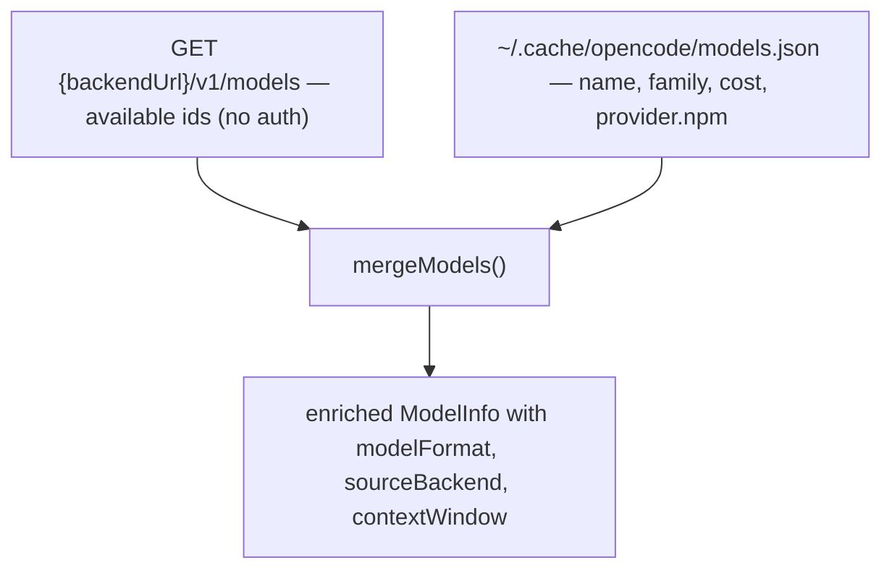

# Model Discovery & Classification

> Category: Ai | Version: 1.0 | Date: June 2026 | Status: Active

How `rflectr` builds the model list a user picks from, and how it decides whether each model is forwarded raw or translated. Read [`translation-layer.md`](translation-layer.md) for what happens *after* a model is classified.

**Related:**
- [`translation-layer.md`](translation-layer.md)
- [`../data/provider-registry.md`](../data/provider-registry.md)
- Source: `src/constants.ts` (`classifyModelFormat`), `src/models.ts`, `src/context-window.ts`, `src/context-model-id.ts`, `src/registry/materialize.ts`

---

## The format decision

Every model carries a `modelFormat` that drives the launch branch (`'anthropic'` = direct passthrough, anything else = SDK adapter proxy). It is computed by `classifyModelFormat(modelId, providerNpm)` in `src/constants.ts`:

```ts
if (providerNpm === '@ai-sdk/anthropic') return 'anthropic';
if (providerNpm === '@ai-sdk/openai')    return 'unsupported';
if (providerNpm === '@ai-sdk/google')    return 'unsupported';
// Fallback: ID-prefix heuristics when no cache npm is known
if (id.startsWith('claude-'))  return 'anthropic';
if (id.startsWith('gpt-'))     return 'unsupported';
if (id.startsWith('gemini-'))  return 'unsupported';
return 'openai';
```

The four values mean:

| `modelFormat` | Meaning |
|---|---|
| `anthropic` | Direct passthrough to the provider's Anthropic endpoint. `isAnthropicNative` is true. |
| `openai` | Routed through the SDK adapter via the local proxy. The catch-all for everything that isn't natively Anthropic. |
| `unsupported` | Hidden in the **cloud OpenCode wizard** only. GPT/Gemini through OpenCode Zen/Go's proxy layer needs model-specific endpoints that the cloud path can't provide. |

> **Important nuance:** `unsupported` is a *cloud-wizard* restriction, not a global one. To use GPT or Gemini models, configure the **local OpenAI / Google provider** (which carries the real `@ai-sdk/openai` / `@ai-sdk/google` npm) — those route through the SDK adapter normally. The `unsupported` classification only blocks the OpenCode Zen/Go proxy layer where direct OpenAI/Google access isn't available.

---

## The two-source merge

The cloud (OpenCode Zen/Go) model list is built from two sources merged together:



- **Primary:** `GET {backendUrl}/v1/models` returns the available model ids (no auth required).
- **Enrichment:** `~/.cache/opencode/models.json` (written by the OpenCode CLI, path in `OPENCODE_CACHE_PATH`) supplies `name`, `family`, `cost`, and `provider.npm`. It is optional enrichment, never a runtime dependency.

`sourceBackend` is set from the backend that was queried. This matters for the `go` subscription tier, which shows Zen free models *and* Go paid models in one combined list — `sourceBackend` lets the launcher set the correct `ANTHROPIC_BASE_URL` per selected model.

### Stale free models

Models whose free promotion ended but the API still returns them are listed in `src/data/model-incompatible.json` with `"category": "stale_promotion"` (currently `qwen3.6-plus-free`). They are hidden through the same `shouldHideModel` incompatibility path as every other blacklisted model — there is **no** separate `STALE_FREE_MODELS` constant in `src/constants.ts`. Treat `model-incompatible.json` as the source of truth.

---

## Registry models

Registry providers (`~/.rflectr/providers.json`) carry their own `CachedModel[]`, each already stamped with `modelFormat`, `npm`, `upstreamModelId`, `contextWindow`, `cost`, `supportedParameters`, and `reasoning`. `materializeRegistry` (`src/registry/materialize.ts`) converts those into runtime `LocalProviderModel`s and applies per-agent hiding via `shouldHideModel()` — e.g. Zen/Go favorites are hidden from Codex, which has no gateway path for them. See [`../data/provider-registry.md`](../data/provider-registry.md).

---

## Context window resolution

The status bar in Claude Code shows remaining context, which depends on a correct window. `resolveContextWindow(modelId, contextWindow?)` (`src/context-window.ts`) picks the window; `buildChildEnv` writes it to `CLAUDE_CODE_MAX_CONTEXT_TOKENS`. The proxy's synthetic `GET /v1/models` includes `context_window` per model (`formatAnthropicModelEntry`) so the host can render it.

A model id may carry a `[1m]` suffix to denote a 1-million-token context variant; `stripOneMContextSuffix` / `claudeCodeClientModelId` (`src/context-model-id.ts`) separate the wire id from the display id and the context hint. In switch-menu mode the window is fixed at launch and does not change on live `/model` switch (see [`../architecture/launch-flow-claude.md`](../architecture/launch-flow-claude.md#the-context-window-caveat)).

---

## Cost display is inaccurate for non-Anthropic models

Claude Code applies its own internal pricing table to whatever model id it sees, so the cost it shows for a Groq/DeepSeek/Gemini model is wrong. This is a documented, unfixable-from-here limitation — the host owns its pricing display.
