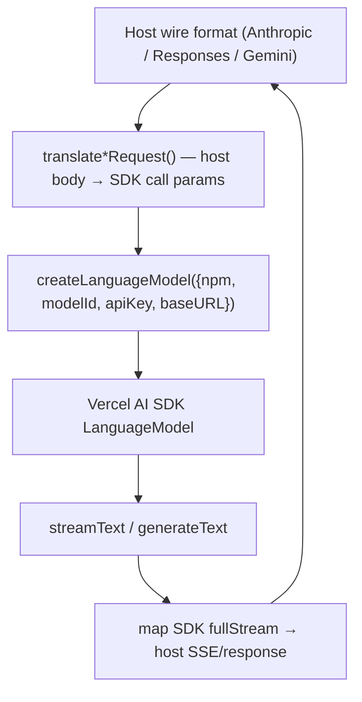

# The Translation Layer

> Category: Ai | Version: 1.0 | Date: June 2026 | Status: Active

The single path that lets a Claude Code / Codex / Gemini host talk to any non-Anthropic model. This doc explains the Vercel AI SDK adapter (`src/sdk-adapter.ts`) and the provider factory (`src/provider-factory.ts`) that feeds it. Read [`../architecture/system-overview.md`](../architecture/system-overview.md) first.

**Related:**
- [`model-discovery-classification.md`](model-discovery-classification.md)
- [`../integrations/local-proxy.md`](../integrations/local-proxy.md)
- [`../integrations/harnesses.md`](../integrations/harnesses.md)
- Source: `src/sdk-adapter.ts`, `src/provider-factory.ts`, `src/proxy-shared.ts`, `src/codex-responses-adapter.ts`, `src/gemini-proxy.ts`

---

## Why there is exactly one translation path

A naive launcher would hand-roll a translator per provider: Anthropic→OpenAI, Anthropic→Gemini, and so on. That is a combinatorial mess and every provider has quirks (message ordering, reasoning signatures, tool-call encoding). `rflectr` instead routes **all** non-Anthropic providers through the Vercel AI SDK (`ai` + `@ai-sdk/*`) — the same packages OpenCode loads. The SDK owns wire format, endpoint selection, and provider quirks, so there is one translation path, not N.

The rule that decides whether to translate at all: `isSdkMigratedNpm(npm)` (`src/provider-factory.ts`) is true for **any** npm except `@ai-sdk/anthropic`. Anthropic-format models skip the adapter and are forwarded raw.

---

## provider-factory.ts — npm → LanguageModel

`createLanguageModel(spec)` (async) is the factory. `spec` carries `{ npm, modelId, apiKey, baseURL?, providerId?, authType?, oauthAccountId?, vertex? }`. It dynamically `import(npm)`s the SDK package and discovers its `create*` factory. The router has special branches:

| npm | Behaviour |
|---|---|
| `@ai-sdk/google-vertex/anthropic` (`VERTEX_ANTHROPIC_NPM`) | Claude on Google Vertex AI via gcloud Application Default Credentials (no apiKey). |
| `@ai-sdk/openai` | OAuth → ChatGPT Codex backend (`https://chatgpt.com/backend-api/codex`); API key → direct OpenAI. `modelPrefersResponsesApi()` picks `openai.responses(id)` vs `openai.chat(id)`. |
| `@ai-sdk/xai` | Direct; also consults `modelPrefersResponsesApi()`. |
| `@ai-sdk/google` | Direct — ignores `baseURL`, uses the native `/v1beta` endpoint. |
| `@ai-sdk/anthropic` | Direct; strips a trailing `/v1` from `baseURL` if present. |
| `@ai-sdk/openai-compatible`, `@openrouter/ai-sdk-provider` | Routed via `baseURL`. |
| anything else | `loadSdkProviderFactory(npm)` finds the `create*()` export dynamically. |

The `@ai-sdk/*` provider packages ship as npm **`dependencies`** and are marked `external` in `tsup.config.ts`, so they resolve from `node_modules` at runtime and keep `dist/cli.js` small.

### The Responses API selector

`modelPrefersResponsesApi(modelId)` returns true for OpenAI/xAI models that require the Responses API rather than Chat Completions: GPT-5.4+, GPT-5.5, `gpt-5-pro` / `gpt-5.2-pro`, `*-codex`, the o-series (`o3`, `o4`, …), and xAI `grok-*-multi-agent`. Newer OpenAI reasoning models only round-trip correctly through Responses, so this selection is load-bearing — not cosmetic.

OpenCode catalog ids may differ from upstream API ids (e.g. `gpt-5.5-fast` → `gpt-5.5`); `upstreamModelId` carries OpenCode's `api.id` for the actual upstream call.

### Reasoning capabilities

`getReasoningCapabilities(npm, modelId, metadata)` returns a `ReasoningCapabilities` describing whether a model exposes controllable effort/thinking, internal-only reasoning, or none — covering Claude 4.6+, Gemini 2.5+/3, Mistral reasoners, xAI reasoners, DeepSeek V4, Kimi, and OpenRouter. The adapter uses this (with `effortProviderOptions` / `thinkingProviderOptions` / `deepMergeProviderOptions`) to translate a host's thinking/effort request into the right provider option block.

---

## sdk-adapter.ts — Anthropic ↔ SDK

The adapter handles the Claude-Code-facing direction. Its contract: **one turn per request.** Claude Code owns the tool loop, so the adapter never loops; it translates a single request and streams a single response.

- `translateRequest(body, npm, options?)` builds the SDK call params from an Anthropic request — messages, tools, `tool_choice`, system. Critically, it **folds inline `role:'system'` messages into the system prompt**: Claude Code injects the skills list and system-reminders as system-role messages mid-conversation, and dropping them would break behaviour. `TranslateRequestOptions` carries `defaultEffort` (fallback when the client omits effort, e.g. the Claude Desktop gateway), `reasoningMetadata`, and `openAiOAuth` (ChatGPT Codex OAuth manages its own output limit and requires `instructions`).
- `streamAnthropicResponse` maps the SDK `fullStream` to Anthropic SSE.
- `generateAnthropicResponse` handles the non-streaming case.

### The thought_signature round-trip

Reasoning models (especially Gemini) require their `thought_signature` to be echoed back verbatim on the next turn. Anthropic's wire format has no field for it, so `rflectr` smuggles it through the tool-use id:

- **Encode:** `encodeToolUseId(rawId, signature)` (`src/proxy-shared.ts`) produces `{id}::ts::{signature}`.
- **Decode:** `splitToolUseId(id)` recovers `{ rawId, thoughtSignature }`, which is fed back into `providerOptions.google.thoughtSignature`.

Gemini puts the signature on tool-call parts (captured at `tool-input-start`); the SDK then handles Gemini's strict echo-back. This is the reason the old hand-rolled Gemini-native path was retired. The `::ts::` separator would break only if a signature literally contained `::ts::` — extremely unlikely, and a documented edge.

---

## The other two host directions

The same factory + SDK model is reused; only the host-facing translation differs:

- **Codex Responses API** (`src/codex-responses-adapter.ts`): `translateResponsesRequest` / `translateResponsesInput` / `translateResponsesTools` build SDK params from a Responses body; `streamResponsesResponse` / `generateResponsesResponse` emit the Responses SSE/JSON shape.
- **Gemini REST** (`src/gemini-proxy.ts` + `src/gemini-parts.ts`): `translateGeminiRequest` extracts system instruction, contents, tools, and generation config; `parseGeminiPart` / `collectAnthropicBlocksFromGeminiParts` / `mapGeminiUsage` translate parts and usage.

All three converge on `createLanguageModel` + `streamText`/`generateText`. That convergence is the whole point: add a provider once and every host can use it.
