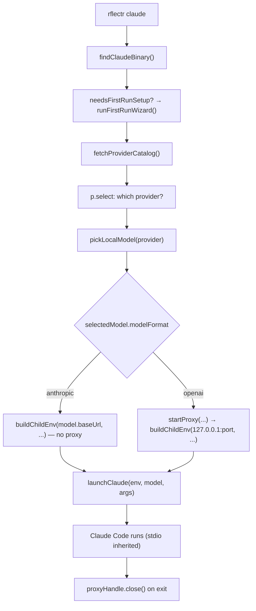

# Claude Code Launch Flow

> Category: Architecture | Version: 1.0 | Date: June 2026 | Status: Active

How `rflectr claude` goes from a command line to a running Claude Code process pointed at the chosen model. Read [`system-overview.md`](system-overview.md) first. This doc traces `runClaudeCommand` in `src/cli.ts` and its two launch paths.

**Related:**
- [`system-overview.md`](system-overview.md)
- [`../integrations/local-proxy.md`](../integrations/local-proxy.md)
- [`../ai/translation-layer.md`](../ai/translation-layer.md)
- [`../data/preferences-config.md`](../data/preferences-config.md)
- Source: `src/cli.ts` (`runClaudeCommand`, `runModelsCommand`, `launchClaudeViaCatalog`), `src/env.ts` (`buildChildEnv`), `src/catalog.ts`

---

## The two modes

The launch has two shapes, decided by one line in `runClaudeCommand`:

```ts
const switchMenuActive = favorites.length > 0 && !launchPlan.skip;
```

- **Single-model mode** (no favorites saved): one model, one route. Launch and exit.
- **Switch-menu mode** (`rflectr models` has saved at least one favorite): a multi-route catalog proxy is started and Claude Code's gateway model discovery is enabled, so the in-session `/model` command lists the starting model plus every favorite for live switching.

Favorites are managed by `runModelsCommand` (also in `src/cli.ts`) and persisted to `~/.rflectr/config.json`. The cap is `MAX_MODEL_CATALOG = 20` (`src/constants.ts`).

---

## Single-model flow



The format branch is the heart of it (`src/cli.ts`):

- `modelFormat === 'anthropic'` → **direct passthrough.** `buildChildEnv(selectedModel.baseUrl!, selectedModel.id, launchApiKey, undefined, contextWindow)`. No proxy; Claude Code talks straight to the provider's Anthropic-compatible endpoint. `CLAUDE_CODE_DISABLE_EXPERIMENTAL_BETAS=1` is set so beta headers are stripped on the direct hop.
- otherwise → **SDK adapter proxy.** `startProxy(completionsUrl, modelId, trace, contextWindow, { npm, baseURL, upstreamModelId, providerId, authType, oauthAccountId, supportedParameters, reasoning, interleavedReasoningField }, apiKey)` returns a `ProxyHandle`; the child env points `ANTHROPIC_BASE_URL` at `http://127.0.0.1:<port>`.

The provider API key is resolved by `resolveLocalProviderApiKey(activeProvider)` (`src/provider-catalog.ts`). If none is found, launch aborts with a message pointing at `rflectr providers`.

---

## Switch-menu (catalog) flow

When favorites exist, `runClaudeCommand` delegates to `launchClaudeViaCatalog`:

1. `makeRouteResolver(localProviders, zenModels, goModels, zenGoApiKey)` (`src/catalog.ts`) builds a function that maps a `(providerId, modelId)` pair to a `ProxyRoute`.
2. `buildCatalogRoutes(startingRoute, favorites, resolveRoute)` builds the route list — **starting model + favorites only**, never the full catalog — and reports `droppedFavorites` (favorites whose provider/model is no longer available, silently skipped).
3. `startProxyCatalog(catalogRoutes, startingRoute.aliasId, trace)` starts one proxy serving all routes.
4. `buildChildEnv(..., enableGatewayDiscovery = true)` sets `CLAUDE_CODE_ENABLE_GATEWAY_MODEL_DISCOVERY=1` so Claude Code fetches `/v1/models` from the proxy and populates `/model`.

Each route's id is rewritten by `aliasModelId()` (`src/proxy.ts`) so Claude Code sees unique, gateway-safe names (e.g. `anthropic-opencode-go__deepseek-v4-flash`) in the picker. See [`../integrations/local-proxy.md`](../integrations/local-proxy.md).

A `__favorites__` pseudo-provider is unshifted onto the provider picker in switch-menu mode; selecting it loads the Favorites Catalog and uses `resolveFirstAvailableFavorite` as the starting model.

---

## The context-window caveat

In switch-menu mode the displayed context window reflects the **launch** model and does **not** update on a live `/model` switch. Claude Code's gateway model discovery only carries `id` + `display_name` (no `context_window`) and fetches `/v1/models` once at startup, so `CLAUDE_CODE_MAX_CONTEXT_TOKENS` — fixed at launch by `buildChildEnv` — is the only lever. Single-model launches show the correct window. This is a documented, by-design limitation.

---

## Flags and boot shortcuts

`parseArgs` (`src/cli.ts`) recognises starter flags (`--dry-run`, `--setup`, `--trace`, `--help`, `--version`) and relay launch flags (`--provider`, `--model`). Everything after `--`, and any unrecognised flag, is forwarded verbatim to Claude Code (`claudeArgs`).

- `--provider X --model Y` (or print mode `-p`) skips the wizard entirely via `planLaunchWizard` / `findProviderAndModel` (`src/launch-target.ts`).
- `--dry-run` runs the whole wizard but prints a preview (`printDryRun`) and writes nothing — it ignores saved env keys, keyring, tier, and preferences, simulating a fresh first run.
- `--trace` writes a debug log under `~/.rflectr/logs/` and prints errors on exit (`prepareClaudeTraceLog` / `printTraceLog`).

Clean-stdout agent mode (`wantsCleanAgentStdout`, `setAgentStdoutMode`) suppresses the interactive intro/spinners when Claude Code is run in print/pipe mode.

---

## What the child process receives

For the exact env contract (`ANTHROPIC_BASE_URL`, `ANTHROPIC_API_KEY`, `ANTHROPIC_MODEL`, `CLAUDE_CODE_MAX_CONTEXT_TOKENS`, the tool-search / system-prompt compat vars, and the removed conflict vars), see [`../security/credential-storage.md`](../security/credential-storage.md#child-process-environment).
