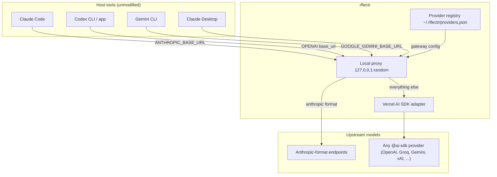

# System Overview

> Category: Architecture | Version: 1.0 | Date: June 2026 | Status: Active

Read this first. It explains what `rflectr` is, the surfaces it exposes, and the single translation core that every surface shares. New engineers should read this before diving into any domain doc.

**Related:**
- [`launch-flow-claude.md`](launch-flow-claude.md)
- [`../ai/translation-layer.md`](../ai/translation-layer.md)
- [`../ai/model-discovery-classification.md`](../ai/model-discovery-classification.md)
- [`../integrations/local-proxy.md`](../integrations/local-proxy.md)
- [`../integrations/harnesses.md`](../integrations/harnesses.md)
- [`../data/provider-registry.md`](../data/provider-registry.md)
- Source: `src/cli.ts`, `src/constants.ts`

---

## Why this exists

The major agentic coding tools — Claude Code, OpenAI Codex (CLI and desktop), Google Gemini CLI, and Claude Desktop — each speak only to their vendor's own API by default. `rflectr` is a launcher that re-points each of those tools at a *different* model backend without the tool noticing. You can run Claude Code against a Groq Llama model, Codex against DeepSeek, or Gemini CLI against a local Ollama endpoint — picking the model from an interactive wizard, then handing the host tool an environment that makes it believe it is talking to its native API.

The published npm package and CLI binary are both named `rflectr` (`package.json` is the single source of truth for the version; see [`CLAUDE.md`](../../../../CLAUDE.md) for the release workflow). The repository directory is `rflectr`.

The hard problem `rflectr` solves is **wire-format translation**: Claude Code emits Anthropic `/v1/messages`, Codex emits the OpenAI Responses API, Gemini CLI emits the Gemini REST protocol — but the chosen model may speak any of those formats (or none of them directly). A local HTTP proxy sits between the host tool and the upstream model and translates in both directions. All non-Anthropic translation flows through one path: the **Vercel AI SDK adapter** (see [`../ai/translation-layer.md`](../ai/translation-layer.md)).

---

## The surfaces

Every surface is a subcommand of the `rflectr` CLI, dispatched from `parseArgs` / `main` in `src/cli.ts`.

| Command | What it launches | Host wire format | Doc |
|---|---|---|---|
| `rflectr claude` | Claude Code CLI | Anthropic `/v1/messages` | [`launch-flow-claude.md`](launch-flow-claude.md) |
| `rflectr codex` | OpenAI Codex CLI | OpenAI Responses (`/v1/responses`) | [`../integrations/harnesses.md`](../integrations/harnesses.md) |
| `rflectr codex-app` | Codex desktop app | OpenAI Responses | [`../integrations/harnesses.md`](../integrations/harnesses.md) |
| `rflectr gemini` | Gemini CLI | Gemini REST (`:generateContent`) | [`../integrations/harnesses.md`](../integrations/harnesses.md) |
| `rflectr claude-app` | Claude Desktop app | Anthropic (gateway config) | [`../integrations/harnesses.md`](../integrations/harnesses.md) |
| `rflectr server` | Foreground API gateway | Anthropic + OpenAI compatible | [`../infrastructure/server-gateway.md`](../infrastructure/server-gateway.md) |
| `rflectr providers` | Provider registry manager | — | [`../data/provider-registry.md`](../data/provider-registry.md) |
| `rflectr models` / `favorites` | Favorite-model manager | — | [`launch-flow-claude.md`](launch-flow-claude.md) |

---

## The shared core

Three subsystems are reused by every surface:

**1. The provider registry** (`src/registry/`, `src/provider-catalog.ts`). The list of providers and their models lives in `~/.rflectr/providers.json`. It is the single source of truth for what shows up in every wizard. Built-in templates (Groq, Mistral, OpenAI, Ollama, …) are defined in `src/provider-templates.ts`; OpenCode Zen / Go are always available even with no registry. See [`../data/provider-registry.md`](../data/provider-registry.md).

**2. The translation layer** (`src/sdk-adapter.ts`, `src/provider-factory.ts`). `createLanguageModel({ npm, modelId, apiKey, baseURL })` turns whatever npm package OpenCode/the registry assigned the provider into a Vercel AI SDK `LanguageModel`. The adapter then maps the host's wire format to and from that model, one turn per request — the host tool always owns its own tool loop. See [`../ai/translation-layer.md`](../ai/translation-layer.md).

**3. The local proxy** (`src/proxy.ts` and the per-protocol variants `src/codex-proxy.ts`, `src/gemini-proxy.ts`). A throwaway HTTP server on `127.0.0.1:<random port>` that the host tool is pointed at. Anthropic-format models are forwarded raw; everything else goes through the SDK adapter. `aliasModelId()` rewrites non-`claude-*` ids to a gateway-safe form. See [`../integrations/local-proxy.md`](../integrations/local-proxy.md).

---

## Environment isolation, not config editing

`rflectr` never edits the host tool's settings file. It launches the child process with a purpose-built environment (`buildChildEnv` in `src/env.ts`) that:

- **Removes** the 17 conflicting Anthropic/Vertex/Bedrock/AWS/Foundry env vars listed in `CONFLICTING_ENV_VARS` (`src/constants.ts`), so stale cloud config can't leak in.
- **Sets** `ANTHROPIC_BASE_URL`, `ANTHROPIC_API_KEY`, `ANTHROPIC_MODEL`, and `CLAUDE_CODE_MAX_CONTEXT_TOKENS`.

This avoids the backup/restore problem that settings-file rewriters have. The one caveat: Claude Code itself persists the launched model to `~/.claude/settings.json`, so a later bare `claude` may still show a relay alias. See [`../security/credential-storage.md`](../security/credential-storage.md) for the full env contract.

The two desktop apps (`claude-app`, `codex-app`) are the exception — they *do* write config files, because the apps have no env to inherit. Those writes are backed up and restored on exit via lock files. See [`../integrations/harnesses.md`](../integrations/harnesses.md).

---

## A critical URL constraint

`BACKENDS.baseUrl` in `src/constants.ts` must **not** include `/v1`. The Anthropic SDK appends `/v1/messages` automatically, so `https://opencode.ai/zen/v1` would produce requests to `/zen/v1/v1/messages` → 404. The same rule applies anywhere an Anthropic-format `baseUrl` is built. This is the single most common configuration footgun in the codebase.

---

## Where to go next

- To trace a launch end to end: [`launch-flow-claude.md`](launch-flow-claude.md).
- To understand how a Groq or DeepSeek model gets spoken to as if it were Anthropic: [`../ai/translation-layer.md`](../ai/translation-layer.md).
- To understand how the model list is built and classified: [`../ai/model-discovery-classification.md`](../ai/model-discovery-classification.md).
- To understand credential handling: [`../security/credential-storage.md`](../security/credential-storage.md) and [`../auth/oauth-device-flows.md`](../auth/oauth-device-flows.md).
