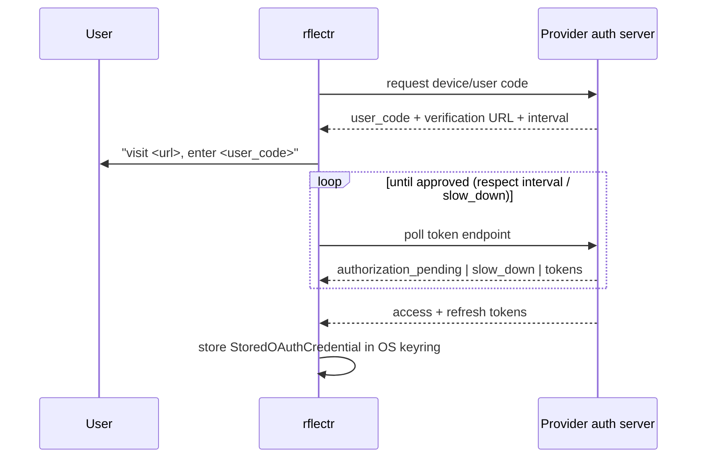

# OAuth Device Flows

> Category: Auth | Version: 1.0 | Date: June 2026 | Status: Active

How `rflectr` signs into providers that use OAuth instead of an API key — OpenAI (ChatGPT), xAI (Grok), and GitHub Copilot — and how those tokens are stored and refreshed. Read [`../data/provider-registry.md`](../data/provider-registry.md) for how an OAuth provider is registered.

**Related:**
- [`../security/credential-storage.md`](../security/credential-storage.md)
- [`../data/provider-registry.md`](../data/provider-registry.md)
- [`../ai/translation-layer.md`](../ai/translation-layer.md)
- Source: `src/oauth/` (`types.ts`, `openai.ts`, `xai.ts`, `github.ts`, `refresh.ts`, `pkce.ts`)

---

## Why device flow

These hosts run in a terminal with no browser redirect URI to catch. The OAuth 2.0 **Device Authorization Grant** (RFC 8628) fits: `rflectr` asks the provider for a user code, prints a URL for the user to visit, then polls until the user approves. No localhost callback server, no redirect handling.

`supportsNativeOAuth(providerId)` (`src/oauth/types.ts`) gates which providers offer this. The native set is `'xai' | 'xai-oauth' | 'openai' | 'openai-oauth' | 'github-copilot'`. The `rflectr providers auth <id>` command (`--native` vs `--broker`) drives it.

---

## Stored credential shape

`StoredOAuthCredential` (`src/oauth/types.ts`) is `{ type: 'oauth', access, refresh, expires, accountId? }`. It is serialized to JSON and written to the keyring account `oauth:provider:<id>` (see [`../security/credential-storage.md`](../security/credential-storage.md)). Helpers:

- `tokensToStoredCredential(tokens, existingRefresh?, accountId?)` — build it from a token response, preserving the existing refresh token if the provider didn't return a new one.
- `parseStoredOAuthCredential(raw)` — parse + validate from keyring.
- `oauthCredentialNeedsRefresh(cred, skewMs?)` — true when `expires <= now + skew` (default 120 s).
- `accessTokenIsExpiring(token, skewMs?)` — decode the JWT `exp` and check proactively.

---

## The three providers

### OpenAI / ChatGPT (`src/oauth/openai.ts`)

- Client id `app_EMoaamEEZ73f0CkXaXp7hrann`, issuer `https://auth.openai.com`.
- `runOpenAiDeviceCodeFlow(onDeviceCode, opts?)`: POST `/api/accounts/deviceauth/usercode` → poll `/api/accounts/deviceauth/token` → exchange the authorization code (with PKCE `code_verifier`) at `/oauth/token`.
- `extractOpenAiAccountId(tokens)` decodes the `id_token` / access token JWT for `chatgpt_account_id`. That `accountId` is what `provider-factory.ts` uses to route to the ChatGPT Codex backend (`https://chatgpt.com/backend-api/codex`).
- `refreshOpenAiAccessToken(refreshToken)` — `grant_type=refresh_token` at `/oauth/token`.

### xAI / Grok (`src/oauth/xai.ts`)

- Client id `b1a00492-073a-47ea-816f-4c329264a828`; device endpoint `https://auth.x.ai/oauth2/device/code`, token `https://auth.x.ai/oauth2/token`.
- Scope `openid profile email offline_access grok-cli:access api:access`.
- `requestXaiDeviceCode()` → `pollXaiDeviceCodeToken(device, opts?)` (grant `urn:ietf:params:oauth:grant-type:device_code`), combined as `runXaiDeviceCodeFlow`. Handles `slow_down` by bumping the interval +5 s.
- `refreshXaiAccessToken(refreshToken)`.

### GitHub Copilot (`src/oauth/github.ts`)

A two-step exchange — this is the quirk to remember:

1. Standard GitHub device flow (client id `Iv1.b507a08c87ecfe98`, the VS Code Copilot extension id; scope `copilot`) yields a long-lived `ghu_` access token.
2. `exchangeForCopilotToken(ghuToken)` GETs `https://api.github.com/copilot_internal/v2/token` to mint a **short-lived Copilot session token**.

`refreshGithubCopilotToken(ghuToken)` simply re-exchanges the `ghu_` for a fresh session token — so the **stored `refresh` field is the `ghu_` itself**, not a conventional refresh token.

> Caveat: Copilot OAuth *login* works, but Copilot as a *model provider* does not — OpenCode loads `@ai-sdk/github-copilot` from internal `@opencode-ai/core`, not a public npm factory. See [`../data/provider-registry.md`](../data/provider-registry.md).

---

## Refresh orchestration

`src/oauth/refresh.ts` is the single dispatch point, called lazily at credential-resolution time (`resolveProviderCredential` in `src/env.ts`):

- `oauthCredentialShouldRefresh(cred, providerId)` — true if `oauthCredentialNeedsRefresh(cred)` (time-based) **or**, for native providers, `accessTokenIsExpiring(cred.access)` (proactive JWT check).
- `refreshStoredOAuthCredential(providerId, cred)` — routes to `refreshOpenAiAccessToken` / `refreshXaiAccessToken` / `refreshGithubCopilotToken` and returns a new `StoredOAuthCredential` via `tokensToStoredCredential`.

Refresh is deduplicated per keyring account (`refreshOAuthKeyringAccount` in `src/env.ts`) so concurrent launches don't double-refresh, and a refreshed token is written back to the keyring. If refresh fails but the existing access token hasn't yet expired, the stale-but-valid token is used.

---

## PKCE & utilities (`src/oauth/pkce.ts`)

- `generatePkce()` → `{ verifier, challenge }` with `challenge = SHA256(verifier)`.
- `generateOAuthState()` → base64url of 32 random bytes.
- `generateRandomString(length)` — crypto-random from the unreserved-char set.
- `positiveSecondsToMs(value, defaultMs)`, `sleepMs(ms)` — polling helpers.
