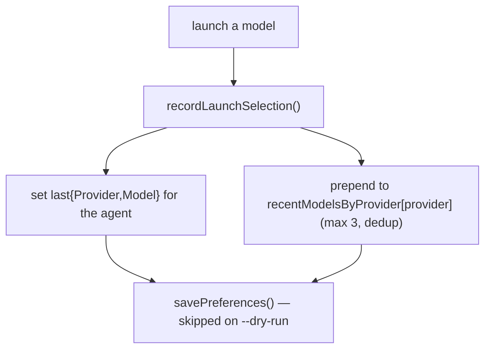
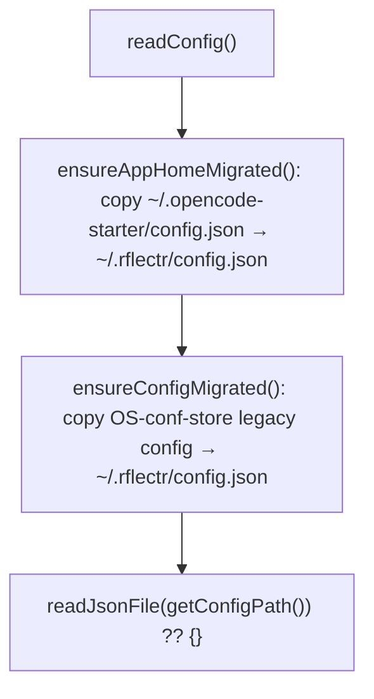

# Preferences & Config Store

> Category: Data | Version: 1.0 | Date: June 2026 | Status: Active

Where `rflectr` keeps user preferences, how the app-home directory is resolved, and the legacy-path migration. Read [`provider-registry.md`](provider-registry.md) for the separate providers file.

**Related:**
- [`provider-registry.md`](provider-registry.md)
- [`../security/credential-storage.md`](../security/credential-storage.md)
- Source: `src/paths.ts`, `src/config.ts`, `src/types.ts`

---

## The app home

Everything `rflectr` writes lives under one directory, resolved by `getAppHome()` (`src/paths.ts`):

1. `RFLECTR_HOME` (or deprecated `OPENCODE_STARTER_HOME`) if set — overrides everything.
2. otherwise `~/.rflectr`.

Files within it:

| Path helper | File | Contents |
|---|---|---|
| `getConfigPath()` | `~/.rflectr/config.json` | User preferences (this doc) |
| `getProvidersPath()` | `~/.rflectr/providers.json` | Provider registry ([`provider-registry.md`](provider-registry.md)) |
| `getLogsPath()` | `~/.rflectr/logs/` | `--trace` debug logs |
| `getVertexModelsPath()` | `~/.rflectr/vertex-models.json` | Optional Vertex model catalog |

The directory is created with mode `0o700` and files with `0o600`. All writes are skipped when `dryRun === true`.

---

## Preferences schema

`UserPreferences` (`src/types.ts`), read/written by `loadPreferences()` / `savePreferences()` (`src/config.ts`):

| Field | Purpose |
|---|---|
| `lastBackend` | Last cloud backend (`zen` / `go`) |
| `lastModel`, `lastProvider` | Last Claude Code selection (pre-selected in the wizard) |
| `lastCodexProvider`, `lastCodexModel` | Last Codex selection |
| `lastGeminiProvider`, `lastGeminiModel` | Last Gemini selection |
| `recentModelsByProvider` | `Record<string, string[]>` — up to 3 recent model ids per provider |
| `favoriteModels` | `FavoriteModel[]` (`{ providerId, modelId }`), max `MAX_MODEL_CATALOG` (20) |
| `server` | Saved `server`-command settings |

`savePreferences()` does a shallow merge — pass only the keys you're changing. `recordLaunchSelection(agent, providerId, modelId, prefs)` updates the per-agent `last*` fields and prepends to `recentModelsByProvider` (deduped, capped at 3).

`recentModelsByProvider` powers the "recent" hint at the top of `pickLocalModel` (`src/prompts.ts`), with a "Browse all models →" escape hatch.

---

## Legacy migration

`rflectr` was previously `opencode-starter`, and its config moved twice. `readConfig()` (`src/config.ts`) migrates on first read, transparently:

- `getLegacyAppHome()` → `~/.opencode-starter` (the prior dotfile dir). `vertex-models.json` migrates alongside `config.json`.
- `getLegacyConfPath()` → the even older OS-specific `conf` location (macOS `~/Library/Preferences/opencode-starter-nodejs/`, Windows `%APPDATA%\opencode-starter-nodejs\Config\`, Linux `$XDG_CONFIG_HOME/opencode-starter-nodejs/`). After copying, the legacy file is renamed `…​.migrated` (best-effort).
- `loadPreferences()` also normalizes the old `lastProvider === 'opencode'` value to `'zen'`.

Migration is one-directional and idempotent: if `~/.rflectr/config.json` already exists, nothing is copied.

---

## Large-catalog UX constants

Two constants in `src/prompts.ts` shape the picker once a provider's model list grows:

- `MODEL_SEARCH_THRESHOLD = 25` — lists above this show search or paginated browse instead of a flat list.
- `MODEL_PAGE_SIZE = 15` — page size for prev/next browsing (`selectModelWithSearch`, `selectLargeCatalog`, `pickModelFromPagedList`).
