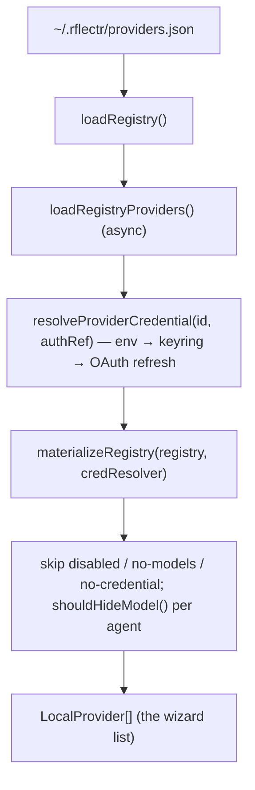

# The Provider Registry

> Category: Data | Version: 1.0 | Date: June 2026 | Status: Active

The on-disk catalog of providers and their models — the single source of truth for every wizard. This doc covers the `~/.rflectr/providers.json` schema, the built-in templates, and how a registry entry becomes a runtime provider. Read [`../architecture/system-overview.md`](../architecture/system-overview.md) first.

**Related:**
- [`preferences-config.md`](preferences-config.md)
- [`../ai/model-discovery-classification.md`](../ai/model-discovery-classification.md)
- [`../security/credential-storage.md`](../security/credential-storage.md)
- [`../auth/oauth-device-flows.md`](../auth/oauth-device-flows.md)
- Source: `src/registry/` (`types.ts`, `io.ts`, `load.ts`, `materialize.ts`, `crud.ts`, `add-template.ts`, `import-opencode.ts`), `src/provider-templates.ts`, `src/providers-command.ts`, `src/provider-catalog.ts`, `src/paths.ts`

---

## Why a registry

Early versions discovered providers by spawning OpenCode's `opencode serve` and reading `/config/providers` on every launch. That is slow and couples `rflectr` to a running OpenCode. The registry replaces that: providers are imported or added **once**, persisted to `~/.rflectr/providers.json`, and read directly on every launch. OpenCode import is now a one-time operation (`rflectr providers import`), not a per-launch dependency. OpenCode Zen / Go remain always available even with an empty registry.

---

## On-disk schema

Path: `getProvidersPath()` → `~/.rflectr/providers.json` (`src/paths.ts`). Types in `src/registry/types.ts`:

```ts
ProviderRegistry {
  schemaVersion: number          // currently 1
  providers: RegistryProvider[]
  importedAt?: string
  pricingCacheAt?: string
}

RegistryProvider {
  id: string                     // /^[a-z0-9](?:[a-z0-9-]*[a-z0-9])?$/ (PROVIDER_ID_PATTERN)
  templateId: string             // origin template, e.g. 'groq', 'custom-lm-studio'
  name: string                   // display name
  enabled: boolean
  authRef: string                // 'keyring:provider:groq' | 'keyring:global:opencode' | 'env:OPENCODE_API_KEY'
  authType?: 'api' | 'oauth' | 'none'
  subscriptionFilter?: 'free' | 'zen' | 'go'
  api: { npm?: string; url?: string; id?: string }
  modelsCache?: { fetchedAt: string; models: CachedModel[] }
  addedAt: string                // ISO
  refreshedAt?: string
}

CachedModel {
  id: string
  name: string
  upstreamModelId: string        // provider's native id for the wire call
  family?: string; brand?: string
  contextWindow?: number
  cost?: { input: number; output: number }
  modelFormat: 'anthropic' | 'openai'
  npm?: string                   // per-model override of provider.api.npm
  apiUrl?: string                // per-model override of provider.api.url
  sourceBackend?: string
  supportedParameters?: string[]
  reasoning?: boolean
  interleavedReasoningField?: string
}
```

**Persistence** (`src/registry/io.ts`): `loadRegistry(path?)` returns an empty registry if the file is missing/unparseable and applies migrations; `saveRegistry()` writes atomically (tmp + rename, backup) with secure permissions (`0o600` file inside a `0o700` dir via `ensureSecureAppHome()`), 2-space JSON + trailing newline. **No secrets live in this file** — `authRef` is only a pointer; the actual key lives in the OS keyring (see [`../security/credential-storage.md`](../security/credential-storage.md)).

---

## From registry entry to runtime provider



- `loadRegistryProviders(diag?, opts?)` (`src/registry/load.ts`) reads enabled entries and resolves each credential.
- `materializeRegistry(registry, credResolver, opts?)` (`src/registry/materialize.ts`) converts `CachedModel` → `LocalProviderModel`, drops providers with no credential or no cached models, and applies per-agent model hiding (`shouldHideModel()`) — e.g. Zen/Go favorites hidden from Codex.
- `providersForPicker()` / `resolveLocalProviderApiKey()` / `formatRegistryAuthLabel()` (`src/provider-catalog.ts`) adapt the materialized providers for the interactive pickers and resolve the launch key.

---

## Built-in templates

`src/provider-templates.ts` defines `ProviderTemplate`s — the menu of providers a user can add without hand-entering a base URL. Each carries `id`, `name`, `authType`, `npm` (the SDK package), `defaultBaseUrl?`, `signupUrl?`, `urlPrompt?` (for local servers), `modelSource` (`api-list | static-seed | manual-only | zen-go-api`), and `supported` / `addable` / `unsupportedReason` flags.

| Group | Templates |
|---|---|
| API-key, addable | groq, mistral, togetherai, cerebras, deepinfra, deepseek, zhipu, moonshot(-global), kimi-code, xai, perplexity, cohere, openai, google, alibaba, openrouter, venice, anthropic |
| Local servers | ollama, lmstudio (`urlPrompt`, `apiKeyOptional`) |
| OAuth | github-copilot, xai |
| Reference only (not addable) | bedrock (AWS creds), azure (deployment URLs), vertex (gcloud ADC) — carry `unsupportedReason` |
| Cloud stubs | `zen`, `go` (`addable: false`); `opencode-cloud` routes to them. Models fetched live. |

Query helpers: `listSupportedTemplates()`, `listAddableTemplates(configuredIds)`, `getTemplateById(id)`, `filterTemplates(templates, query)`.

OpenCode is the source of truth for *which* models a provider exposes — `rflectr` does not maintain a per-package allowlist beyond these templates.

---

## The `providers` command

`src/providers-command.ts` (`parseProvidersArgs` → `runProvidersCommand`):

| Command | Function | Purpose |
|---|---|---|
| `rflectr providers` | `runProvidersHub()` | Interactive hub |
| `… add` | `runProvidersAdd()` | Add from template or custom endpoint → `addProviderFromTemplate` |
| `… import` | `runProvidersImport()` | One-time import from OpenCode → `importFromOpencode` |
| `… list` | `runProvidersList()` | Tabular view |
| `… remove <id>` | `runProvidersRemove(id)` | Remove entry + keyring cleanup → `removeProviderFromRegistry` |
| `… refresh-models [id]` | `runProvidersRefreshModels(id?)` | Re-fetch the model cache |
| `… auth <id> [--native\|--broker]` | `runProvidersAuth(id, method?)` | OAuth sign-in (see [`../auth/oauth-device-flows.md`](../auth/oauth-device-flows.md)) |

CRUD lives in `src/registry/crud.ts` (`removeProviderFromRegistry`, `toggleProviderEnabled`), template-add in `src/registry/add-template.ts`, and OpenCode import in `src/registry/import-opencode.ts` (handles duplicate-provider migration).

---

## Unsupported-by-design providers

- `@ai-sdk/github-copilot` won't work as a *model* provider — OpenCode loads it from internal `@opencode-ai/core`, not a public npm factory we can ship. (OAuth login still works; it's the model factory that's unavailable.)
- Bedrock / Azure / Vertex may need env-based auth beyond a simple forwarded `apiKey`; they're reference-only templates. Vertex *is* supported through the dedicated `server --vertex` path (gcloud ADC) — see [`../infrastructure/server-gateway.md`](../infrastructure/server-gateway.md).
