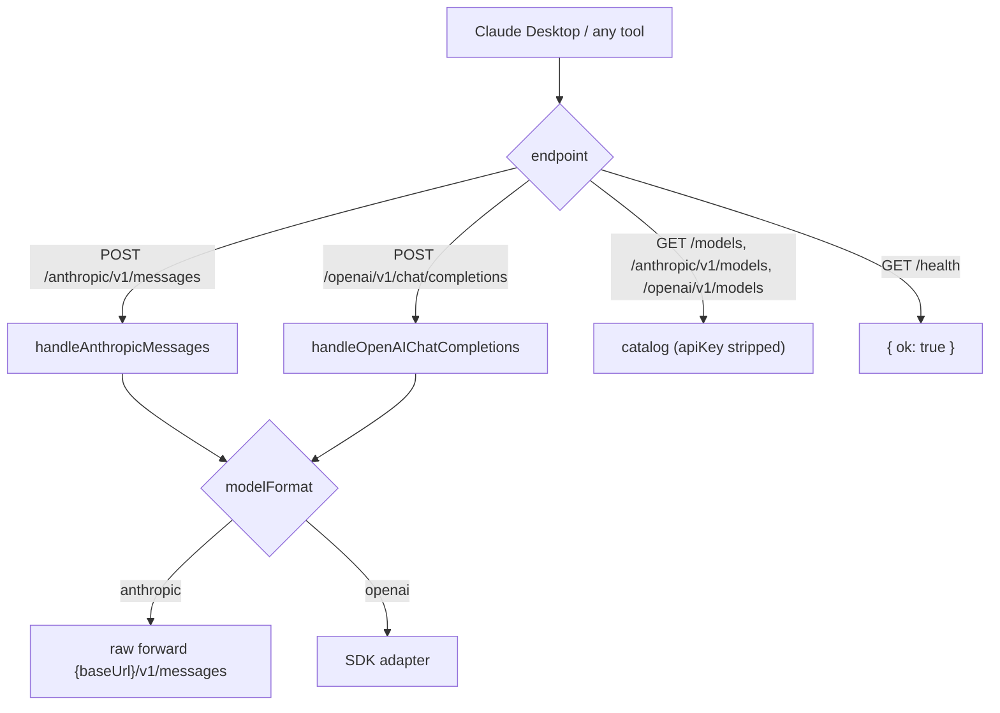

# The Server Gateway

> Category: Infrastructure | Version: 1.0 | Date: June 2026 | Status: Active

`rflectr server` runs a long-lived HTTP gateway that exposes registry/Zen/Go providers (or Claude on Vertex AI) behind Anthropic- and OpenAI-compatible endpoints. It's the backend for Claude Desktop and any tool that can point at a base URL. Read [`../ai/translation-layer.md`](../ai/translation-layer.md) for the translation it reuses.

**Related:**
- [`../integrations/harnesses.md`](../integrations/harnesses.md)
- [`../ai/translation-layer.md`](../ai/translation-layer.md)
- [`../security/credential-storage.md`](../security/credential-storage.md)
- Source: `src/server/` (`index.ts`, `router.ts`, `models.ts`, `vendor-mask.ts`, `vertex-config.ts`, `auth.ts`, `catalog-filter.ts`, `provider-select.ts`, `prompts.ts`)

---

## What it is

Where the launch commands are short-lived (start a proxy, run a child, tear down), `server` is a **foreground daemon**. `runServerCommand(options)` (`src/server/index.ts`) runs an interactive wizard (which providers to expose, optional favorites-only catalog, discovery-id masking, local vs network bind) and then `startServer()` (`src/server/router.ts`) listens on port **17645**.

It serves the same translation core as the CLI proxies — `handleAnthropicMessages` and `handleOpenAIChatCompletions` both end at `createLanguageModel` + the SDK adapter for openai-format models, or a raw forward for anthropic-format models, with a per-`(model × npm × baseURL)` `LanguageModel` cache.

---

## Endpoints

| Method + path | Purpose |
|---|---|
| `GET /health` | `{ ok: true }` |
| `GET /models` | Raw catalog, `apiKey` stripped |
| `GET /anthropic/v1/models` | Anthropic-format list (optionally masked) |
| `GET /openai/v1/models` | OpenAI-format list |
| `POST /anthropic/v1/messages` | Anthropic Messages relay |
| `POST /openai/v1/chat/completions` | OpenAI Chat Completions relay |

Base URLs for clients:

- Anthropic: `ANTHROPIC_BASE_URL=http://127.0.0.1:17645/anthropic`
- OpenAI: `OPENAI_BASE_URL=http://127.0.0.1:17645/openai/v1`

---

## Model catalog & gateway aliases

`loadServerModels()` (`src/server/index.ts`) assembles `ServerModelInfo[]` from Zen/Go models plus every materialized local provider, enriching each with reasoning metadata (`enrichServerModelReasoning` adds `defaultEffort`). `createGatewayModelCatalog(models, opts?)` (`src/server/models.ts`) builds a bidirectional lookup keyed by `model.id` and by gateway alias.

Helpers in `src/server/models.ts`:

- `gatewayAliasId(model)` / `exposedGatewayAliasId(model, opts?)` — canonical alias `anthropic-{provider}__{model}` (via `aliasModelId`), masked or not.
- `gatewayDisplayName(model, opts?)` — "Model Name" or "Model Name (Provider Label)" when masked.
- `upstreamModelId(model)` — strips the `[1m]` context suffix for the wire call.
- `formatGatewayAnthropicModels` / `formatOpenAIModels` — endpoint payloads.

Filtering (`src/server/catalog-filter.ts`): `filterServerModelsByProviders`, `filterServerModelsByFavorites`, `summarizeServerProviders` (human summary like "OpenCode Zen (5), Groq (3)").

### Discovery-id masking

For Claude Desktop / Cowork, exposing raw vendor model ids may be undesirable. When the wizard enables masking (`gateway.maskGatewayIds = true`), `maskGatewayModelId(aliasId)` (`src/server/vendor-mask.ts`) reverses the provider-slug and model-suffix segments to hide vendor names; it is **self-inverse** (`unmaskGatewayModelId` is the same operation). The response `model` field is also set to the masked `gatewayDisplayName`. Example: `anthropic-openai__gpt-4o` → a reversed-segment alias.

---

## Vertex AI mode (`--vertex`)

`rflectr server --vertex` exposes **Claude on Google Vertex AI** using local gcloud Application Default Credentials — no OpenCode API key. `src/server/vertex-config.ts`:

- `buildVertexRuntimeConfig(env?)` reads the project (`ANTHROPIC_VERTEX_PROJECT_ID` → `GOOGLE_CLOUD_PROJECT` → `GOOGLE_VERTEX_PROJECT`) and location (`GOOGLE_CLOUD_LOCATION` → `CLOUD_ML_REGION` → `GOOGLE_VERTEX_LOCATION` → `global`).
- `hasApplicationDefaultCredentials()` checks `GOOGLE_APPLICATION_CREDENTIALS` or `~/.config/gcloud/application_default_credentials.json`.
- `vertexModelsToServerModels(config)` / `createVertexModelCatalog(models)` build the catalog with short aliases (`sonnet` / `haiku` / `opus`) and `[1m]` context variants. Defaults: `claude-sonnet-4-6`, `claude-opus-4-6`, `claude-haiku-4-5`. An optional catalog override lives at `~/.rflectr/vertex-models.json` (see `assets/vertex-models.example.json`).

The models route through `@ai-sdk/google-vertex/anthropic` (`VERTEX_ANTHROPIC_NPM`) — see [`../ai/translation-layer.md`](../ai/translation-layer.md).

---

## Auth

`isAuthorized(request, serverPassword)` (`src/server/auth.ts`) accepts a `Bearer` token or `x-api-key` header and compares it to the configured server password. A `null` password (local mode) allows all callers. `extractBearerToken` and `sanitizeCredential` (first-line only) harden header parsing. In **network mode** the wizard requires a server password; it is the only gate once the port is reachable beyond localhost, so treat it as a real secret. See [`../security/credential-storage.md`](../security/credential-storage.md#server-mode-caveat).
