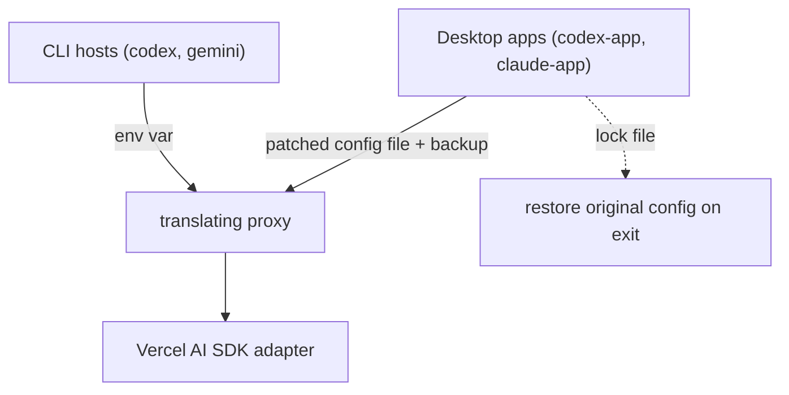

# Host Harnesses: Codex, Gemini, and the Desktop Apps

> Category: Integrations | Version: 1.0 | Date: June 2026 | Status: Active

How `rflectr` wires each non-Claude-Code host to a translating proxy. The Claude Code flow is in [`../architecture/launch-flow-claude.md`](../architecture/launch-flow-claude.md); this doc covers Codex CLI, Codex desktop, Gemini CLI, and Claude Desktop. Read [`local-proxy.md`](local-proxy.md) first.

**Related:**
- [`local-proxy.md`](local-proxy.md)
- [`../infrastructure/server-gateway.md`](../infrastructure/server-gateway.md)
- [`../ai/translation-layer.md`](../ai/translation-layer.md)
- Source: `src/codex.ts`, `src/codex/`, `src/codex-app.ts`, `src/codex-proxy.ts`, `src/codex-responses-adapter.ts`, `src/gemini.ts`, `src/gemini/`, `src/gemini-proxy.ts`, `src/claude-app.ts`, `src/claude-desktop/`

---

## The pattern, and where each host departs from it

Every host follows the same skeleton: find the binary → resolve provider+model → start a proxy that speaks the host's wire format → launch the child with env (CLIs) or a patched config (apps) pointing at the proxy → restore/cleanup on exit. The differences are in *how the host is pointed at the proxy* and *whether config files must be written and restored*.

---

## Codex CLI — `rflectr codex`

Entry: `runCodexCommand` (`src/codex.ts`). Codex speaks the **OpenAI Responses API**.

- **Binary:** `findCodexBinary()` (`src/codex/launch.ts`).
- **Proxy:** `startCodexProxy(routes, { requireAuth: true })` (`src/codex-proxy.ts`) serves `POST /v1/responses`, translating through `src/codex-responses-adapter.ts` (`translateResponsesRequest` → SDK params; `streamResponsesResponse` / `generateResponsesResponse` → Responses SSE/JSON).
- **Profile:** a TOML overlay (`buildCodexProfileToml`, `src/codex/profile.ts`) written to `~/.codex/rflectr-launch.config.toml`. It defines a `model_providers.rflectr-proxy` block whose `base_url = http://127.0.0.1:<port>/v1`, `wire_api = "responses"`, and `env_key = "RFLECTR_CODEX_KEY"`. Codex is launched with `--profile rflectr-launch -m <modelId>`.
- **Catalog:** `~/.rflectr/codex/models-<providerId>.json` (single) or `models-favorites.json` (favorites mode), via `src/codex/catalog.ts`.
- **Env:** `RFLECTR_CODEX_KEY=proxy-local` for proxy-tier routes; direct providers get their real key via `codexProviderEnvKey()` (`src/codex/routing.ts`).
- **Sandbox:** default `danger-full-access` (`CODEX_LAUNCH_SANDBOX`, `src/codex/profile.ts`).

**Favorites catalog mode:** when `prefs.favoriteModels.length > 0`, Codex resolves each favorite via the shared `src/favorites-resolver.ts` (filtering by an `agent: 'codex'` blacklist — Zen/Go favorites are skipped, since Codex has no gateway path for them), builds a `CodexProxyRoute[]`, and starts a single multi-route proxy. Catalog slugs are `${providerId}__${modelId}`.

---

## Codex desktop app — `rflectr codex-app`

Entry: `runCodexAppCommand` (`src/codex-app.ts`). The app can't inherit env, so its config is patched in place and restored on exit.

- **Config patch:** `applyAppConfigPatch` (`src/codex/app-config.ts`) edits `~/.codex/config.toml`, writing `model`, `model_provider = 'openai'`, `openai_base_url`, `model_catalog_json`, and `model_context_window` (`buildCodexAppRootConfig`, `src/codex/app-profile.ts`). Display model defaults to `CODEX_APP_DISPLAY_MODEL = 'gpt-5.5'`.
- **Backup + lock:** the original `config.toml` is copied to `config.toml.bak`; a lock file `~/.codex/.rflectr.lock.json` records `pid`, `configPath`, `catalogPaths`, `backupPath`, and `proxyPort`. `restoreCodexAppOverlay` (`src/codex/app-session.ts`) restores the backup on exit or recovery.
- **Catalog:** `app-models-<providerId>.json` / `app-models-favorites.json`.
- **Proxy:** same `startCodexProxy`, but `requireAuth: false` (the app cannot send the proxy token).
- **`--restore`** globs `app-models-*.json` to clean up prior sessions.

---

## Gemini CLI — `rflectr gemini`

Entry: `runGeminiCommand` (`src/gemini.ts`). Gemini speaks the **Gemini REST protocol**, and every model is routed through the proxy.

- **Binary:** `findGeminiBinary()` (`src/gemini/launch.ts`).
- **Proxy:** `startGeminiProxy(routes, debug?)` (`src/gemini-proxy.ts`) serves `GET /v1beta/models`, `GET /v1beta/models/<model>`, and `POST /v1beta/models/<model>:generateContent` / `:streamGenerateContent`. `translateGeminiRequest` extracts the system instruction, contents, tools, and generation config, and strips the Gemini-CLI-injected identity. Parts are parsed by `src/gemini-parts.ts`.
- **Env:** `buildGeminiChildEnv` (`src/gemini/launch.ts`) sets `GOOGLE_GEMINI_BASE_URL=http://127.0.0.1:<port>` and `GEMINI_API_KEY=<random proxy token>`, and clears conflicting `GOOGLE_GENAI_API_KEY` / `GOOGLE_API_KEY`.
- **Mid-session switch:** the proxy intercepts a `.model <id>` command to switch routes without restarting.

---

## Claude Desktop — `rflectr claude-app`

Entry: `runClaudeAppCommand` (`src/claude-app.ts`). Claude Desktop has a first-class "inference gateway" config, so instead of a per-protocol proxy it is pointed at the full **`server` gateway** (see [`../infrastructure/server-gateway.md`](../infrastructure/server-gateway.md)).

- **App discovery/launch:** `src/claude-desktop/app-launch.ts` finds `Claude.app` (macOS) or `Claude.exe` (Windows) and `launchOrRestartClaudeApp()`. macOS/Windows only (`claudeAppSupported()`).
- **Gateway injection:** a config `<uuid>.json` is written into the Claude Desktop **3P config library** — `~/Library/Application Support/Claude-3p/configLibrary/` (macOS) or `%LOCALAPPDATA%\Claude-3p\configLibrary\` (Windows) — with `inferenceProvider: 'gateway'`, `inferenceGatewayBaseUrl: http://127.0.0.1:<port>/anthropic`, `inferenceGatewayApiKey: 'dummy'`, `inferenceGatewayAuthScheme: 'bearer'`, and `coworkEgressAllowedHosts`. A `_meta.json` points `appliedId` at the new uuid (`src/claude-desktop/app-config.ts`).
- **Backup + lock:** `_meta.json.bak` is created before the patch; a `.rflectr.lock` records `pid`, `uuid`, `proxyPort`. On exit or recovery, `cleanupSession(uuid)` / `recoverSession()` (`src/claude-desktop/app-session.ts`) restore the backup and remove the injected config.
- **Gateway:** the in-process `startServer()` serves `/anthropic` with `createGatewayModelCatalog()`; favorites filter via `filterServerModelsByFavorites`, or a single selected model.

---

## Platform differences (apps)

| Concern | macOS | Windows |
|---|---|---|
| Claude Desktop config root | `~/Library/Application Support/Claude-3p/` | `%LOCALAPPDATA%\Claude-3p\` |
| App launch | `open` / `open -b <bundle id>` | direct `.exe` exec / registry lookup |
| "Is it running?" | `osascript` | PowerShell `Get-Process` |
| CLI binary discovery | `which` + fallbacks | `where` + `.cmd` priority + `%APPDATA%\npm\` |

All proxies bind `127.0.0.1:0` on both platforms (Node `http.createServer`).
