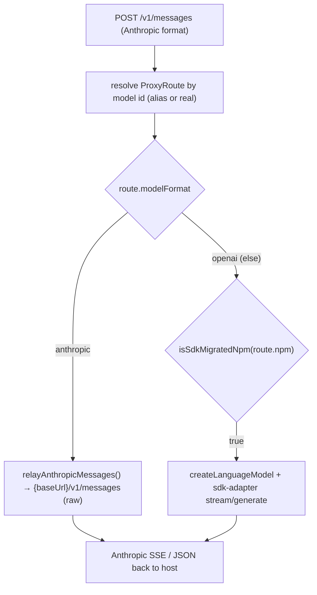

# The Local Proxy

> Category: Integrations | Version: 1.0 | Date: June 2026 | Status: Active

The throwaway HTTP server that sits between a host tool and the upstream model. This doc covers `src/proxy.ts` (the Anthropic-facing proxy) and its routing model; the Codex and Gemini variants are summarized in [`harnesses.md`](harnesses.md). Read [`../ai/translation-layer.md`](../ai/translation-layer.md) for what the proxy delegates to.

**Related:**
- [`harnesses.md`](harnesses.md)
- [`../ai/translation-layer.md`](../ai/translation-layer.md)
- [`../architecture/launch-flow-claude.md`](../architecture/launch-flow-claude.md)
- Source: `src/proxy.ts`, `src/proxy-shared.ts`, `src/proxy-types.ts`, `src/upstream-forward.ts`

---

## What it is

A local HTTP server on `127.0.0.1:<random ephemeral port>` (bind to port `0`, let the OS choose) that accepts Anthropic-format requests at `/v1/messages` and serves a synthetic `GET /v1/models`. The host tool is pointed at it via `ANTHROPIC_BASE_URL=http://127.0.0.1:<port>`. It is created at launch and torn down (`proxyHandle.close()`) when the host process exits.

Two entry points:

- `startProxy(completionsUrl, modelId, debug, contextWindow?, sdk?, apiKey?)` — single-model wrapper.
- `startProxyCatalog(routes, startingAliasId, debug)` — multi-route catalog for switch-menu sessions.

`startProxy` is just `startProxyCatalog` with one route. Both return a `ProxyHandle` (`{ port, token, close() }`); the `token` becomes the child's `ANTHROPIC_API_KEY`, so only the launched child can call the proxy.

---

## Per-request dispatch

Each `ProxyRoute` carries everything needed to serve it: `aliasId`, `realModelId`, `displayName`, `upstreamUrl` / `baseURL`, `apiKey`, `modelFormat`, `contextWindow`, `npm`, `providerId`, `authType`, `oauthAccountId`, `supportedParameters`, `reasoning`, `interleavedReasoningField`.

- `modelFormat === 'anthropic'` → direct passthrough via `relayAnthropicMessages` (`src/upstream-forward.ts`), which builds Anthropic auth headers (`anthropicUpstreamHeaders`) and relays both streaming and non-streaming.
- otherwise → the SDK adapter (`createLanguageModel` + `streamAnthropicResponse` / `generateAnthropicResponse`).

`src/upstream-forward.ts` is shared by both the proxy and the `server` command's router, so the raw-forward path is identical in both. `UpstreamUnreachableError` distinguishes a network failure from an upstream error response.

---

## aliasModelId — making ids gateway-safe

Claude Code's gateway model discovery rejects model ids that don't look like provider-prefixed gateway ids. `aliasModelId(realId, providerId)` (`src/proxy.ts`) rewrites any non-`claude-*` id to the form `anthropic-{provider}__{id}` (e.g. `anthropic-opencode-go__deepseek-v4-flash`). `claude-*` ids pass through unchanged. This is why, after a switch-menu session, a bare `claude` may show a relay alias in `/model` — Claude Code cached the gateway id (see [`../security/credential-storage.md`](../security/credential-storage.md)).

The synthetic `GET /v1/models` returns one entry per route, each formatted by `formatAnthropicModelEntry` with `context_window` so the host's status bar is accurate (single-model mode only; the gateway-discovery payload carries no window).

---

## Shared translation helpers

`src/proxy-shared.ts` holds the format-agnostic glue reused across the Anthropic, Responses, and Gemini proxies:

- `sseChunk()` — formats one SSE event.
- `encodeToolUseId()` / `splitToolUseId()` — round-trip a `thought_signature` through a tool-use id as `{id}::ts::{signature}` (see [`../ai/translation-layer.md`](../ai/translation-layer.md#the-thought_signature-round-trip)).
- `grabRoundTripSignature()` — pull the Google/OpenAI signature off a stream part.
- `parseToolArguments()` — tolerant JSON parse of tool-call args.
- `serializeToolResultContent()` — normalize tool-result content blocks.
- `silenceSdkWarnings()` — suppress noisy SDK debug logging.
- `FullStreamPart` — the unified stream-chunk type the adapters map onto.

`src/proxy-types.ts` defines the Anthropic and Gemini request/response shapes (`AnthropicMessageRequest`, `AnthropicContentBlock`, `GeminiPart`, `GeminiFunctionCall`, …).

---

## Variants

The Codex and Gemini hosts speak different wire formats, so they have sibling proxies that share `proxy-shared.ts` and `provider-factory.ts` but expose different endpoints:

- `src/codex-proxy.ts` — `startCodexProxy(routes, { requireAuth })`, endpoint `POST /v1/responses`, uses `src/codex-responses-adapter.ts`.
- `src/gemini-proxy.ts` — `startGeminiProxy(routes, debug?)`, endpoints `GET /v1beta/models` and `POST /v1beta/models/<model>:generateContent` / `:streamGenerateContent`.

See [`harnesses.md`](harnesses.md) for how each host is wired to its proxy.
