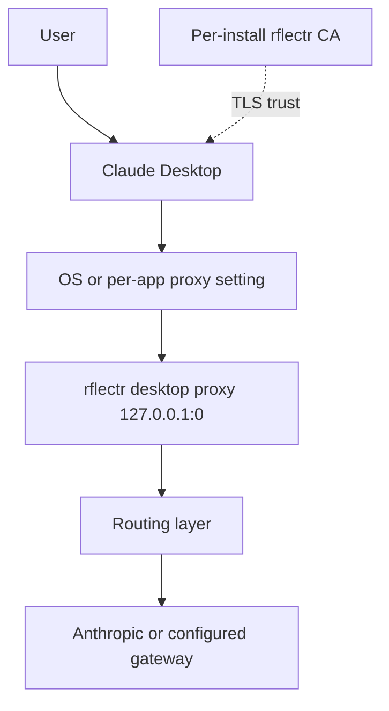
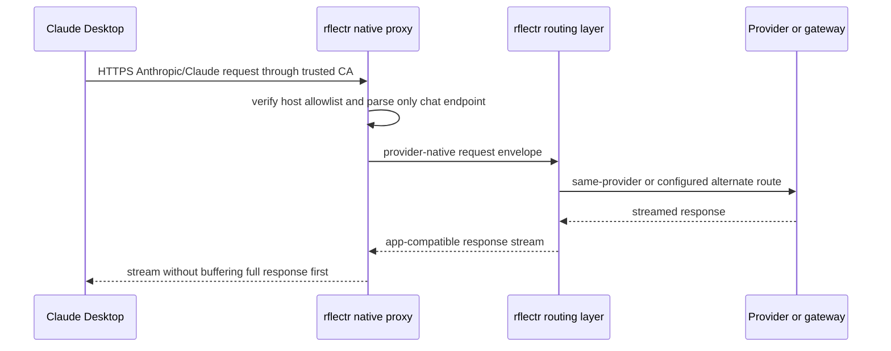

# Native Desktop Interception

> Category: Integrations | Version: 1.0 | Date: June 2026 | Status: Active

How rflectr will attach to sealed desktop apps through a local proxy and trusted CA instead of forcing them into gateway-config mode.

**Related:**
- [`harnesses.md`](harnesses.md)
- [`local-proxy.md`](local-proxy.md)
- [`../security/desktop-egress-and-trust.md`](../security/desktop-egress-and-trust.md)
- [`../architecture/ADR-001-data-path-owner-attach-mechanisms.md`](../architecture/ADR-001-data-path-owner-attach-mechanisms.md)
- [`../architecture/ADR-002-native-desktop-interception.md`](../architecture/ADR-002-native-desktop-interception.md)

---

## Why this exists

Claude Desktop is not Claude Code. Claude Code cleanly honors `ANTHROPIC_BASE_URL`; Claude Desktop is a sealed desktop app whose native chat behavior is built around its own Anthropic and Claude backend traffic. The current rflectr 3P gateway path can point Claude Desktop at another provider, but that path changes the app mode and can feel visually or behaviorally wrong.

Native desktop interception adopts the old rflectr design: keep the app on the path it already knows, then put rflectr on that path as a local proxy. The app still opens its normal provider connection. rflectr observes, routes, and later can guard or capture that stream.

---

## Attach mechanism

The proxy binds to an ephemeral loopback port. The install flow records that port and configures the target app, or the narrowest available OS proxy scope, to use it. The trusted CA lets the proxy terminate TLS for verified provider hosts. If an app pins certificates or ignores the proxy, rflectr must not enable native interception for that app/OS pair.

---

## Current implementation gap

Current source files implement config/profile redirects, not native desktop interception:

| Current file | Current role | Native interception change |
|---|---|---|
| `src/claude-app.ts` | CLI entry for legacy Claude Desktop 3P gateway mode | Keep as legacy path; add native mode command path or replacement command |
| `src/claude-desktop/app-config.ts` | Writes Claude 3P config library entries | Stop treating as primary; retain for legacy restore |
| `src/claude-desktop/app-session.ts` | Legacy config lock, backup, restore | Reuse ownership ideas for proxy install/uninstall state |
| `src/claude-desktop/app-launch.ts` | Finds and opens Claude Desktop | Reuse for native install/open/restart |
| `src/server/dashboard.ts` | Dashboard Desktop Apps DTO/actions | Add native interception status, trust state, install, stop, uninstall |
| `src/server/router.ts` | Dashboard endpoints and gateway router | Add native desktop action endpoints and proxy runtime ownership |
| `src/proxy.ts` / `src/upstream-forward.ts` | Anthropic local proxy and raw forward helpers | Reuse request/response translation ideas, but native proxy must support CONNECT/TLS interception |

The new subsystem should live under a new namespace such as `src/desktop-interception/` so the proxy/CA/OS-setting code does not get mixed into `src/server/router.ts` or the existing Anthropic/Codex protocol proxies.

---

## Verified old-system evidence

The imported old library includes a Windows Phase 0 result from June 17, 2026. It found:

- Claude Desktop traffic to `api.anthropic.com` and `claude.ai` was interceptable.
- ChatGPT Desktop traffic to `chatgpt.com` was interceptable.
- No in-scope host was classified as pinned or proxy-ignored.

That evidence is enough to justify new PRDs, but not enough to skip implementation verification. The new code must rerun a current verification flow because desktop apps can update independently.

---

## Routing order

Native desktop routing should preserve the app's expected wire shape at the app boundary.

The app-facing side should stay compatible with Claude Desktop. If the upstream route uses an alternate model, rflectr must translate internally and return an app-compatible Anthropic/Claude response.

---

## Known limitations

Native interception is not a free replacement for every app integration. It needs OS trust configuration, proxy configuration, app/OS verification, and careful uninstall behavior. It also sees sensitive traffic by design, so the security doc is part of the implementation contract, not optional reading.

The legacy Claude 3P gateway mode remains useful for users who explicitly want that mode or where native interception is unavailable. It is no longer the default future direction.
