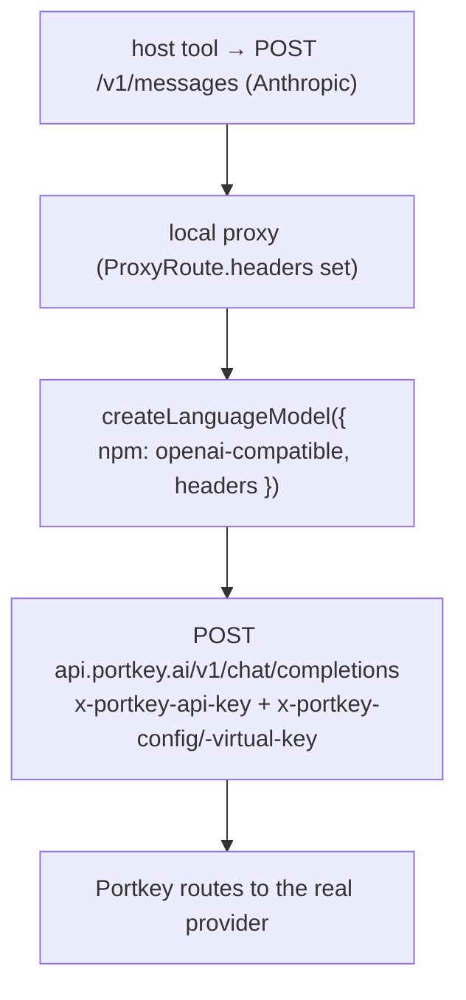

# Portkey AI Gateway

> Category: Integrations | Version: 0.1 | Date: June 2026 | Status: Draft

How rflectr fronts upstream models through [Portkey](https://portkey.ai), an AI gateway that adds routing, fallback, retry, caching, and governance via saved **Configs** and **Providers/Integrations** (formerly **Virtual Keys**). This doc describes the *planned* design specified in [PRD-013](../../../requirements/in-work/prd-013-portkey-gateway-integration/prd-013-portkey-gateway-integration-index.md); it is a Draft and tracks unbuilt work until that PRD ships.

**Related:**
- [PRD-013 — Portkey AI Gateway Integration](../../../requirements/in-work/prd-013-portkey-gateway-integration/prd-013-portkey-gateway-integration-index.md)
- [`local-proxy.md`](local-proxy.md) — the proxy that gains per-route headers
- [`../data/provider-registry.md`](../data/provider-registry.md) — the registry Portkey plugs into
- [`../ai/translation-layer.md`](../ai/translation-layer.md) — the SDK adapter Portkey routes through
- Target source: `src/registry/portkey/*` (new), `src/provider-templates.ts`, `src/provider-factory.ts`, `src/proxy.ts`, `src/registry/types.ts`

---

## What it is

Portkey is **one OpenAI- and Anthropic-compatible endpoint** (`https://api.portkey.ai/v1`) that proxies to dozens of upstream providers. A request authenticates with the master key in `x-portkey-api-key` and selects *what to route to* with **one** routing header:

| Header | Selects | rflectr source |
|---|---|---|
| `x-portkey-api-key` | The workspace/master key (the secret) | keyring `keyring:provider:portkey` |
| `x-portkey-config` | A saved **Config** (slug or id) — fallback/retry/cache/load-balance rules | user-selected Config |
| `x-portkey-virtual-key` | A saved **Virtual Key** (provider credential) | user-selected VK |
| `x-portkey-provider` | A **Provider/Integration** slug (Model Catalog) | derived from `@slug/model` ids |

Portkey serves three inference shapes: OpenAI `POST /v1/chat/completions`, OpenAI `POST /v1/responses`, and Anthropic `POST /v1/messages`.

The user experience: paste **one master Portkey API key**, and rflectr lists the user's Configs, Virtual Keys, and Models for selection — no manual base-URL or header entry.

---

## Why it needs new plumbing

Every other registry provider is identified by a single bearer credential. Portkey is different: it needs the master key **plus a routing header per request**, and rflectr's launch paths could not previously emit arbitrary headers — both `createLanguageModel` (the SDK adapter) and the Anthropic passthrough forward only one bearer / `x-api-key`.

So the integration's core is a **reusable primitive: per-route custom headers**, threaded the length of the launch path:

```text
CachedModel.headers (+ provider.api.headersTemplate)   [registry, non-secret]
  → materializeOne() injects x-portkey-api-key from keyring   [secret, never on disk]
  → LocalProviderModel.headers
  → ProxyRoute.headers
  → createLanguageModel({ headers })
  → createOpenAICompatible({ ..., headers })          [reaches the wire]
```

Any future header-routed provider reuses the same primitive.

---

## How it routes (the default path)

Portkey models register as **openai-format** (`npm: '@ai-sdk/openai-compatible'`, `apiBaseUrl: 'https://api.portkey.ai/v1'`), so they take the existing SDK-adapter proxy path with **zero new wire code** — `createOpenAICompatible` accepts a `headers` map, into which rflectr injects `x-portkey-api-key` + the chosen routing header.



Portkey *also* speaks Anthropic at `/v1/messages`, so an anthropic-format passthrough route is possible — but the direct single-model anthropic path lets the host talk to the upstream with no place to inject `x-portkey-config`. Making that work forces the traffic through the proxy so headers can be added in `relayAnthropicMessages`. That path is **reserved for the `server` gateway and future use**, not the default. See PRD-013 Option A vs B.

---

## Add flow (`rflectr providers add → Portkey`)

A `portkey` template (`modelSource: 'portkey-api'`) dispatches to a dedicated flow instead of the generic `fetchTemplateModels`:

1. Prompt the master key → resolve to `keyring:provider:portkey`.
2. Call the **control-plane client** (`src/registry/portkey/client.ts`, new):
   - `listConfigs(key)` → `GET /v1/configs` → `{ success, data: [{ id, name, slug, is_default, status, ... }] }`.
   - `listVirtualKeys(key)` → `GET /v1/virtual-keys` → `{ data: [{ name, slug }] }` *(deprecated upstream; tolerate 404 and fall back to Model-Catalog provider slugs)*.
   - `listModels(key, { config?|virtualKey?|provider? })` → `GET /v1/models` → OpenAI list (Model-Catalog ids look like `@openai-prod/gpt-4o`).
3. User picks a **routing target** (Config / Virtual Key / individual models), then the specific items.
4. Persist the credential + a `RegistryProvider{ id:'portkey' }` whose models carry routing headers.

The flow degrades gracefully: if Configs/VKs return empty or `403` (scope/plan limits), it falls back to "pick individual models" as long as `/v1/models` is reachable.

---

## Registry shape (additive)

No schema-version bump — all fields optional, parser ignores absent fields.

```ts
RegistryProvider.api.headersTemplate?: Record<string,string>  // non-secret, provider-wide
CachedModel.headers?:                  Record<string,string>  // non-secret, per-model (merged over template)
CachedModel.portkey?: { configSlug?; virtualKeySlug?; providerSlug? }  // display/refresh hint
LocalProviderModel.headers / ProxyRoute.headers / ProviderModelSpec.headers / ServerModelInfo.headers
```

**Secret invariant:** `x-portkey-api-key` is a *header value*, easy to leak. It is **never** written to `providers.json` — stored only at `keyring:provider:portkey`, injected into each Portkey model's `headers` at materialization, and all `x-portkey-*` values are redacted in trace logs (`redactTraceLine`).

---

## Launch surfaces

Because Portkey is a normal openai-format registry provider once configured, every surface that consumes the registry works after the `headers` field is threaded through its route builder:

- **`claude`** — single-model (`startProxy(..., { headers })`) and favorites catalog (`buildCatalogRoutes`).
- **`codex` / `gemini`** — via `favorites-resolver.ts` and each agent's proxy route builder.
- **`server`** — `ServerModelInfo.headers` → `createLanguageModel` in `handleAnthropicMessages`; the anthropic endpoint uses the passthrough-header path.

---

## Known limitations

- **Read-only.** rflectr lists and selects Configs/VKs/Models; it never creates or edits them (management stays in the Portkey dashboard).
- **Scope variance.** Configs/Virtual-Keys listing may require admin/org scope or a paid plan; the add flow falls back to model selection.
- **Virtual Keys deprecation.** Portkey is migrating VKs → Integrations/Providers (Model Catalog, `@slug/model`); `/v1/virtual-keys` is treated as best-effort.
- **Cost display.** Like all non-Anthropic providers, Claude Code shows inaccurate cost for Portkey-routed models (see [`../data/provider-registry.md`](../data/provider-registry.md)).
