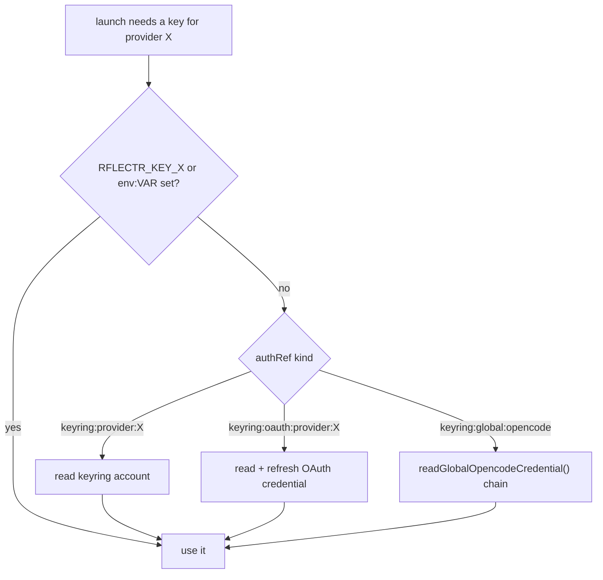
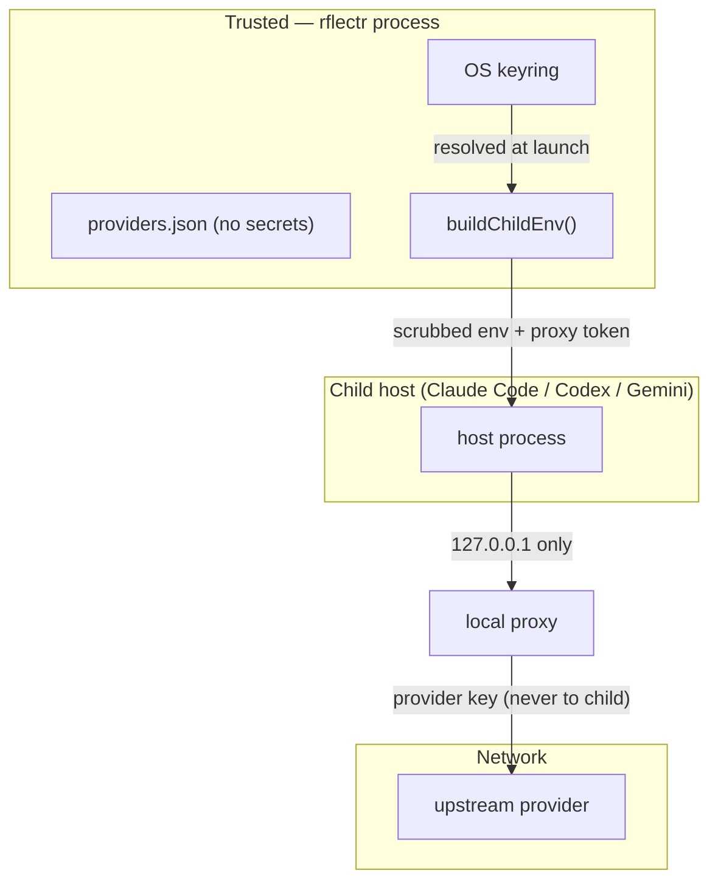

# Credential Storage & Environment Isolation

> Category: Security | Version: 1.0 | Date: June 2026 | Status: Active

Where secrets live, how they're resolved at launch, and the exact environment contract handed to each child process. This is the security-critical surface of `rflectr`. Read [`../architecture/system-overview.md`](../architecture/system-overview.md) first.

**Related:**
- [`../auth/oauth-device-flows.md`](../auth/oauth-device-flows.md)
- [`../data/provider-registry.md`](../data/provider-registry.md)
- [`../architecture/launch-flow-claude.md`](../architecture/launch-flow-claude.md)
- Source: `src/env.ts`, `src/key-setup.ts`, `src/constants.ts`

---

## Where secrets live

Secrets are **never** written to `providers.json` or `config.json`. Those files hold only an `authRef` pointer. The actual secret lives in one of three places, resolved in priority order by `resolveProviderCredential(providerId, authRef)` (`src/env.ts`):

1. **Env var** — `RFLECTR_KEY_<PROVIDER_ID_UPPER>` (highest priority), or whatever `env:VAR_NAME` the `authRef` names (e.g. `env:OPENCODE_API_KEY`).
2. **OS keyring** — via `@napi-rs/keyring`, service `rflectr`. Accounts:
   - `provider:<id>` — an API key.
   - `oauth:provider:<id>` — a JSON `StoredOAuthCredential` (see [`../auth/oauth-device-flows.md`](../auth/oauth-device-flows.md)).
   - `global:opencode` — the shared OpenCode Zen/Go key.
3. **Legacy keyring entries** — `rflectr` / `opencode-starter` accounts, auto-migrated on first successful read.

`@napi-rs/keyring` is an `optionalDependency` loaded via dynamic `import()`, so a missing native binary degrades gracefully rather than crashing. `classifyKeyringError(err)` turns native failures into human messages ("Secret Service daemon is not running", "keychain access was denied or the keychain is locked", "native keyring module not available", …).



### The OpenCode Zen/Go fallback chain

`readGlobalOpencodeCredential()` tries, in order: `OPENCODE_API_KEY` env var → keyring `global:opencode` → legacy keyring `rflectr` → oldest legacy service `opencode-starter`. On a successful legacy read, `migrateGlobalOpencodeCredential()` rewrites it to `global:opencode` using a **read → write → verify → delete** protocol (the old entry is only deleted after the new one verifies).

---

## Child process environment

`buildChildEnv(baseUrl, model, apiKey, proxyPort?, contextWindow?, enableGatewayDiscovery?)` (`src/env.ts`) builds the env for the launched host. It is the security boundary: the parent shell is never mutated (except `OPENCODE_API_KEY` during interactive key setup).

**Removed** — every var in `CONFLICTING_ENV_VARS` (`src/constants.ts`), so stale cloud config can't leak into the child:

```
CLAUDE_CODE_USE_VERTEX, ANTHROPIC_VERTEX_PROJECT_ID, ANTHROPIC_VERTEX_BASE_URL,
CLOUD_ML_REGION, ANTHROPIC_BEDROCK_BASE_URL, ANTHROPIC_AWS_BASE_URL,
ANTHROPIC_AWS_API_KEY, ANTHROPIC_AWS_WORKSPACE_ID, ANTHROPIC_FOUNDRY_API_KEY,
ANTHROPIC_FOUNDRY_BASE_URL, ANTHROPIC_AUTH_TOKEN, ANTHROPIC_API_KEY,
ANTHROPIC_BASE_URL, ANTHROPIC_MODEL, ANTHROPIC_DEFAULT_OPUS_MODEL,
ANTHROPIC_DEFAULT_SONNET_MODEL, ANTHROPIC_DEFAULT_HAIKU_MODEL
```

**Set:**

| Var | Value |
|---|---|
| `ANTHROPIC_BASE_URL` | `http://127.0.0.1:<proxyPort>` when a proxy is used, else `baseUrl` (which must **not** end in `/v1`) |
| `ANTHROPIC_API_KEY` | the provider key, or the proxy token when proxying |
| `ANTHROPIC_MODEL` | `claudeCodeClientModelId(stripOneMContextSuffix(model), contextWindow)` |
| `CLAUDE_CODE_MAX_CONTEXT_TOKENS` | `resolveContextWindow(bareModel, contextWindow)` |
| `CLAUDE_CODE_ENABLE_GATEWAY_MODEL_DISCOVERY` | `1` when `enableGatewayDiscovery` (switch-menu mode) |
| `ENABLE_TOOL_SEARCH` | `true` — defer MCP tools like native Claude Code (`applyClaudeCodeThirdPartyCompat`) |
| `CLAUDE_CODE_SIMPLE_SYSTEM_PROMPT` | `0` — keep the full system prompt on proxy routes |

On the **anthropic direct-passthrough** path, the single-model launch additionally sets `CLAUDE_CODE_DISABLE_EXPERIMENTAL_BETAS=1` to strip beta headers on the direct hop. On proxy routes the betas stay enabled so tool search works through the local proxy.

`detectConflicts()` reports which of these vars were present (shown in `--dry-run` and warnings) so a user can see what was scrubbed.

---

## Interactive key setup

`resolveOrCollectApiKey(simulate?, trace?)` (`src/key-setup.ts`) is called for the OpenCode Zen/Go key. On startup it silently calls the credential-store read first — if a key is found, no prompt appears. Otherwise it prompts for paste and offers platform-specific save options. In every case `process.env['OPENCODE_API_KEY']` is set immediately so the key is live for the current session regardless of save choice.

| Platform | Options |
|---|---|
| **macOS** | Keychain only · Keychain + `~/.zshrc` autoload · shell profile (plaintext) · session only |
| **Windows** | Credential Manager · `setx` user env var (plaintext) · session only |
| **Linux desktop** | Secret Service (GNOME Keyring / KWallet) · shell profile (plaintext) · session only |
| **Linux headless** | shell profile · session only (with a note explaining why secure storage is unavailable) |

Notes:

- The macOS autoload line uses the `security` CLI directly so the shell can source it: `export OPENCODE_API_KEY="$(security find-generic-password -s rflectr -a rflectr -w 2>/dev/null)"`.
- `setx` is invoked with piped stdio to suppress its "SUCCESS" stdout.
- Secret Service availability is probed with a test `getPassword()` (`isSecretServiceAvailable()`); if the daemon isn't running the option is hidden.
- `detectShellProfile()` chooses the right profile file per platform/shell (`~/.zshrc`, `~/.bash_profile`, `~/.bashrc`, `~/.profile`).

---

## Trust boundaries



Key properties:

- The **provider's real key never reaches the child** when proxying — the child gets a random proxy token; the proxy holds the real key and calls upstream.
- The proxy binds `127.0.0.1` only, on a random port, and validates the token, so other local processes can't use it.
- Secrets are keyring-backed by default; plaintext options (`setx`, shell profile) are opt-in and clearly labelled.

### Server-mode caveat

The `server` command can bind in network mode and asks for a server password (`isAuthorized`, `sanitizeCredential` in `src/server/auth.ts`). When exposed beyond localhost, that password is the only gate — see [`../infrastructure/server-gateway.md`](../infrastructure/server-gateway.md).
