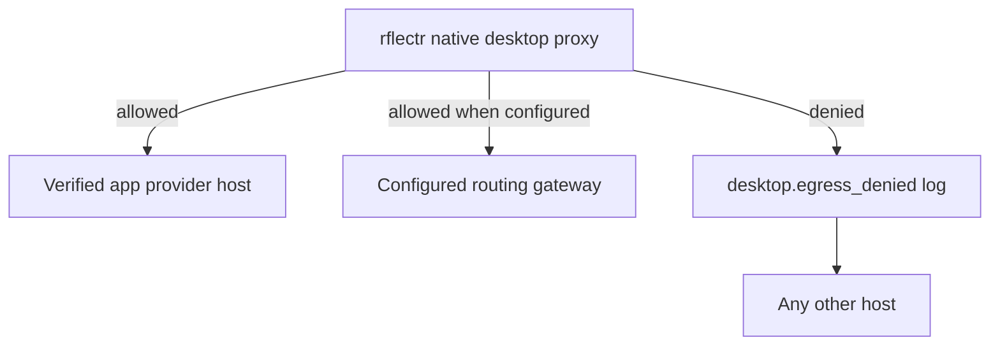

# Desktop Egress and Trust

> Category: Security | Version: 1.0 | Date: June 2026 | Status: Active

The security contract for native desktop interception: explicit consent, local trust, bounded egress, and reversible cleanup.

**Related:**
- [`../integrations/native-desktop-interception.md`](../integrations/native-desktop-interception.md)
- [`../architecture/ADR-003-local-trust-egress-consent.md`](../architecture/ADR-003-local-trust-egress-consent.md)
- [`credential-storage.md`](credential-storage.md)
- [`../infrastructure/server-gateway.md`](../infrastructure/server-gateway.md)

---

## Why this trust boundary matters

Native desktop interception terminates TLS locally for a user's own desktop app traffic. That means the rflectr process can see request bodies, response bodies, authorization headers, cookies, and provider-specific metadata for the intercepted hosts. The design must say this plainly.

The mitigation is not pretending the proxy cannot see sensitive data. The mitigation is narrowing scope, requiring consent, redacting secrets, proving egress, and making uninstall reliable.

---

## Required controls

| Control | Requirement | Owning PRD |
|---|---|---|
| Explicit consent | User confirms before CA install or proxy routing | PRD-021 / PRD-023 |
| Per-install CA | Local CA unique to this machine; removable by rflectr | PRD-021 |
| Narrow proxy scope | Prefer per-app proxy; system proxy only as fallback | PRD-021 |
| Egress allowlist | Forward only verified provider/gateway hosts | PRD-021 |
| Secret redaction | Never log or render auth headers, cookies, tokens, API keys | PRD-021 / PRD-023 |
| Reversible uninstall | Remove proxy settings, CA trust, owned state, and runtime listeners | PRD-023 |
| Empirical verification | App/OS pair must pass proxy/no-pinning check before enabling | PRD-022 |

---

## Egress model

Loopback is allowed for rflectr-owned control traffic. Provider hosts are allowed only after verification. Gateway hosts are allowed only when routing is configured. Future memory or policy hosts must be added deliberately by a later ADR/PRD.

---

## Secret handling

The proxy may receive headers it must forward but must not store:

- `authorization`
- `cookie`
- `x-api-key`
- provider session headers
- bearer tokens
- API keys in query strings or JSON payloads

Logs, dashboard DTOs, activity rows, test fixtures, and error payloads must redact those values. Tests should include representative headers and assert they do not appear in output.

---

## Consent language requirements

The install flow and dashboard must explain:

1. rflectr will install a local trusted certificate for this user.
2. rflectr will route selected desktop app traffic through a local proxy.
3. rflectr can see intercepted request and response contents for allowed hosts.
4. rflectr will not log secrets or send traffic to unapproved hosts.
5. The user can stop interception and uninstall the CA/proxy configuration.

This text belongs in product UI and CLI prompts, not only in documentation.

---

## Failure behavior

Native interception should fail loudly and recoverably:

| Failure | Expected behavior |
|---|---|
| CA missing or untrusted | Interception disabled; dashboard offers repair/uninstall |
| App pins certificate | App/OS marked unsupported; do not keep retrying |
| Proxy process stops | Dashboard shows stopped; app proxy setting can be reverted |
| Egress host denied | Request fails with clear local error; denied host logged without secrets |
| Routing upstream fails | App receives compatible error; no silent wrong-provider fallback |

The product rule is simple: never strand the user's desktop app in a proxy/trust state the dashboard cannot explain or reverse.
