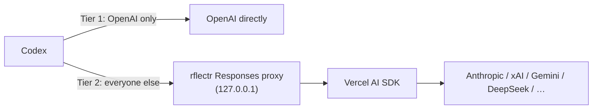

# Codex

> Category: Guide | Version: 1.0 | Date: June 2026 | Status: Active

Use **OpenAI Codex** — the terminal CLI or the desktop app — with any model from your rflectr registry: Anthropic, xAI, Google Gemini, Nvidia, DeepSeek, OpenAI, and more.

| Command | Launches | Config target |
|---|---|---|
| `rflectr codex` | Codex **terminal** (TUI) | A temporary sidecar profile — never touches your main Codex config. |
| `rflectr codex-app` | Codex **desktop app** (macOS / Windows) | Patches `~/.codex/config.toml` with a backup; restored on `Ctrl+C`. |

Both use the same registry (`~/.rflectr/providers.json`) and provider picker. The CLI uses OpenAI directly when possible; the desktop app always uses the local Responses proxy so it can keep Codex's built-in provider identity and preserve history visibility.

> 📖 Full flags: `rflectr codex --help` and `rflectr codex-app --help`.
> 🤖 Automating it? See [AI Agents & automation](ai-agents.md) or run `rflectr --ai`.

---

## Prerequisites

1. **rflectr** on your PATH (`npm install -g @legioncodeinc/rflectr`, or `npm run build && npm link` locally).
2. **At least one provider:** `rflectr providers add` (or `rflectr providers import`).
3. **Codex installed:**
   - CLI: `npm install -g @openai/codex` (for `rflectr codex`)
   - Desktop: [Codex for macOS or Windows](https://developers.openai.com/codex/cli) (for `rflectr codex-app`)

Registry providers plus OpenCode Zen/Go cloud backends all route through rflectr's local Responses proxy.

---

## How it works

Codex speaks the **OpenAI Responses API** (`POST /v1/responses`). Most registry providers don't, so rflectr bridges the gap with a two-tier routing model:



| Tier | Providers | What rflectr does |
|---|---|---|
| **Tier 1 — Direct** | OpenAI (API key or ChatGPT OAuth) | Points Codex at OpenAI; no local proxy. |
| **Tier 2 — Proxy** | Anthropic, xAI, Gemini, Nvidia, DeepSeek, most others | Local server translates Responses ↔ upstream SDK. |

Your real API keys stay in rflectr (keychain / registry). The proxy holds them in memory for the session only.

---

## Codex CLI (`rflectr codex`)

### Quick start

```bash
rflectr codex
```

Pick provider → pick model → the Codex TUI opens. Under the hood rflectr runs `codex --profile rflectr-launch -m <model-id>`.

### Flags

| Flag | Purpose |
|---|---|
| *(none)* | Interactive launch. |
| `--restore` | Remove leftover CLI files after a crash. |
| `--config` | Write profile + catalog to disk, print paths, exit (no launch). |
| `--help` | Help text. |

rflectr manages `--profile` and `-m` / `--model`; pass any other Codex flag directly (no `--` needed):

```bash
rflectr codex -s workspace-write
```

### Files rflectr owns (CLI)

| File | Purpose |
|---|---|
| `~/.codex/rflectr-launch.config.toml` | Temporary profile for this session. |
| `~/.rflectr/codex/models-<provider>.json` | Model catalog. |
| `~/.rflectr/codex/session.json` | Session lock (one CLI session at a time). |

rflectr **never edits** `~/.codex/config.toml` for CLI launches — your personal Codex settings still apply.

### Cleanup (CLI)

| Situation | What happens |
|---|---|
| Normal exit (including `Ctrl+C` in Codex) | Overlay files removed automatically. |
| Crash / force-quit | Files may remain; next launch auto-recovers when possible. |
| Manual | `rflectr codex --restore`. |

### What rflectr injects (CLI)

| Variable | When | Why |
|---|---|---|
| `RFLECTR_CODEX_KEY=proxy-local` | Tier 2 only | Placeholder so Codex hits the local proxy; the real key stays in the proxy. |
| `OPENAI_API_KEY` (etc.) | Tier 1 OpenAI | Codex calls OpenAI natively. |

rflectr **strips CI env vars** (`CI`, `CODEX_CI`, `GITHUB_ACTIONS`, …) before spawning Codex so IDE terminals don't accidentally force read-only CI mode. `RFLECTR_CODEX_KEY` does **not** control sandbox policy.

### Sandbox and network (CLI)

Two layers people confuse:

1. **Codex's sandbox** — shell commands inside Codex (files, network, approvals). Lives in `~/.codex/config.toml` and Codex CLI flags.
2. **rflectr's proxy** — model API traffic only.

`rflectr codex` **defaults to `danger-full-access`** (set in both the launch profile and the spawn args) so shell tools (`curl`, `nlm`, npm, MCP CLIs) reach the network without passing `-s` each time. Override per session:

```bash
rflectr codex -s workspace-write
```

To change the sandbox for bare `codex` (without rflectr), edit `~/.codex/config.toml` yourself:

```toml
sandbox = "danger-full-access"
ask_for_approval = "never"

[shell_environment_policy]
inherit = "all"
```

On macOS, profile TOML alone may not be enough; rflectr also passes `-s danger-full-access` on spawn ([Codex #10390](https://github.com/openai/codex/issues/10390)).

---

## Codex desktop app (`rflectr codex-app`)

### Quick start

```bash
rflectr codex-app
```

Pick provider → pick model → the Codex **app** opens. **Keep the rflectr terminal open** until you're done — the app always uses the foreground proxy. Press **`Ctrl+C`** to stop the proxy and restore your previous Codex config.

**Platforms:** macOS and Windows (no Codex desktop app on Linux).

### Flags

| Flag | Purpose |
|---|---|
| *(none)* | Interactive launch + open app. |
| `--restore` | Restore `config.toml` and remove rflectr app files. |
| `--config` | **Preview only** — print the TOML that would be written; no disk writes, no app, no proxy. |
| `--help` | Help text. |

`--config` skips the picker and uses your last Codex provider/model (or the first compatible provider). The shown port `54321` is a placeholder; a real launch uses a random port.

### Files rflectr owns (App)

| File | Purpose |
|---|---|
| `~/.codex/config.toml` | **Patched while active** — restored on `Ctrl+C` or `--restore`. |
| `~/.rflectr/codex/app-models-<provider>.json` | Model catalog. |
| `~/.rflectr/codex/session-app.json` | App session lock. |
| `~/.rflectr/codex/app-restore-state.json` | Snapshot of your pre-session root keys (for surgical restore). |
| `~/.rflectr/codex/backups/config.toml.*.bak` | Rotating backups before each patch. |

CLI and App files are separate — running one after the other won't break the other.

### What gets written to `config.toml`

```toml
model = "claude-sonnet-4-6"
model_provider = "openai"
openai_base_url = "http://127.0.0.1:<random-port>/v1"
model_catalog_json = "/Users/you/.rflectr/codex/app-models-anthropic.json"
model_context_window = 1000000
model_auto_compact_token_limit = 700000
```

The app deliberately keeps `model_provider = "openai"` and redirects the built-in provider with `openai_base_url`. Codex records the provider on every local thread and filters history by provider; a separate custom provider would hide your existing OpenAI/ChatGPT threads while a rflectr session is active. No conversations are deleted. (See [Context management](#context-management) for the two context fields.)

### Cleanup (App)

| Situation | What to do |
|---|---|
| Normal end of session | `Ctrl+C` in the rflectr terminal → config restored, proxy stopped. |
| Codex already running | rflectr offers to **restart Codex** so new settings apply; decline and reopen manually if you prefer. |
| Crash / killed terminal | Next launch auto-recovers, or `rflectr codex-app --restore`. |
| Live session still running | `--restore` refuses until you `Ctrl+C` the other terminal. |

### App vs CLI — config safety

| | CLI | App |
|---|---|---|
| Touches `~/.codex/config.toml`? | **Never** | Yes, with backup + restore |
| Proxy lifetime | Until Codex CLI exits | Until **`Ctrl+C`** in the rflectr terminal |
| Picker every launch? | Yes (prefs pre-highlight last choice) | Yes |

---

## Favorites catalog mode

When you've saved favorites via `rflectr models`, both commands show your starting model + favorites in the mid-session picker. Zen/Go favorites are included when an OpenCode API key is available.

- **Slugs** — CLI uses `${providerId}__${modelId}` so models from different providers never collide. The App uses bare ids for single-provider catalogs and the same collision-safe slug for favorites.
- **Auth** — CLI favorites give the Codex child `OPENAI_API_KEY=proxy-local`; the app keeps its normal OpenAI login while `openai_base_url` points at the proxy. Either way the proxy holds the real credentials.
- **Warm-up** — with ~20 favorites across many providers, the first request may be slow as the proxy initializes one `LanguageModel` per favorite. Subsequent requests are fast.

---

## Reasoning effort

Codex shows a **reasoning-effort** picker when rflectr's catalog includes supported levels. rflectr fills `supported_reasoning_levels`, `default_reasoning_level`, and `supports_reasoning_summaries` from its reasoning resolver — provider metadata first, provider-specific rules second. You control effort in **Codex's native UI**; rflectr adds no menu of its own. For `codex-app`, an existing `model_reasoning_effort` in your config is **preserved**.

| Provider npm | Example models | Picker levels | Wire mapping |
|---|---|---|---|
| `@ai-sdk/anthropic` | claude-sonnet-4-6, claude-opus-4-6 | low, medium, high | SDK `thinking: adaptive` + `effort` |
| `@ai-sdk/openai` | gpt-5.5, gpt-5.4-codex | low, medium, high, xhigh | `reasoningEffort` on Responses API |
| `@ai-sdk/google` | gemini-2.5-pro, gemini-3-flash | low, medium, high | Gemini 2.5 → token budget; Gemini 3 → `thinkingLevel` |
| `@ai-sdk/mistral` | mistral-large, magistral-* | **high, off only** | `reasoningEffort: high \| none` |
| `@ai-sdk/xai` | grok-* | none, low, medium, high | `reasoningEffort` |
| `@openrouter/ai-sdk-provider` | z-ai/glm-5.2, models with `reasoning` support | none, minimal, low, medium, high, xhigh | `providerOptions.openrouter.reasoning.effort` |
| `@ai-sdk/openai-compatible` | unknown backends | *(picker hidden)* | no effort sent |

Unrecognized local models (e.g. Ollama `llama3:8b`) get an empty picker — best-effort, no guarantee.

---

## Provider routing

| Provider | CLI route | App route | Notes |
|---|---|---|---|
| **OpenAI** | Tier 1 direct | Local proxy | `rflectr providers auth openai` for ChatGPT OAuth. |
| **Anthropic, xAI, Gemini, Nvidia, DeepSeek, …** | Tier 2 proxy | Local proxy | SDK translation path. |
| **OpenCode Zen / Go** | Tier 2 proxy | Local proxy | Requires an OpenCode API key. |

---

## OAuth

Tokens (e.g. xAI, OpenAI OAuth) refresh **at launch only**. Long sessions may return 401 when a token expires — restart `rflectr codex` or `rflectr codex-app`.

---

## Context management

**Codex App is a stateless client:** it sends the full accumulated conversation history with every request (the Responses API `previous_response_id` field is not implemented in the app binary). Each turn therefore grows larger, and a long GPT-5.5 session (which OpenAI manages server-side) can't be transparently resumed on a different model — the full local history is sent inline, and a 1 M-token model rejects a 2 M-token payload.

rflectr protects against overflow in two layers:

1. **Early auto-compaction via `config.toml`.** rflectr writes `model_context_window` and `model_auto_compact_token_limit` (70% of the limit). Codex compacts before hitting the threshold, leaving headroom for the compaction request itself.
2. **Proxy-level truncation as a last resort.** If an over-threshold conversation reaches the proxy (e.g. after switching off a GPT-5.5 session), rflectr drops the oldest messages to bring the estimate under ~85% of the window — degraded but functional rather than crashing.

**"Custom" label:** Codex App labels any catalog-loaded model as **"Custom"** (e.g. "Custom · Medium"). That's expected — the model rflectr selected is in use; the label is cosmetic.

**Background requests:** Codex App's internal agent periodically sends background requests with hardcoded OpenAI model ids (`gpt-5.4`, `gpt-5.4-mini`, `gpt-5.5`). rflectr's proxy silently routes these to the session's starting model. Harmless — it handles UI state, not your conversation.

---

## Troubleshooting

### CLI (`rflectr codex`)

| Symptom | Fix |
|---|---|
| Provider missing in picker | `rflectr providers add` |
| Leftover files after crash | Next launch auto-cleans, or `rflectr codex --restore` |
| "Another session running" | Wait, or `--restore` |
| Shell tools have no network | Confirm `rflectr codex --config` shows `sandbox = "danger-full-access"`, or pass `-s danger-full-access` |
| Read-only / CI behavior | rflectr strips CI vars; try Terminal.app outside your IDE |
| `codex` not found | `npm install -g @openai/codex` |

### App (`rflectr codex-app`)

| Symptom | Fix |
|---|---|
| Conversations disappear during a session | Update rflectr — older releases used a custom `model_provider`; current releases keep `openai` and preserve history. |
| App didn't open | Open Codex once manually, then re-run `rflectr codex-app` |
| Model errors / disconnected | Keep the rflectr terminal open (the proxy must run) |
| Stuck on rflectr settings | `rflectr codex-app --restore` |
| `--restore` blocked | `Ctrl+C` the other `codex-app` terminal first |
| Wrong config after a test | `--restore`; backups live in `~/.rflectr/codex/backups/` |
| "prompt too long" after many turns | History outgrew the context limit — start a fresh conversation. See [Context management](#context-management). |
| Model shows as "Custom" | Expected — the correct model is in use. |

### Shared

| Symptom | Fix |
|---|---|
| Anthropic key rejected on `providers add` | Update rflectr (Bearer vs `x-api-key` fix). |
| "rflectr forced sandbox" | It didn't — check Codex sandbox flags, not `RFLECTR_CODEX_KEY`. |

---

## Related guides

- [AI Agents & automation](ai-agents.md) · [Providers](providers.md) · [Troubleshooting](../faqs/troubleshooting.md)
- [Codex advanced config](https://developers.openai.com/codex/config-advanced) · [Codex approvals & security](https://developers.openai.com/codex/agent-approvals-security)
