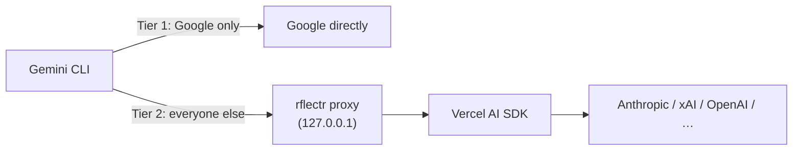

# Gemini CLI

> Category: Guide | Version: 1.0 | Date: June 2026 | Status: Active · Experimental

Use the **Google Gemini CLI** with any model from your rflectr registry — Anthropic, xAI, Google Gemini, Nvidia, DeepSeek, OpenAI, and more.

> 🧪 **Experimental.** Gemini CLI integration is newer than the Claude and Codex paths; expect rough edges.

| Command | Launches | Config target |
|---|---|---|
| `rflectr gemini` | Gemini **terminal** (prompt loop / TUI) | Ephemeral proxy port via environment variables. |

It uses the same registry (`~/.rflectr/providers.json`) and provider picker as Claude Code and Codex — Google's native Gemini endpoints when possible, and a local translation proxy for everything else.

> 📖 Full flags: `rflectr gemini --help`.
> 🤖 Automating it? See [AI Agents & automation](ai-agents.md) or run `rflectr --ai`.

---

## Prerequisites

1. **rflectr** on your PATH (`npm install -g @legioncodeinc/rflectr`, or built locally).
2. **At least one provider:** `rflectr providers add` (or `rflectr providers import`).
3. **Gemini CLI installed:** `npm install -g @google/gemini-cli`.

Registry providers plus OpenCode Zen/Go all route through rflectr's translation layer when they don't natively speak Gemini format.

---

## How it works

The Gemini CLI uses the **Gemini API format** (`POST /v1beta/models/<model>:generateContent`). When you pick a non-Google provider, rflectr spins up a local translation proxy:



Your real API keys stay in rflectr (keychain / registry); the proxy holds them in memory for the session.

---

## Quick start

```bash
rflectr gemini
```

Pick provider → pick model → the Gemini prompt loop opens, pointed at the translation proxy automatically.

### Flags

| Flag | Purpose |
|---|---|
| *(none)* | Interactive launch. |
| `--trace` | Write debug logs to `~/.rflectr/logs/gemini-proxy-debug.log`. |
| `--help` | Help text. |

rflectr manages `--provider` and `--model`; pass other Gemini CLI flags directly:

```bash
rflectr gemini -p "Analyze this"
rflectr gemini --provider google --model gemini-2.5-flash -p "Review this file" -o stream-json
```

### Environment isolation

On launch, rflectr builds a clean child environment: it removes conflicting Gemini env vars, points the CLI at the proxy via base-URL discovery, and sets the selected model. When the CLI exits (normal, `Ctrl+C`, or terminal close), your shell is unchanged.

### Favorites catalog mode

With favorites saved via `rflectr models`, `rflectr gemini` shows your starting model + favorites in the mid-session picker natively.

---

## Provider routing

| Provider | Route | Notes |
|---|---|---|
| **Google** | Tier 1 direct | Native Gemini endpoints for best performance. |
| **Anthropic, xAI, OpenAI, Nvidia, DeepSeek, …** | Tier 2 proxy | Converts Gemini-format requests to each native format via the Vercel AI SDK. |
| **OpenCode Zen / Go** | Tier 2 proxy | Requires an OpenCode API key. |

---

## Troubleshooting

| Symptom | Fix |
|---|---|
| Provider missing in picker | `rflectr providers add` |
| Model errors / disconnected | `rflectr gemini --trace`, then read `~/.rflectr/logs/gemini-proxy-debug.log` |
| JSON parse error on first stdout lines (agents) | Add `-o stream-json` or `-o json` |

**Known limitation:** the model name in the top-right of the Gemini CLI UI does not refresh after a mid-session `.model` switch. This is a Gemini CLI UI limitation, not a routing problem — the new model is active.

---

## Related guides

- [AI Agents & automation](ai-agents.md) · [Providers](providers.md) · [Troubleshooting](../faqs/troubleshooting.md)
- [Gemini CLI on npm](https://www.npmjs.com/package/@google/gemini-cli)
