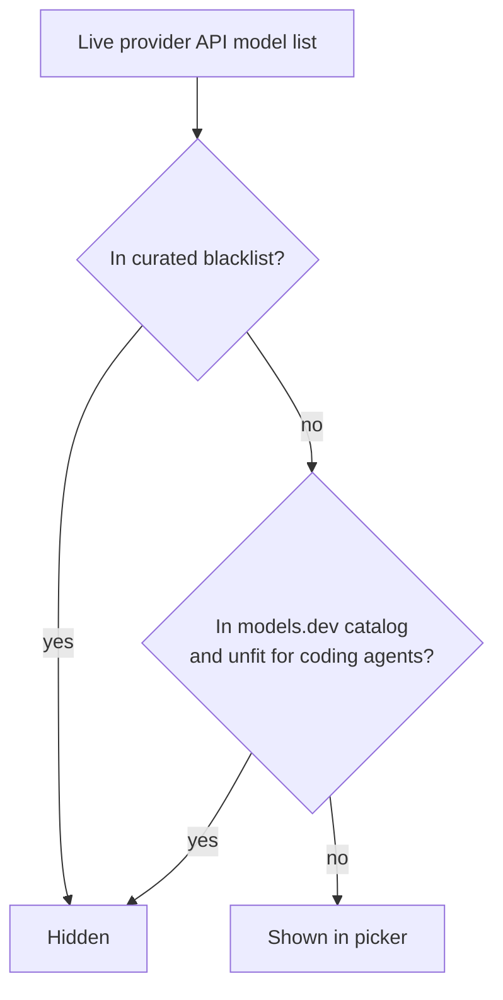

# Model Compatibility

> Category: Guide | Version: 1.0 | Date: June 2026 | Status: Active

Why some models don't appear in the picker, and how rflectr decides what to show. By default rflectr shows every model a provider's live API returns — models are hidden **only when there's a specific reason** (they can't run a coding agent, or a free promo ended).

---

## The two filters



1. **Curated blacklist** — `src/data/model-incompatible.json`. Researched entries, each with a provider, model id, category, reason, and sources.
2. **models.dev capabilities** — a bundled full snapshot in `src/data/models-dev-cache.json` (~2 MB, all providers). When a model exists in that catalog, rflectr may auto-hide it if it can't support coding agents (no text output, `tool_call: false`, etc.). **Missing catalog data never hides a model.**

**Offline / blocked network:** the bundled snapshot is always used when `~/.rflectr/models-dev-cache.json` is missing or a fetch fails. **On launch:** rflectr refreshes from `https://models.dev/api.json` in the background (non-blocking); the next compatibility check uses the updated file.

---

## Google Gemini (raw API)

Google's `GET /v1/models` returns **many non-chat models** (Imagen, Veo, embeddings, TTS, robotics, …), and models.dev only catalogs a subset. So rflectr also keeps explicit `provider: google` entries in the blacklist for non-coding ids verified on the live API list. After `rflectr providers refresh-models`, if new non-coding ids appear, they should be added to the blacklist rather than matched by name patterns.

---

## "Why don't I see model X?"

| Likely cause | What to do |
|---|---|
| It's a non-coding model (image/video/embedding/TTS). | Expected — those are filtered out. |
| Its free promotion ended (stale id still returned by the API). | Expected — hidden via a `"*"` blacklist entry. |
| Your model list is stale. | `rflectr providers refresh-models [provider]`. |
| You think it's hidden by mistake. | Run with `--trace` where supported — hidden models log via `hideReason()`. |

---

## Maintainers

### Add a blacklist entry

Edit `src/data/model-incompatible.json`:

```json
{
  "provider": "google",
  "modelId": "example-bad-model",
  "category": "managed_agent",
  "reason": "Plain English explanation",
  "sources": ["https://…"],
  "verifiedAt": "2026-06-10"
}
```

- Use `"provider": "*"` to hide a model id for **every** provider (stale promos, deprecated ids).
- Optional `"agents": ["codex", "codex-app"]` limits hiding to specific launch surfaces.

Rebuild after changes: `npm run build`.

### Refresh the bundled snapshot

Before a release (or when models.dev changes materially):

```bash
npm run refresh:models-dev
```

This commits an updated `src/data/models-dev-cache.json` for offline installs. The user cache path is `~/.rflectr/models-dev-cache.json`, written automatically on launch when the network allows.

---

## Related guides

- [Providers](providers.md) · [Troubleshooting](../faqs/troubleshooting.md)
