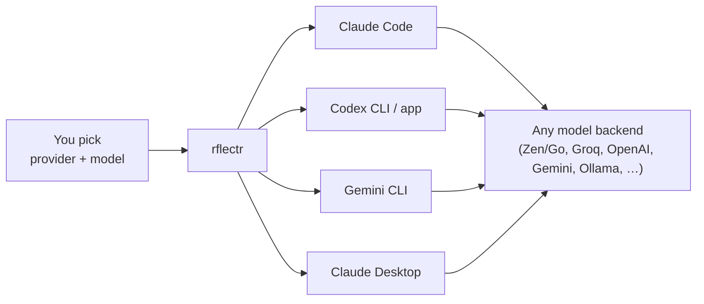

# What is rflectr?

> Category: Overview | Version: 1.0 | Date: June 2026 | Status: Active

**rflectr** — *point your coding agents at any model.* Launch Claude Code, OpenAI Codex, Google Gemini CLI, and the Claude / Codex desktop apps against whatever model you want — OpenCode Zen & Go, or your own provider keys (Groq, Mistral, OpenAI, Gemini, DeepSeek, xAI, Ollama, and more) — without touching the host tool's own settings.

Built by [Legion Code Inc.](https://github.com/legioncodeinc) · `npm install -g @legioncodeinc/rflectr`

---

## The one-paragraph version

Every major AI coding tool talks only to its vendor's API out of the box. rflectr sits in front of them: you pick a provider and model from an interactive wizard, and rflectr launches the tool with an environment (or a translating local proxy) that makes it believe it's talking to its native API. Run Claude Code on a Groq Llama model, Codex on DeepSeek, or Gemini CLI on a local Ollama endpoint — same tools, any backend.

---

## What you can launch

| Command | Launches | Guide |
|---|---|---|
| `rflectr claude` | Claude Code CLI | (interactive — start here) |
| `rflectr codex` / `codex-app` | OpenAI Codex CLI / desktop app | [Codex](../guides/codex.md) |
| `rflectr gemini` | Google Gemini CLI | [Gemini CLI](../guides/gemini-cli.md) |
| `rflectr claude-app` | Claude Desktop (Cowork + Code) | [Claude Desktop](../guides/claude-desktop.md) |
| `rflectr server` | Local API gateway (Anthropic + OpenAI compatible) | [API Server](../guides/api-server.md) |
| `rflectr providers` | Manage your provider registry | [Providers](../guides/providers.md) |
| `rflectr models` | Pick favorites for mid-session `/model` switching | — |
| `rflectr --ai` | Machine-readable reference for scripts & agents | [AI Agents](../guides/ai-agents.md) |

---

## How it works, in three ideas

1. **A provider registry.** Your providers and their models live in `~/.rflectr/providers.json`; secrets live in your OS keychain, never in the file. Add providers with `rflectr providers add` or import them from OpenCode once. See [Providers](../guides/providers.md).

2. **A single translation layer.** Anything that isn't natively Anthropic is routed through one path — the Vercel AI SDK — so the host tool's wire format is translated to and from your chosen model. There's no per-provider hand-rolled translator. See [Model compatibility](../guides/model-compatibility.md).

3. **No settings-file surgery.** rflectr launches the host with a purpose-built environment and a throwaway local proxy on `127.0.0.1`. The two desktop apps are the exception — their config is patched, backed up, and restored on exit.

---

## Glossary

| Term | Meaning |
|---|---|
| **Provider** | A source of models — `groq`, `openai`, `zen`, `go`, a local Ollama, etc. |
| **Registry** | Your saved providers + cached model lists, at `~/.rflectr/providers.json`. |
| **Zen / Go** | OpenCode's cloud backends. Always available with an `OPENCODE_API_KEY`. |
| **Proxy** | The local `127.0.0.1` server rflectr starts to translate wire formats. |
| **Favorites** | Up to 20 models saved with `rflectr models` for live `/model` switching. |
| **Boot flags** | `--provider` / `--model` — skip the wizard for scripts and CI. |
| **Gateway** | The `rflectr server` long-lived endpoint, used by Claude Desktop. |

---

## Where to go next

- **Just want to use it?** Run `rflectr providers add`, then `rflectr claude`.
- **Set up a specific tool:** [Codex](../guides/codex.md) · [Gemini CLI](../guides/gemini-cli.md) · [Claude Desktop](../guides/claude-desktop.md) · [API Server](../guides/api-server.md)
- **Automating / scripting:** [AI Agents & automation](../guides/ai-agents.md)
- **Something's wrong:** [Troubleshooting](../faqs/troubleshooting.md)
