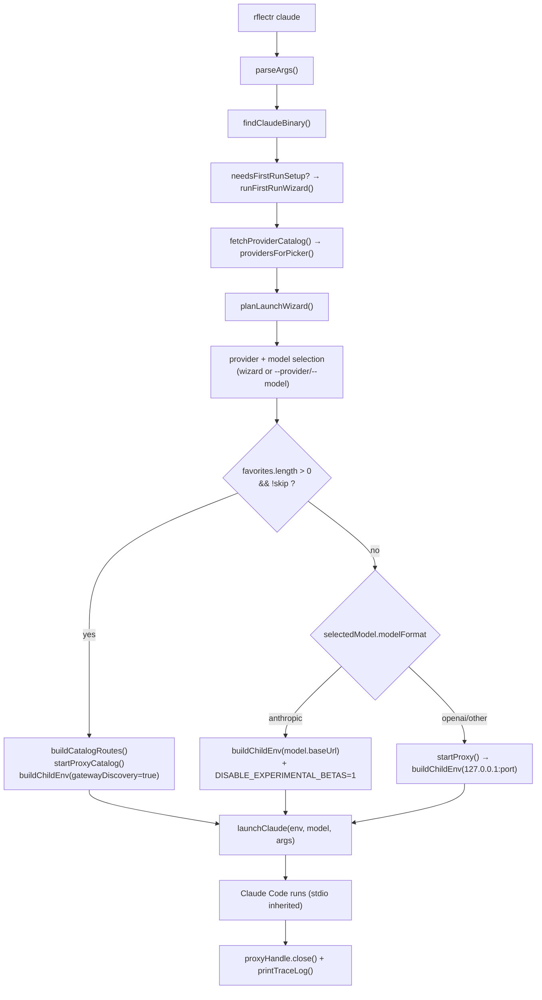

# PRD-001: CLI Core & Launch Orchestration *(Retroactive)*

> **Status:** Shipped
> **Priority:** — *(retroactive — work is done)*
> **Effort:** —
> **Written:** June 2026
> **Retroactive:** Yes — this PRD was written after implementation, documenting shipped behavior in rflectr v0.2.7.
> **Source:** `src/cli.ts`, `src/env.ts`, `src/launch.ts`, `src/launch-target.ts`, `src/first-run.ts`, `src/constants.ts`, `src/ui.ts`, `src/trace-log.ts`

## Overview

`rflectr` is a CLI launcher that re-points unmodified AI coding tools (Claude Code, Codex, Gemini, Claude Desktop) at alternative model backends without the host tool noticing. This PRD covers the **core CLI surface** — argument parsing and subcommand dispatch — and the **`rflectr claude` launch orchestration**: the end-to-end flow that goes from a command line to a running Claude Code process pointed at the chosen model, then cleans up after the process exits.

The central mechanism is **environment isolation, not config editing**: `rflectr` never writes to the host tool's settings file. Instead it spawns the child process with a purpose-built environment that removes conflicting cloud/Anthropic env vars and sets `ANTHROPIC_*` to target either a provider's Anthropic-compatible endpoint directly or a local translation proxy (`src/env.ts:40`, `src/env.ts:48-51`). This avoids the backup/restore problem that settings-file rewriters face.

The orchestration has two shapes, decided by whether the user has saved favorites: **single-model mode** (one model, one route) and **switch-menu mode** (a multi-route catalog proxy plus Claude Code gateway model discovery, enabling live `/model` switching).

## What Was Built

`src/cli.ts` is the entry point that orchestrates the full flow. `main()` (`src/cli.ts:1033`) calls `parseArgs()` (`src/cli.ts:108`) to dispatch a subcommand, then routes to the matching command handler. The `claude` path is handled by `runClaudeCommand()` (`src/cli.ts:743`).

The shipped `runClaudeCommand` flow:

1. **Normalize agent args & detect clean-stdout mode** — `normalizeClaudeAgentArgs()` and `wantsCleanAgentStdout()` (`src/cli.ts:745-747`) suppress the interactive intro/spinners when Claude Code runs in print/pipe machine-readable mode.
2. **Locate the binary** — `findClaudeBinary()` (`src/launch.ts:24`) resolves `claude` via `which`/`where.exe` with platform fallback paths; aborts with an install hint if missing (`src/cli.ts:750-756`).
3. **Load preferences & detect conflicts** — `loadPreferences()` and `detectConflicts()` (`src/cli.ts:758-759`). Under `--dry-run`, prefs are an empty object so saved state is ignored.
4. **Plan the wizard** — `planLaunchWizard()` (`src/launch-target.ts:150`) decides whether to skip the interactive wizard based on `--provider`/`--model` flags or print-mode + saved preferences.
5. **First-run setup** — when no providers and no Zen/Go key exist, `needsFirstRunSetup()` → `runFirstRunWizard()` (`src/first-run.ts:21`, `src/first-run.ts:36`) runs an inline welcome wizard that never dead-ends.
6. **Build the provider catalog** — `fetchProviderCatalog()` + `providersForPicker()` (`src/cli.ts:797`, `src/cli.ts:806`).
7. **Provider/model selection** — either resolved directly from the launch plan (`findProviderAndModel`, `src/cli.ts:832`) or via the interactive `p.select` provider picker + `pickLocalModel()` (`src/cli.ts:847-884`). In switch-menu mode a `__favorites__` pseudo-provider is unshifted onto the picker (`src/cli.ts:815-821`).
8. **Branch on mode** — switch-menu (catalog) vs single-model.
9. **Build child env & launch** — `buildChildEnv()` (`src/env.ts:40`) then `launchClaude()` (`src/launch.ts:63`) with `stdio: 'inherit'`.
10. **Cleanup** — `proxyHandle.close()` after Claude Code exits, plus `printTraceLog()` when `--trace` is set (`src/cli.ts:1028-1029`).

The format branch is the heart of the single-model path (`src/cli.ts:968-1013`): `modelFormat === 'anthropic'` → direct passthrough (no proxy, also sets `CLAUDE_CODE_DISABLE_EXPERIMENTAL_BETAS=1`); otherwise → SDK adapter proxy via `startProxy()` with `ANTHROPIC_BASE_URL` pointed at `http://127.0.0.1:<port>`.

## Goals

- Dispatch every `rflectr` subcommand (`claude`, `models`/`favorites`, `providers`, `server`, `codex`, `codex-app`, `gemini`, `claude-app`, `--ai`, `--help`, `--version`) from a single pure `parseArgs` function (`src/cli.ts:108`).
- Launch Claude Code against any selected provider/model with zero edits to `~/.claude/settings.json`.
- Isolate the child environment so stale Vertex/Bedrock/AWS/Foundry/Anthropic config cannot leak into the launched process.
- Support both single-model launches and multi-model switch-menu sessions from the same command.
- Forward unrecognized flags and everything after `--` verbatim to Claude Code so the host tool's own flags keep working.
- Provide `--dry-run` (simulate a fresh first run, write nothing), `--setup`, and `--trace` (redacted debug logging) developer affordances.
- Skip the interactive wizard for scripted / agent use via `--provider`/`--model` or print mode + saved preferences.

## Non-Goals

- Editing or backing up the host tool's settings file. Launch config is env-var-only (plus `--model`). *(The two desktop apps are the exception and are covered by PRD-009 / PRD-011, not here.)*
- Owning wire-format translation — that is the SDK adapter (PRD-004) and local proxy (PRD-005).
- Owning provider discovery and the registry (PRD-002) or model classification (PRD-003).
- Owning credential storage internals (PRD-006) or OAuth device flows (PRD-007).
- Owning favorites/tier semantics beyond reading them to drive launch mode (PRD-008).
- Guaranteeing Claude Code does not later persist the launched model to its own settings — that is outside rflectr's control.

## Features

| Feature | Description | Status |
|---|---|---|
| Subcommand dispatch | Pure `parseArgs` → `main` routing for all 8 subcommands plus root flags (`src/cli.ts:108`, `src/cli.ts:1033`) | Shipped |
| Claude binary discovery | Cross-platform `which`/`where.exe` resolution with fallback paths; `.cmd` preference on Windows (`src/launch.ts:24`) | Shipped |
| Single-model launch | Provider/model pick → format branch → `buildChildEnv` → `launchClaude` → proxy cleanup (`src/cli.ts:934-1031`) | Shipped |
| Switch-menu (catalog) launch | Multi-route proxy + gateway discovery for live `/model` switching when favorites exist (`src/cli.ts:889-932`, `launchClaudeViaCatalog` `src/cli.ts:440`) | Shipped |
| Environment isolation | Remove 17 conflicting vars, set `ANTHROPIC_*` + context tokens + tool-search compat (`src/env.ts:40`, `src/constants.ts:25`) | Shipped |
| Format-aware routing | `anthropic` → direct passthrough; otherwise → SDK adapter proxy (`src/cli.ts:968`) | Shipped |
| `--dry-run` | Run the wizard, print a preview, write nothing, ignore all saved state (`src/cli.ts:482`, `src/cli.ts:909`, `src/cli.ts:936`) | Shipped |
| `--trace` | Redacted debug log under `~/.rflectr/logs/`, errors printed on exit (`src/trace-log.ts:41`, `src/trace-log.ts:122`) | Shipped |
| `--provider` / `--model` boot | Skip the wizard for scripted/agent launches (`src/launch-target.ts:150`, `src/cli.ts:831`) | Shipped |
| Clean agent stdout | Suppress intro/spinners in Claude print/JSON mode so stdout stays machine-readable (`src/launch-target.ts:46`, `src/launch-target.ts:73`) | Shipped |
| First-run wizard | Inline welcome that never dead-ends (Zen quick start / import / providers) (`src/first-run.ts:36`) | Shipped |
| Favorites manager | `rflectr models` interactive add/remove, capped at 20, saved once on Done (`runModelsCommand` `src/cli.ts:534`) | Shipped |
| Signal forwarding | SIGINT/SIGTERM forwarded to the child; stdout/stderr restored on exit (`src/launch.ts:108-124`) | Shipped |

## Architecture & Implementation

### Argument parsing & dispatch

`parseArgs(args)` (`src/cli.ts:108`) is a pure function returning a `ParsedArgs` object. It handles `--ai` first, then bare-no-args → help, then root flags, then matches the first token against each subcommand. Starter flags for `claude` are `--dry-run`, `--setup`, `--trace`, `--help`, `--version` (`STARTER_CLAUDE_FLAGS`, `src/cli.ts:51`); relay launch flags are `--provider` / `--model` (`RELAY_LAUNCH_FLAGS`, `src/cli.ts:52`), parsed by `tryConsumeRelayLaunchFlag` (`src/cli.ts:81`) supporting both `--flag value` and `--flag=value` forms. For `claude`, everything after `--` and any unrecognized flag is pushed to `claudeArgs` and forwarded verbatim (`src/cli.ts:251-266`). `main()` (`src/cli.ts:1033`) short-circuits on `parsed.error`, fires an async models.dev cache refresh, then dispatches per `parsed.command`.

### The two launch modes

The mode is chosen by one line (`src/cli.ts:772`):

```ts
const switchMenuActive = favorites.length > 0 && !launchPlan.skip;
```



**Single-model path** (`src/cli.ts:934-1031`): resolves the provider API key via `resolveLocalProviderApiKey()` (aborts if none), then branches on `selectedModel.modelFormat`. Anthropic models call `buildChildEnv(selectedModel.baseUrl!, selectedModel.id, launchApiKey, undefined, selectedModel.contextWindow)` with no proxy and add `CLAUDE_CODE_DISABLE_EXPERIMENTAL_BETAS=1` (`src/cli.ts:1015-1017`). All other formats start the SDK adapter proxy (`startProxy`, `src/cli.ts:978`) and point the child at `http://127.0.0.1:<port>`.

**Switch-menu path** (`launchClaudeViaCatalog`, `src/cli.ts:440`): `makeRouteResolver` + `buildCatalogRoutes` build the route list (starting model + favorites only, never the full catalog), `droppedFavorites` are silently skipped with a warning, `startProxyCatalog` serves all routes on one port, and `buildChildEnv(..., enableGatewayDiscovery = true)` sets `CLAUDE_CODE_ENABLE_GATEWAY_MODEL_DISCOVERY=1` so Claude Code fetches `/v1/models` from the proxy and populates `/model` (`src/cli.ts:889-931`, `src/env.ts:65-67`).

### Environment isolation contract (`buildChildEnv`, `src/env.ts:40`)

`buildChildEnv(baseUrl, model, apiKey, proxyPort?, contextWindow?, enableGatewayDiscovery?)` copies `process.env`, then:

1. **Removes** every name in `CONFLICTING_ENV_VARS` (`src/env.ts:49-51`) — the 17 vars listed in `src/constants.ts:25-43`.
2. **Sets** `ANTHROPIC_BASE_URL` — `http://127.0.0.1:{proxyPort}` when `proxyPort` is provided, otherwise the passed `baseUrl` (`src/env.ts:52-54`). When a `proxyPort` is set, the base URL is *always* the local proxy regardless of `baseUrl`.
3. **Sets** `ANTHROPIC_API_KEY` to the resolved key (for proxy launches this is the proxy's local token, `src/cli.ts:1009`).
4. **Sets** `ANTHROPIC_MODEL` to `claudeCodeClientModelId(model, contextWindow)` and `CLAUDE_CODE_MAX_CONTEXT_TOKENS` to the resolved real window (`src/env.ts:57-64`).
5. **Optionally sets** `CLAUDE_CODE_ENABLE_GATEWAY_MODEL_DISCOVERY=1` (`src/env.ts:65-67`).
6. **Applies** `applyClaudeCodeThirdPartyCompat` (`src/env.ts:30`): `ENABLE_TOOL_SEARCH=true` (defer MCP tools like native Claude Code) and `CLAUDE_CODE_SIMPLE_SYSTEM_PROMPT=0` (keep the full system prompt on proxy routes).

Isolation applies to the child process only — the parent shell is not mutated.

### Launch & process lifecycle (`src/launch.ts`)

`launchClaude(env, model, extraArgs)` (`src/launch.ts:63`) spawns the resolved binary with `buildClaudeArgs` (`--model {model}` + extra args), `stdio: 'inherit'`, and `shell: isWindows`. It temporarily mutes the parent's `stdout`/`stderr` writes (appending them to the `--debug-file` when tracing) so rflectr does not interleave with the child, restoring them on exit. SIGINT/SIGTERM are forwarded to the child (`src/launch.ts:108-114`). The returned promise resolves to the child exit code (or `1` on spawn error), which propagates to `process.exit` in the CLI entry guard (`src/cli.ts:1169-1179`).

### Tracing (`src/trace-log.ts`)

`prepareClaudeTraceLog()` (`src/trace-log.ts:41`) resets and returns `~/.rflectr/logs/claude-debug.log`. When `--trace` is set the CLI passes `--debug-file <path>` to Claude Code and calls `printTraceLog()` on exit (`src/cli.ts:1019-1029`). Log dirs/files are created `0o700`/`0o600` and all lines pass through `redactTraceLine` (`src/trace-log.ts:99`), which scrubs Bearer/Authorization/x-api-key headers and `sk-`, `sk-ant-`, `AIza`, `gsk_` key prefixes.

## Configuration & Environment

**Env vars SET on the child** (`src/env.ts`):
- `ANTHROPIC_BASE_URL` — provider Anthropic endpoint (direct) or `http://127.0.0.1:<port>` (proxy)
- `ANTHROPIC_API_KEY` — provider key (direct) or local proxy token (proxy)
- `ANTHROPIC_MODEL` — client model id (with `[1m]` suffix for 1M+ windows)
- `CLAUDE_CODE_MAX_CONTEXT_TOKENS` — resolved real context window
- `CLAUDE_CODE_ENABLE_GATEWAY_MODEL_DISCOVERY=1` — switch-menu mode only
- `CLAUDE_CODE_DISABLE_EXPERIMENTAL_BETAS=1` — anthropic-format direct launches only (`src/cli.ts:1016`)
- `ENABLE_TOOL_SEARCH=true`, `CLAUDE_CODE_SIMPLE_SYSTEM_PROMPT=0` — third-party compat (`src/env.ts:34-37`)

**Env vars REMOVED** — `CONFLICTING_ENV_VARS` (`src/constants.ts:25-43`), the 17:
`CLAUDE_CODE_USE_VERTEX`, `ANTHROPIC_VERTEX_PROJECT_ID`, `ANTHROPIC_VERTEX_BASE_URL`, `CLOUD_ML_REGION`, `ANTHROPIC_BEDROCK_BASE_URL`, `ANTHROPIC_AWS_BASE_URL`, `ANTHROPIC_AWS_API_KEY`, `ANTHROPIC_AWS_WORKSPACE_ID`, `ANTHROPIC_FOUNDRY_API_KEY`, `ANTHROPIC_FOUNDRY_BASE_URL`, `ANTHROPIC_AUTH_TOKEN`, `ANTHROPIC_API_KEY`, `ANTHROPIC_BASE_URL`, `ANTHROPIC_MODEL`, `ANTHROPIC_DEFAULT_OPUS_MODEL`, `ANTHROPIC_DEFAULT_SONNET_MODEL`, `ANTHROPIC_DEFAULT_HAIKU_MODEL`.

**Flags** (`src/cli.ts`):
- `--dry-run` — wizard runs, preview printed, nothing written, saved state ignored
- `--setup` — informational hint pointing at `rflectr providers`
- `--trace` — write `~/.rflectr/logs/claude-debug.log`, print redacted errors on exit
- `--provider X` / `--model Y` (or `provider__model` slug) — skip the wizard
- `--help` / `-h`, `--version` / `-v`
- `--` and any unrecognized flag — forwarded verbatim to Claude Code

**Constants**: `MAX_MODEL_CATALOG = 20` (favorites cap / max catalog routes, `src/constants.ts:51`); `BACKENDS` Zen/Go base URLs (no `/v1` suffix, `src/constants.ts:9`); `VERSION` derived from `package.json` (`src/constants.ts:75`).

**Critical URL constraint**: `BACKENDS.baseUrl` must NOT include `/v1` — the Anthropic SDK appends `/v1/messages` automatically (`src/constants.ts:13`). The same rule applies to any anthropic-format `baseUrl` passed to `buildChildEnv`.

## Acceptance Criteria (verification checklist — satisfied by shipped code)

- [x] AC-1.1 Given no args, when `rflectr` runs, then root help is printed and no launch occurs (`src/cli.ts:118`, `src/cli.ts:1046-1058`).
- [x] AC-1.2 `parseArgs` dispatches each of `claude`, `models`/`favorites`, `providers`, `server`, `codex`, `codex-app`, `gemini`, `claude-app` to its handler; an unknown first token yields a `Unknown command` error and exit 1 (`src/cli.ts:241-244`, `src/cli.ts:1036-1040`).
- [x] AC-1.3 For `rflectr claude`, everything after `--` and any flag not in `STARTER_CLAUDE_FLAGS`/`RELAY_LAUNCH_FLAGS` is forwarded verbatim to Claude Code (`src/cli.ts:251-266`).
- [x] AC-1.4 When the `claude` binary is not found, launch aborts with an install hint and exit 1 (`src/cli.ts:750-756`).
- [x] AC-1.5 `buildChildEnv` removes all 17 `CONFLICTING_ENV_VARS` from the child env before setting `ANTHROPIC_*` (`src/env.ts:49-51`, `src/constants.ts:25`).
- [x] AC-1.6 When `proxyPort` is provided, `ANTHROPIC_BASE_URL` is `http://127.0.0.1:{proxyPort}` regardless of the `baseUrl` argument (`src/env.ts:52-54`).
- [x] AC-1.7 An anthropic-format model launches with no proxy, direct to `selectedModel.baseUrl`, and sets `CLAUDE_CODE_DISABLE_EXPERIMENTAL_BETAS=1` (`src/cli.ts:968-975`, `src/cli.ts:1015-1017`).
- [x] AC-1.8 A non-anthropic model starts the SDK adapter proxy and points the child at the local proxy port (`src/cli.ts:976-1013`).
- [x] AC-1.9 Given at least one saved favorite and no wizard-skip, launch enters switch-menu mode: a multi-route catalog proxy starts and `CLAUDE_CODE_ENABLE_GATEWAY_MODEL_DISCOVERY=1` is set (`src/cli.ts:772`, `src/cli.ts:889-931`, `src/env.ts:65-67`).
- [x] AC-1.10 Catalog routes contain only the starting model plus favorites; favorites whose provider/model are unavailable are dropped with a warning (`src/cli.ts:901-907`).
- [x] AC-1.11 `--dry-run` runs the wizard, prints a preview, and writes nothing (no `recordLaunchSelection`, prefs treated as empty) (`src/cli.ts:758`, `src/cli.ts:761`, `src/cli.ts:909-922`, `src/cli.ts:936-954`).
- [x] AC-1.12 `--provider X --model Y` (or `provider__model` slug) skips the interactive wizard and resolves the target directly; an incomplete pair yields an error (`src/launch-target.ts:150-197`, `src/cli.ts:831-844`).
- [x] AC-1.13 Claude print/JSON machine-readable mode suppresses the interactive intro and spinners so stdout stays clean (`src/launch-target.ts:46-52`, `src/cli.ts:746-747`, `src/cli.ts:774`).
- [x] AC-1.14 On first run with no providers and no Zen/Go key, the inline welcome wizard runs and only `cancel` aborts the launch (`src/cli.ts:780-783`, `src/first-run.ts:21-36`).
- [x] AC-1.15 After Claude Code exits, any started proxy is closed and (when tracing) the trace log is printed (`src/cli.ts:1028-1029`, `src/cli.ts:477-478`).
- [x] AC-1.16 The child exit code propagates to `process.exit`, and SIGINT/SIGTERM are forwarded to the child (`src/launch.ts:108-117`, `src/cli.ts:1170-1171`).
- [x] AC-1.17 `--trace` writes a redacted debug log under `~/.rflectr/logs/` (dir `0o700`, file `0o600`) with secrets scrubbed (`src/trace-log.ts:26-34`, `src/trace-log.ts:99-120`).
- [x] AC-1.18 `rflectr models` adds/removes favorites interactively, enforces the `MAX_MODEL_CATALOG` cap, and persists once on Done (`src/cli.ts:534-741`, `src/cli.ts:579-587`, `src/cli.ts:728-730`).
- [x] AC-1.19 `--version` prints the `package.json` version for the root and every subcommand (`src/constants.ts:75`, `src/cli.ts:1054`, `src/cli.ts:1063`).

## Files

### Primary
- `src/cli.ts` — Entry point: `parseArgs`, `main`, `runClaudeCommand`, `runModelsCommand`, `launchClaudeViaCatalog`, dry-run printers, help text.
- `src/env.ts` — `buildChildEnv` (env isolation contract), `detectConflicts`, `applyClaudeCodeThirdPartyCompat`, `resolveApiKey`.
- `src/launch.ts` — `findClaudeBinary`, `buildClaudeArgs`, `launchClaude` (spawn with stdio inherited, signal forwarding, exit-code resolution).
- `src/launch-target.ts` — `planLaunchWizard`, `findProviderAndModel`, `parseModelSlug`, print/non-interactive detection, `wantsCleanAgentStdout`, `normalizeClaudeAgentArgs`.

### Supporting
- `src/first-run.ts` — `needsFirstRunSetup`, `runFirstRunWizard` (inline never-dead-end welcome).
- `src/constants.ts` — `CONFLICTING_ENV_VARS` (the 17), `BACKENDS`, `MAX_MODEL_CATALOG`, `VERSION`, `classifyModelFormat`.
- `src/ui.ts` — shared @clack/picocolors styling (`relayIntro`, `providerSelectOption`, `printPanel`, env-conflict panel, dry-run panel).
- `src/trace-log.ts` — `prepareClaudeTraceLog`, `printTraceLog`, secret redaction, secure log file modes.

## Risks & Known Limitations

- **Claude Code persists the launched model.** rflectr never touches `settings.json`, but Claude Code itself writes the launched model to `~/.claude/settings.json`, so a later bare `claude` may still show a relay alias (e.g. `anthropic-opencode-go__deepseek-v4-flash`). Gateway discovery caches at `~/.claude/cache/gateway-models.json`. Reset with `claude --model sonnet` or by editing/removing those files (`src/cli.ts:364-366`, knowledge `system-overview.md`).
- **Context window is fixed at launch in switch-menu mode.** `CLAUDE_CODE_MAX_CONTEXT_TOKENS` reflects the *launch* model and does NOT update on a live `/model` switch — Claude Code's gateway model discovery only carries `id` + `display_name` (no `context_window`) and fetches `/v1/models` once at startup. Single-model launches show the correct window. This is by design (`src/env.ts:58-64`, knowledge `launch-flow-claude.md`).
- **`/v1` URL footgun.** Any anthropic-format `baseUrl` that includes `/v1` produces `/v1/v1/messages` → 404. `BACKENDS.baseUrl` and provider Anthropic endpoints must omit `/v1` (`src/constants.ts:13`).
- **Favorites cap.** Hard cap of 20 (`MAX_MODEL_CATALOG`); excess additions are rejected in `runModelsCommand` (`src/cli.ts:579-587`, `src/cli.ts:714-716`).
- **Stale favorites silently skipped.** Favorites pointing at a now-unavailable provider/model are dropped from the catalog with a warning rather than failing the launch (`src/cli.ts:901-907`).

## Related
- Knowledge: [system-overview](../../../knowledge/private/architecture/system-overview.md), [launch-flow-claude](../../../knowledge/private/architecture/launch-flow-claude.md)
- Sibling PRDs: [PRD-002 Provider Registry](../prd-002-provider-registry/prd-002-provider-registry-index.md), [PRD-003 Model Discovery & Classification](../prd-003-model-discovery-classification/prd-003-model-discovery-classification-index.md), [PRD-004 Translation Layer](../prd-004-translation-layer/prd-004-translation-layer-index.md), [PRD-005 Local Proxy & Catalog Routing](../prd-005-local-proxy-catalog-routing/prd-005-local-proxy-catalog-routing-index.md), [PRD-008 Preferences, Tiers & Favorites](../prd-008-preferences-tiers-favorites/prd-008-preferences-tiers-favorites-index.md)
