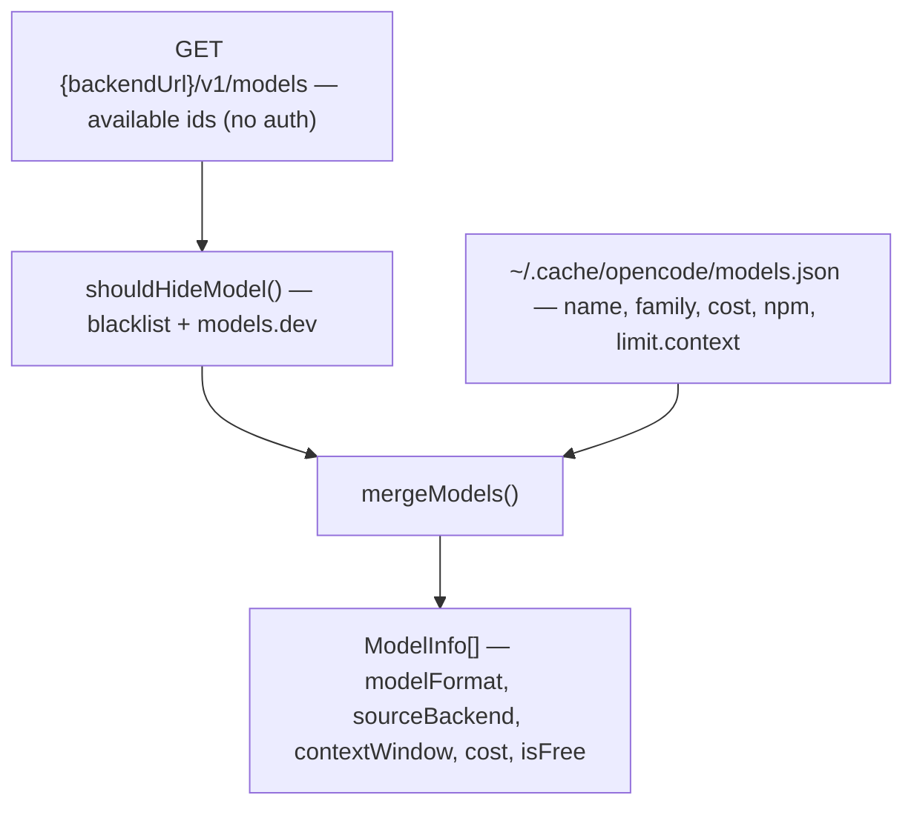

# PRD-003: Model Discovery & Classification *(Retroactive)*

> **Status:** Shipped
> **Priority:** —
> **Effort:** —
> **Written:** June 2026
> **Retroactive:** Yes — written after implementation (rflectr v0.2.7).
> **Source:** `src/models.ts`, `src/model-compatibility.ts`, `src/context-window.ts`, `src/reasoning-capabilities.ts`

---

## Overview

`rflectr` re-points Claude Code (and the other agents) at alternative model backends. Before a user can pick a model, the launcher has to build a list of models that are actually usable, decide for each one whether it can be forwarded raw to an Anthropic-compatible endpoint or must be translated, and stamp it with the metadata Claude Code needs to render an accurate status bar (context window, cost, reasoning controls).

This PRD documents that subsystem: how the cloud (OpenCode Zen/Go) model list is assembled from two merged sources, how every model's `modelFormat` is classified, how context windows and reasoning capabilities are resolved, and how unusable models (incompatible, deprecated, stale-free) are filtered out.

The single most load-bearing output is `modelFormat`. It is the branch point for the entire launch flow — `'anthropic'` means direct passthrough, anything else routes through the SDK adapter proxy (see [PRD-004 — Translation Layer](../prd-004-translation-layer/prd-004-translation-layer-index.md)).

Knowledge doc: [`model-discovery-classification.md`](../../../knowledge/private/ai/model-discovery-classification.md).

---

## What Was Built

- A **two-source merge** that builds the cloud model list from a live API call (`GET {backendUrl}/v1/models`, no auth) enriched by the local OpenCode CLI cache (`~/.cache/opencode/models.json`) — `src/models.ts:131` (`getModels`), `src/models.ts:85` (`mergeModels`).
- A pure **format classifier** `classifyModelFormat(modelId, providerNpm)` returning `'anthropic' | 'openai' | 'unsupported'` from provider npm first, then ID-prefix heuristics — `src/constants.ts:58`.
- A **Go-backend override** that demotes any `'anthropic'` classification to `'openai'`, because the Go gateway is OpenAI-compatible and an `@ai-sdk/anthropic` npm in the cache is a metadata error — `src/models.ts:50`, `src/models.ts:95`.
- **`sourceBackend` stamping** so a combined Zen-free + Go-paid list (the `go` tier) can resolve the correct base URL per selected model — `src/models.ts:51`, `src/models.ts:96`.
- **Context-window resolution** from cache `limit.context` → ID heuristics → 200K default, plus a `[1m]` suffix convention for million-token variants — `src/context-window.ts`, `src/context-model-id.ts`.
- **Reasoning-capability metadata** (levels, default level, mode, wire format) resolved per provider npm + model id — `src/reasoning-capabilities.ts`, `src/provider-factory.ts:469`.
- **Incompatibility filtering** via a curated JSON blacklist plus conservative models.dev capability checks — `src/model-compatibility.ts`, `src/data/model-incompatible.json`.
- **Graceful degradation**: API failure falls back to the cache, then to caller-supplied fallback models, then errors — `src/models.ts:140`.

---

## Goals

- Show the user only models that will actually work in a coding agent (no embedding/image/audio/video/deprecated/managed-agent models).
- Decide passthrough-vs-translate deterministically and at the model level, not the provider level.
- Render an accurate remaining-context status bar in Claude Code for non-Anthropic models.
- Surface reasoning-effort controls where the provider supports them.
- Never hard-depend on the OpenCode cache: it is enrichment, not a runtime requirement.
- Degrade gracefully when the model API is unreachable.

## Non-Goals

- Live `/model` switching context-window updates — fixed at launch in switch-menu mode (documented limitation).
- Accurate cost display for non-Anthropic models — Claude Code owns its pricing table; this is unfixable from rflectr.
- Registry-provider model materialization — owned by [PRD-002 — Provider Registry](../prd-002-provider-registry/prd-002-provider-registry-index.md). This PRD covers the cloud Zen/Go path; registry models arrive pre-stamped.
- Backend selection / tier logic — owned by [PRD-008 — Preferences, Tiers & Favorites](../prd-008-preferences-tiers-favorites/prd-008-preferences-tiers-favorites-index.md). This PRD consumes `backend.id` / `sourceBackend`.
- The translation that happens *after* a model is classified `'openai'` — owned by [PRD-004 — Translation Layer](../prd-004-translation-layer/prd-004-translation-layer-index.md).

---

## Features

| # | Feature | Source |
|---|---------|--------|
| F1 | Two-source merge (live API ids + OpenCode cache enrichment) | `src/models.ts:85`, `src/models.ts:131` |
| F2 | `classifyModelFormat` (npm → id-prefix heuristic) | `src/constants.ts:58` |
| F3 | Go-backend anthropic→openai demotion | `src/models.ts:50`, `src/models.ts:95` |
| F4 | `sourceBackend` per-model stamping | `src/models.ts:51`, `src/models.ts:96` |
| F5 | `isFree` detection (cost.input == 0 && cost.output == 0) | `src/models.ts:44` |
| F6 | Brand derivation for grouping | `src/models.ts:23` (`deriveBrand`) |
| F7 | Context-window resolution (cache → heuristics → 200K) | `src/context-window.ts:131` |
| F8 | `[1m]` context-suffix convention | `src/context-model-id.ts` |
| F9 | Reasoning-capability metadata resolution | `src/reasoning-capabilities.ts:24`, `src/provider-factory.ts:469` |
| F10 | Curated incompatibility blacklist filtering | `src/model-compatibility.ts:46`, `src/data/model-incompatible.json` |
| F11 | models.dev conservative capability filtering | `src/model-compatibility.ts:60`, `src/registry/models-dev.ts:229` |
| F12 | Deprecated/stale model exclusion | `src/models.ts:43` (cache `status`), `model-incompatible.json` (`stale_promotion`) |
| F13 | Graceful fallback chain on API failure | `src/models.ts:140` |

---

## Architecture & Implementation

### The two-source merge

The cloud (OpenCode Zen / Go) model list is built from two sources merged together in `getModels` — `src/models.ts:131`:

1. **Primary — live API.** `fetchModelsFromApi(backend)` does `GET {backend.baseUrl}/v1/models` (5s abort timeout, no real auth — sends a placeholder `Bearer test`) and returns the available model ids — `src/models.ts:69`. This is the authority on *what exists*.
2. **Enrichment — OpenCode cache.** `readModelsFromCache(backendId)` reads `~/.cache/opencode/models.json` (path `OPENCODE_CACHE_PATH`, `src/constants.ts:48`) and indexes the entries under the `opencode` (Zen) or `opencode-go` (Go) provider keys — `src/models.ts:31`. Each cache entry supplies `name`, `family`, `cost`, `provider.npm`, and `limit.context`. The cache is optional; a missing or unparseable file simply yields `null` (`loadOpencodeCache`, `src/context-window.ts:63`).

`mergeModels(apiIds, cache, backendId)` — `src/models.ts:85` — drives the join:

```
for each apiId:
  if shouldHideModel(...) → drop                       (incompatibility filter)
  if cache has apiId      → spread cached ModelInfo, re-stamp sourceBackend + modelFormat
  else                    → synthesize a bare ModelInfo (name = id, brand 'Other',
                            classifyModelFormat(id, undefined), resolveContextWindow(id))
```

So the API ids are the spine; the cache only *enriches* ids that already appear in the live response. An id present only in the cache is never shown.



### The classification heuristic

`classifyModelFormat(modelId, providerNpm)` — `src/constants.ts:58` — is a pure function. Provider npm (from the cache) wins; if absent, an ID-prefix heuristic is applied to the lowercased id:

| Order | Condition | Result | Rationale |
|---|---|---|---|
| 1 | `providerNpm === '@ai-sdk/anthropic'` | `anthropic` | Direct Anthropic passthrough. |
| 2 | `providerNpm === '@ai-sdk/openai'` | `unsupported` | Cloud Zen/Go proxy can't do model-specific OpenAI endpoints. |
| 3 | `providerNpm === '@ai-sdk/google'` | `unsupported` | Needs Gemini-specific endpoints the cloud path lacks. |
| 4 | id starts with `claude-` | `anthropic` | Heuristic fallback when no cache npm. |
| 5 | id starts with `gpt-` | `unsupported` | Heuristic fallback. |
| 6 | id starts with `gemini-` | `unsupported` | Heuristic fallback. |
| 7 | (everything else) | `openai` | Catch-all → SDK adapter via local proxy. |

**Nuance:** `unsupported` is a *cloud-wizard* restriction, not a global one. The cloud OpenCode Zen/Go proxy layer can't reach GPT/Gemini directly, so those are hidden in the wizard. The same GPT/Gemini models *are* usable through the **local OpenAI / Google provider** (PRD-002), which carries the real `@ai-sdk/openai` / `@ai-sdk/google` npm and routes through the SDK adapter normally.

### The Go-backend override

The Go gateway is OpenAI-compatible. If the cache labels a Go model `@ai-sdk/anthropic` (a metadata error), `mergeModels` and `readModelsFromCache` both demote `'anthropic'` → `'openai'` so it routes through the translation proxy rather than attempting a raw Anthropic passthrough that would fail — `src/models.ts:50` and `src/models.ts:95`.

### `sourceBackend` and the combined-list problem

Every `ModelInfo` carries `sourceBackend: 'zen' | 'go'`, set from the backend that was queried (`src/models.ts:51`, `:96`). The `go` subscription tier shows Zen *free* models **and** Go *paid* models in one combined list; `sourceBackend` is what lets the launcher set the correct `ANTHROPIC_BASE_URL` per selected model rather than per session.

### `isFree` and brand grouping

`isFree` is true when the cache cost is explicitly `input === 0 && output === 0` — `src/models.ts:44`. Bare (cache-miss) models default `isFree: false`. `deriveBrand(family)` maps a family string to a display brand via the `BRAND_MAP` prefix table (Claude, GPT, Gemini, DeepSeek, Qwen, MiniMax, Kimi, GLM, MiMo, Grok, Nemotron, else `'Other'`) — `src/models.ts:9`. `groupModels` then splits free models out and buckets the rest by brand, each sorted by id — `src/models.ts:111`.

### Context-window resolution

`resolveContextWindow(modelId, explicit?)` — `src/context-window.ts:131` — resolves in priority order:

1. An explicit positive value (cache `limit.context`, or a pre-resolved number) wins.
2. Otherwise `lookupContextWindow` consults a model-id → context map built from the cache. The map prefers the `opencode` / `opencode-go` provider keys (`CACHE_PROVIDER_PRIORITY`), then falls back to the max context seen across any provider for that id — `src/context-window.ts:75`.
3. Otherwise ID-pattern heuristics (`HEURISTIC_RULES`, ordered most-specific-first) — `src/context-window.ts:30`.
4. Otherwise `DEFAULT_CONTEXT_WINDOW = 200_000` — Claude Code's own fallback for unknown models — `src/context-window.ts:12`.

The resolved window is written to `CLAUDE_CODE_MAX_CONTEXT_TOKENS` (by `buildChildEnv`) and emitted in the proxy's synthetic `GET /v1/models` (`context_window` per model) so the host can render remaining context.

### The `[1m]` suffix convention

Claude Code treats third-party routes as 200K unless the model id ends with `[1m]` — `src/context-model-id.ts:3`. `claudeCodeClientModelId(modelId, contextWindow?)` strips any existing suffix, resolves the real window, and re-appends `[1m]` when the window exceeds 200K so the host renders the larger window — `src/context-model-id.ts:17`. `routeLookupIds` generates the suffix/`models/`-prefix variants so inbound ids still match catalog aliases — `src/context-model-id.ts:27`.

### Reasoning-capability metadata

`resolveReasoningCapabilities({ npm, modelId, ...metadata })` — `src/reasoning-capabilities.ts:24` — delegates to `getReasoningCapabilities(npm, modelId, metadata)` in `src/provider-factory.ts:469`. The result (`ReasoningCapabilities`, `src/provider-factory.ts:206`) carries effort `levels`, a `defaultLevel`, `supportsSummaries`, a `mode` (`none | internal-only | controllable`), a provenance `source`, a `confidence`, and an optional `wireFormat` discriminated union (openrouter / openai-effort / anthropic-thinking / google-thinking-config / mistral-effort / deepseek-thinking) — `src/provider-factory.ts:187`. Per-provider effort vocabularies differ (e.g. OpenAI `low/medium/high/xhigh`, xAI `none/low/medium/high`, DeepSeek `high/max/off`) — `src/provider-factory.ts:216`.

### Incompatibility filtering

`shouldHideModel(ctx)` — `src/model-compatibility.ts:68` — hides a model when `hideReason` returns non-null. Two layers:

1. **Curated blacklist** (`src/data/model-incompatible.json`) keyed by `{provider, modelId, agents?}`. `provider: '*'` matches any provider; an absent/empty `agents` matches every agent. Categories include `image_generation`, `audio_only`, `video_generation`, `embedding`, `managed_agent`, `deprecated`, `gated_access`, and `stale_promotion` — `src/model-compatibility.ts:46`.
2. **models.dev conservative capabilities** — `shouldHideByModelsDevCapabilities` hides a model only when its models.dev row is explicit: non-text-only output modalities, `tool_call === false`, or `interactions === true && chat === false` — `src/registry/models-dev.ts:229`.

`mergeModels` calls this with `agent: 'claude'` for the cloud path — `src/models.ts:91`. Cache entries with `status === 'deprecated'` are dropped at read time too — `src/models.ts:43`.

### Stale-free models

The knowledge doc and `CLAUDE.md` reference a `STALE_FREE_MODELS` constant for models whose free promotion ended but the API still returns. In the shipped v0.2.7 tree this responsibility lives in the **incompatibility blacklist** instead: `qwen3.6-plus-free` is listed with `category: "stale_promotion"` (`src/data/model-incompatible.json`) and filtered through the same `shouldHideModel` path. There is no separate `STALE_FREE_MODELS` symbol in `src/constants.ts` in this version.

### Graceful degradation

`getModels` — `src/models.ts:131` — tries the live API first. On any throw it falls back: cache (if non-empty) → caller `fallbackModels` (if any) → a thrown error instructing the user to check network / OpenCode status. The returned `fromCache` flag tells callers the list is stale.

---

## Data Shapes

`ModelInfo` (cloud Zen/Go path) — `src/types.ts:22`:

| Field | Type | Notes |
|---|---|---|
| `id` | `string` | Model id from the API. |
| `name` | `string` | Display name (cache `name`, else id). |
| `isFree` | `boolean` | Cache cost both zero. |
| `brand` | `string` | From `deriveBrand(family)`. |
| `sourceBackend` | `'zen' \| 'go'` | Backend that was queried; drives base-URL selection. |
| `modelFormat` | `'anthropic' \| 'openai' \| 'unsupported'` | Launch branch point (`ModelFormat`, `src/types.ts:5`). |
| `cost` | `ModelCost?` | `{ input, output, cache_read?, cache_write? }`. |
| `contextWindow` | `number?` | Resolved window for the status bar. |

`ModelFormat` semantics:

| Value | Meaning |
|---|---|
| `anthropic` | Direct passthrough to the provider's Anthropic endpoint. |
| `openai` | Routed through the SDK adapter via the local proxy. |
| `unsupported` | Hidden in the cloud OpenCode wizard only (not a global ban). |

`ReasoningCapabilities` — `src/provider-factory.ts:206`: `{ levels: string[], defaultLevel: string, supportsSummaries: boolean, mode: 'none'|'internal-only'|'controllable', source, confidence, wireFormat? }`.

`IncompatibleModelEntry` — `src/model-compatibility.ts:20`: `{ provider, modelId, category, reason, agents?, sources?, verifiedAt? }`.

---

## Acceptance Criteria

- [x] Cloud model list is built by merging live API ids with OpenCode cache enrichment — `src/models.ts:131`, `:85`.
- [x] API ids are authoritative; cache-only ids are not shown — `src/models.ts:90`.
- [x] OpenCode cache is optional — a missing/unparseable file degrades to `null` without error — `src/context-window.ts:63`.
- [x] `classifyModelFormat` resolves npm first, then id-prefix heuristics, returning one of three `ModelFormat` values — `src/constants.ts:58`.
- [x] Go backend demotes `anthropic` → `openai` — `src/models.ts:50`, `:95`.
- [x] `sourceBackend` is stamped on every model for per-model base-URL resolution — `src/models.ts:51`, `:96`.
- [x] `isFree` is true only when cache cost input and output are both 0 — `src/models.ts:44`.
- [x] Context window resolves cache `limit.context` → cache index → id heuristics → 200K default — `src/context-window.ts:131`.
- [x] `[1m]` suffix is appended for >200K windows so Claude Code renders the larger window — `src/context-model-id.ts:17`.
- [x] Reasoning capabilities are resolved per npm + model id with a per-provider wire format — `src/reasoning-capabilities.ts:24`, `src/provider-factory.ts:469`.
- [x] Incompatible models (image/audio/video/embedding/managed-agent/deprecated/gated/stale) are filtered via the curated blacklist — `src/model-compatibility.ts:46`, `src/data/model-incompatible.json`.
- [x] models.dev capability checks hide non-text/no-tool/interactions-only models conservatively — `src/registry/models-dev.ts:229`.
- [x] Cache entries marked `status: 'deprecated'` are dropped at read time — `src/models.ts:43`.
- [x] API failure degrades to cache → fallback models → error, with a `fromCache` flag — `src/models.ts:140`.

---

## Files

**Primary**

- `src/models.ts` — two-source merge, `getModels`, `mergeModels`, `readModelsFromCache`, `fetchModelsFromApi`, `deriveBrand`, `groupModels`, `isFree`, `sourceBackend`, Go override.
- `src/constants.ts` — `classifyModelFormat` (`:58`), `OPENCODE_CACHE_PATH` (`:48`).
- `src/context-window.ts` — `resolveContextWindow`, `lookupContextWindow`, `buildContextWindowIndex`, `contextWindowFromHeuristics`, `loadOpencodeCache`, `DEFAULT_CONTEXT_WINDOW`.
- `src/context-model-id.ts` — `[1m]` suffix handling, `claudeCodeClientModelId`, `routeLookupIds`.
- `src/reasoning-capabilities.ts` — `resolveReasoningCapabilities`, `effortProviderOptions` (re-exports from `provider-factory`).
- `src/model-compatibility.ts` — `shouldHideModel`, `hideReason`, `findBlacklistEntry`.

**Supporting**

- `src/data/model-incompatible.json` — curated incompatibility blacklist (image/audio/video/embedding/managed-agent/deprecated/gated/stale entries).
- `src/data/models-dev-cache.json` — relayed models.dev snapshot used for conservative capability filtering and enrichment.
- `src/data/pricing-cache.json` — relayed pricing snapshot.
- `src/registry/models-dev.ts` — `findModelsDevModel`, `loadModelsDevCache`, `shouldHideByModelsDevCapabilities`.
- `src/provider-factory.ts` — `getReasoningCapabilities`, `ReasoningCapabilities` / `ReasoningMetadata` types, effort vocabularies, wire formats.
- `src/types.ts` — `ModelInfo`, `ModelFormat`, `ModelCost`.

---

## Risks & Known Limitations

- **Cost display is inaccurate for non-Anthropic models.** Claude Code applies its own internal pricing table to whatever model id it sees, so the cost shown for a Groq/DeepSeek/Gemini model is wrong. Unfixable from rflectr — the host owns its pricing display.
- **GPT and Gemini models are `unsupported` in the cloud wizard.** They are hidden from the OpenCode Zen/Go wizard because the cloud proxy layer can't reach those model-specific endpoints. Workaround is the local OpenAI/Google provider (PRD-002), which routes through the SDK adapter.
- **Context window is fixed at launch in switch-menu mode.** Claude Code's gateway model discovery carries only id + display name (no `context_window`) and fetches `/v1/models` once at startup, so a live `/model` switch does not update the displayed window. Single-model launches show the correct window.
- **OpenCode cache is enrichment, not authority.** Without it, models still appear (id-only) but lose `name`, `family`, `cost`, and accurate per-model context/format from npm — classification then relies on id-prefix heuristics, which can misclassify novel ids.
- **Heuristic windows can drift.** `HEURISTIC_RULES` and the brand map are hand-maintained; a new model family with no cache entry falls to the 200K default or a coarse pattern match until the rules are updated.
- **Blacklist is point-in-time.** Entries carry `verifiedAt` dates (mostly 2026-06); a model that changes capabilities upstream won't be re-evaluated until the JSON is updated.
- **`STALE_FREE_MODELS` is documented but not present as a constant** in v0.2.7 — the stale-free responsibility moved into `model-incompatible.json` (`category: stale_promotion`). Docs referencing the constant are slightly ahead of/behind the code.

---

## Related

- [Knowledge: Model Discovery & Classification](../../../knowledge/private/ai/model-discovery-classification.md)
- [PRD-002 — Provider Registry](../prd-002-provider-registry/prd-002-provider-registry-index.md) — registry providers arrive with models pre-stamped (`modelFormat`, `npm`, `contextWindow`, `reasoning`).
- [PRD-004 — Translation Layer](../prd-004-translation-layer/prd-004-translation-layer-index.md) — what happens after a model is classified `'openai'`.
- [PRD-008 — Preferences, Tiers & Favorites](../prd-008-preferences-tiers-favorites/prd-008-preferences-tiers-favorites-index.md) — subscription tiers that drive which backends are queried and combined.
