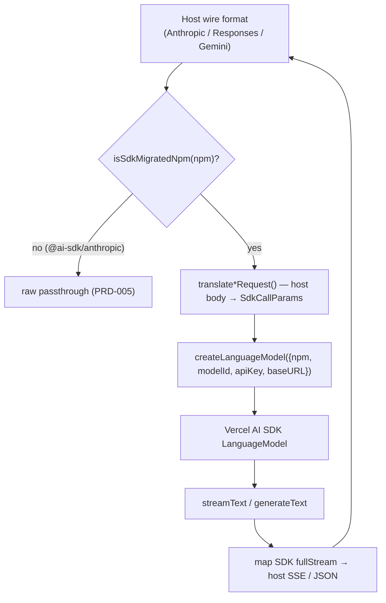

# PRD-004: Translation Layer (Vercel AI SDK Adapter) *(Retroactive)*

> **Status:** Shipped
> **Priority:** —
> **Effort:** —
> **Written:** June 2026
> **Retroactive:** Yes — written after implementation (rflectr v0.2.7).
> **Source:** `src/sdk-adapter.ts`, `src/provider-factory.ts`, `src/openai-adapter.ts`, `src/gemini-parts.ts`

---

## Overview

A Claude Code / Codex / Gemini host speaks one wire format (Anthropic `/v1/messages`, OpenAI Responses, or Gemini REST). The alternative model backends rflectr re-points those hosts at speak many — OpenAI Chat Completions, OpenAI Responses, Gemini `v1beta`, xAI, Mistral, DeepSeek, OpenRouter, openai-compatible endpoints, and so on. The translation layer is the single code path that bridges the host's format to whatever the selected model actually wants.

The defining decision is that there is **exactly one translation path**, not N. Every non-Anthropic provider routes through the Vercel AI SDK (`ai` + `@ai-sdk/*`) — the same packages OpenCode loads — which owns wire format, endpoint selection, and provider quirks. rflectr never hand-rolls an Anthropic→OpenAI or Anthropic→Gemini translator per provider. Adding a provider once makes it usable from every host.

Anthropic-native models skip the adapter entirely and are forwarded raw; `isSdkMigratedNpm(npm)` (`src/provider-factory.ts:68`) is the gate — true for any npm except `@ai-sdk/anthropic`.

See the knowledge doc: [`../../../knowledge/private/ai/translation-layer.md`](../../../knowledge/private/ai/translation-layer.md).

## What Was Built

- A provider factory (`createLanguageModel`) that maps OpenCode's `api.npm` package name to a Vercel AI SDK `LanguageModel` via dynamic `import(npm)` and `create*`-export discovery (`src/provider-factory.ts:102`).
- A Responses-vs-Chat API selector (`modelPrefersResponsesApi`) that routes newer OpenAI/xAI reasoning models through the Responses API (`src/provider-factory.ts:34`).
- The Anthropic-facing adapter: `translateRequest` (request → SDK call params), `streamAnthropicResponse` (SDK `fullStream` → Anthropic SSE), and `generateAnthropicResponse` (non-streaming) (`src/sdk-adapter.ts:222`, `:413`, `:431`).
- Inline `role:'system'` folding — Claude Code's mid-conversation skills list and system-reminders are merged into the system prompt instead of being dropped (`src/sdk-adapter.ts:90`, `:232`).
- The `thought_signature` round-trip — smuggled through the tool-use id so reasoning models (especially Gemini) get their signature echoed back verbatim (`src/proxy-shared.ts:93`, `:72`).
- Per-provider reasoning capability + effort translation (`getReasoningCapabilities`, `effortProviderOptions`, `thinkingProviderOptions`, `deepMergeProviderOptions`) (`src/provider-factory.ts:469`, `:633`, `:741`, `:725`).
- Two more host-facing directions reusing the same factory + SDK model: the OpenAI Chat Completions adapter (`src/openai-adapter.ts`), the Codex Responses adapter (`src/codex-responses-adapter.ts`), and the Gemini parts translator (`src/gemini-parts.ts`).

## Goals

- One translation path for all non-Anthropic providers — eliminate the combinatorial per-provider translator mess.
- Let the SDK own wire format, endpoint selection, and provider quirks (message ordering, reasoning signatures, tool-call encoding).
- Preserve host behavior that the Anthropic wire format alone would lose — inline system messages and reasoning signatures.
- Keep `dist/cli.js` small by loading SDK provider packages on demand from `node_modules`.
- Make every host (Claude Code, Codex, Gemini, Claude Desktop gateway) converge on the same factory so a provider added once works everywhere.

## Non-Goals

- Hand-rolled per-provider wire translation — explicitly rejected in favor of the SDK.
- Owning the agent tool loop. The adapter is strictly **one turn per request**; Claude Code owns the loop (`src/sdk-adapter.ts:3`).
- Bundling SDK provider packages into the CLI. They ship as `dependencies` / `external` and resolve at runtime (`src/provider-factory.ts:81`).
- Routing Anthropic-native models — those bypass the adapter and are forwarded raw (passthrough handled by the proxy, see PRD-005).
- Accurate cost reporting for non-Anthropic models (Claude Code applies its own pricing table; documented limitation).

## Features

| # | Feature | Source |
|---|---------|--------|
| F1 | Single-path gate (`isSdkMigratedNpm`): SDK for all npm except `@ai-sdk/anthropic` | `src/provider-factory.ts:68` |
| F2 | `createLanguageModel({npm,modelId,apiKey,baseURL})` factory via dynamic `import(npm)` + `create*` discovery | `src/provider-factory.ts:102`, `:72`, `:81` |
| F3 | Responses-vs-Chat API selection (`modelPrefersResponsesApi`) for OpenAI/xAI | `src/provider-factory.ts:34` |
| F4 | `translateRequest` — messages, tools, `tool_choice`, system | `src/sdk-adapter.ts:222` |
| F5 | Inline `role:'system'` folding into the system prompt | `src/sdk-adapter.ts:90`, `:232` |
| F6 | `streamAnthropicResponse` — SDK `fullStream` → Anthropic SSE | `src/sdk-adapter.ts:413`, `:273` |
| F7 | `generateAnthropicResponse` — non-streaming case | `src/sdk-adapter.ts:431` |
| F8 | `thought_signature` round-trip via tool-use id (encode/decode) | `src/proxy-shared.ts:93`, `:72`; `src/sdk-adapter.ts:190`, `:352` |
| F9 | Per-provider reasoning effort/thinking translation | `src/provider-factory.ts:469`, `:633`, `:741` |
| F10 | OpenAI Chat Completions host direction (reuses factory + SDK model) | `src/openai-adapter.ts:38` |
| F11 | Gemini parts → Anthropic blocks translation | `src/gemini-parts.ts:16`, `:45` |
| F12 | Codex Responses host direction (reuses factory + SDK model) | `src/codex-responses-adapter.ts:243` |

## Architecture & Implementation

### One translation path

The classifier in PRD-003 supplies `npm` and `modelFormat`; the proxy in PRD-005 dispatches into this layer.

### Request translation (Anthropic → SDK)

`translateRequest(body, npm, options?)` (`src/sdk-adapter.ts:222`) builds an `SdkCallParams` object:

- **Messages** — `translateMessages` (`src/sdk-adapter.ts:153`) walks Anthropic blocks into SDK `ModelMessage[]`: text, images (`imagePart`, `:103`), `tool_use` → `tool-call`, `tool_result` → a `tool` role message, and `thinking` → SDK `reasoning` parts. Tool-result messages need a tool name, resolved by `annotateToolNames` (`:116`) which builds an id→name map first.
- **Tools** — `translateTools` (`:204`) wraps each Anthropic tool as an SDK `tool({ description, inputSchema: jsonSchema(...) })`.
- **`tool_choice`** — `translateToolChoice` (`:214`) maps `auto`→`'auto'`, `any`→`'required'`, `tool`→`{type:'tool',toolName}`.
- **System folding** — `systemToString` (`:82`) flattens the top-level `system`; `inlineSystemText` (`:90`) collects mid-conversation `role:'system'` messages (Claude Code injects the skills list and system-reminders this way) and joins them into the system prompt so they are not dropped (`:232`).
- **Reasoning** — effort is read from `output_config.effort` (`anthropicEffortFromRequest`, `:65`) or `options.defaultEffort` (the Claude Desktop gateway omits effort); `providerOptions` is the deep-merge of `thinkingProviderOptions(npm)` and `effortProviderOptions(...)` (`:244`).
- **ChatGPT Codex OAuth branch** — when `openAiOAuth` is set, the system prompt moves into `providerOptions.openai.instructions`, `system`/`maxOutputTokens` are cleared, and a default `"You are a coding assistant."` is used if no system text exists (`:235`, `:251`, `:258`).

### Factory discovery (`createLanguageModel`)

`createLanguageModel(spec)` (`src/provider-factory.ts:102`) is async and routes by `npm`:

| npm | Behavior | Source |
|---|---|---|
| `@ai-sdk/google-vertex/anthropic` (`VERTEX_ANTHROPIC_NPM`) | Claude on Vertex AI via ADC (no apiKey) | `:105` |
| `@ai-sdk/openai` | OAuth → ChatGPT Codex backend (`https://chatgpt.com/backend-api/codex`); API key → direct. `modelPrefersResponsesApi()` picks `openai.responses(id)` vs `openai.chat(id)` | `:117` |
| `@ai-sdk/xai` | Direct; also consults `modelPrefersResponsesApi()` | `:134` |
| `@ai-sdk/google` | Direct — ignores `baseURL`, uses native `v1beta` (passing the OpenAI-compat discovery URL would 404) | `:142` |
| `@ai-sdk/anthropic` | Direct; strips a trailing `/v1` from `baseURL`, re-appends `/v1` for the SDK | `:149` |
| `@ai-sdk/openai-compatible`, `@openrouter/ai-sdk-provider` | Routed via `baseURL` | `:160`, `:167` |
| anything else | `loadSdkProviderFactory(npm)` → dynamic `import(npm)` → `findCreateFactory` finds the `create*()` export | `:170`, `:81`, `:72` |

`findCreateFactory` (`:72`) scans the module's exports for a function whose name starts with `create`. `loadSdkProviderFactory` (`:81`) caches the promise per npm and, on `ERR_MODULE_NOT_FOUND`, raises an install hint. Reasoning models matching `/deepseek-r1|think|reasoning|qwq/` are wrapped with `extractReasoningMiddleware({ tagName: 'think' })` (`:176`). The `@ai-sdk/*` packages are npm `dependencies` marked `external` in `tsup.config.ts`, so `dist/cli.js` stays small.

### Responses-vs-Chat selection

`modelPrefersResponsesApi(modelId)` (`src/provider-factory.ts:34`) returns true when a model must use `/v1/responses` rather than `/v1/chat/completions`:

| Pattern | Examples | Matched by |
|---|---|---|
| `gpt-5.4` / `gpt-5.5` prefixes | `gpt-5.4`, `gpt-5.5-fast` | `RESPONSES_ONLY_PREFIXES` exact/`-`-prefix (`:12`, `:36`) |
| `gpt-5-pro` / `gpt-5.2-pro` | `gpt-5-pro` | same |
| `gpt-5-codex` and versioned codex | `gpt-5-codex`, `gpt-5.3-codex` | prefix + `gpt-*-codex` check (`:40`) |
| o-series | `o3`, `o4`, `o3-mini` | prefix list (`:18`) |
| xAI multi-agent | `grok-4.20-multi-agent`, `grok-4.2-multiagent` | `grok-*` + `multi-agent`/`multiagent` (`:42`) |

`upstreamModelId` (from PRD-003) carries OpenCode's `api.id` because catalog ids may differ from upstream API ids (e.g. `gpt-5.5-fast` → `gpt-5.5`).

### Response translation (SDK → Anthropic SSE)

`writeAnthropicStream` (`src/sdk-adapter.ts:273`) consumes the SDK `fullStream` and emits Anthropic SSE events. It tracks one open content block at a time and maps SDK parts:

- `reasoning-start` / `reasoning-delta` → `thinking` block + `thinking_delta`; `reasoning-end` captures the round-trip signature emitted later as a `signature_delta` on close (`:321`, `:331`, `:302`).
- `text-start` / `text-delta` → `text` block + `text_delta` (`:337`).
- `tool-input-start` / `-delta` → `tool_use` block (id encoded with the thought signature) + `input_json_delta`; `tool-call` handles the non-streamed case (`:349`, `:365`).
- `finish` maps `finishReason` and usage; `error` closes the open block and emits an Anthropic `error` event (`:381`, `:393`).

`streamAnthropicResponse` (`:413`) wires `streamText` to `writeAnthropicStream` and swallows stream-property rejections; `generateAnthropicResponse` (`:431`) runs `generateText` and builds a single Anthropic message JSON.

### thought_signature round-trip

Reasoning models (especially Gemini) require their `thought_signature` echoed back verbatim on the next turn, but the Anthropic wire format has no field for it. rflectr smuggles it through the tool-use id:

- **Encode** — `encodeToolUseId(rawId, signature)` (`src/proxy-shared.ts:93`) base64url-encodes the signature and appends it after a `__ts__` separator: `{rawId}__ts__{base64url(signature)}`. When emitting blocks, the adapter calls it at `tool-input-start` / `tool-call` with the signature from `grabRoundTripSignature` (`src/sdk-adapter.ts:352`, `:371`).
- **Decode** — `splitToolUseId(id)` (`src/proxy-shared.ts:72`) recovers `{ rawId, thoughtSignature }`. On the next request, `translateMessages` decodes it and, for Google, sets `providerOptions.google.thoughtSignature` on the `tool-call` part (`src/sdk-adapter.ts:190`); the SDK then handles Gemini's strict echo-back.

`grabRoundTripSignature` (`src/proxy-shared.ts:22`) reads the signature from provider metadata — `google.thoughtSignature` / `thought_signature` for Gemini, `openai.reasoningEncryptedContent` for OpenAI Responses. On the Gemini host direction, `partThoughtSignature` (`src/gemini-parts.ts:8`) pulls it off the function-call part and `parseGeminiPart` re-encodes it into the tool-use id (`:30`).

> **Separator note:** the live separator is `__ts__` with a base64url-encoded payload (`src/proxy-shared.ts:38`, `:93`). `::ts::` is retained only as a legacy decode fallback for sessions started before the change (`:82`). The knowledge doc describes the `::ts::` form.

### Reusing the factory for the other two host directions

The same `createLanguageModel` + `streamText`/`generateText` underpins all hosts; only the host-facing translation differs:

- **OpenAI Chat Completions** (`src/openai-adapter.ts`): `translateOpenAiRequest` (`:38`) builds `SdkCallParams` from an OpenAI body; `generateOpenAiResponse` (`:131`) / `streamOpenAiResponse` (`:161`) emit the OpenAI JSON / SSE shape.
- **Codex Responses API** (`src/codex-responses-adapter.ts`): `translateResponsesRequest` (`:243`) / `translateResponsesInput` (`:166`) / `translateResponsesTools` (`:230`) build SDK params from a Responses body; `streamResponsesResponse` (`:575`) / `generateResponsesResponse` (`:593`) emit Responses SSE/JSON.
- **Gemini REST** (`src/gemini-parts.ts`): `parseGeminiPart` (`:16`), `collectAnthropicBlocksFromGeminiParts` (`:45`), and `mapGeminiUsage` (`:76`) translate Gemini parts and usage.

## Acceptance Criteria

- [x] All non-Anthropic providers route through the Vercel AI SDK; `@ai-sdk/anthropic` is the only npm that bypasses it (`isSdkMigratedNpm`, `src/provider-factory.ts:68`).
- [x] `createLanguageModel` resolves an SDK `LanguageModel` from `{npm, modelId, apiKey, baseURL}` via dynamic `import(npm)` + `create*` discovery (`src/provider-factory.ts:102`, `:72`, `:81`).
- [x] Special factory branches exist for Vertex Anthropic, OpenAI (OAuth Codex backend + Responses/chat), xAI, Google `v1beta`, Anthropic `/v1` normalization, openai-compatible, and OpenRouter (`src/provider-factory.ts:105`–`:174`).
- [x] `modelPrefersResponsesApi` returns true for GPT-5.4+/5.5/pro, `*-codex`, the o-series, and xAI multi-agent models (`src/provider-factory.ts:34`).
- [x] `translateRequest` maps messages, tools, `tool_choice`, and system into `SdkCallParams` (`src/sdk-adapter.ts:222`).
- [x] Inline `role:'system'` messages are folded into the system prompt rather than dropped (`src/sdk-adapter.ts:90`, `:232`).
- [x] `streamAnthropicResponse` maps the SDK `fullStream` to Anthropic SSE and `generateAnthropicResponse` handles the non-streaming case (`src/sdk-adapter.ts:413`, `:431`).
- [x] `thought_signature` is encoded into the tool-use id and decoded back into `providerOptions.google.thoughtSignature` (`src/proxy-shared.ts:93`, `:72`; `src/sdk-adapter.ts:190`).
- [x] Per-provider reasoning effort/thinking is translated via `getReasoningCapabilities` / `effortProviderOptions` / `thinkingProviderOptions` / `deepMergeProviderOptions` (`src/provider-factory.ts:469`, `:633`, `:741`, `:725`).
- [x] The Codex Responses and OpenAI/Gemini host directions reuse the same factory + SDK model (`src/codex-responses-adapter.ts:243`, `src/openai-adapter.ts:38`, `src/gemini-parts.ts:16`).
- [x] SDK provider packages load on demand and stay `external` so `dist/cli.js` remains small (`src/provider-factory.ts:81`; `tsup.config.ts`).

## Files

| File | Role |
|------|------|
| `src/sdk-adapter.ts` | Anthropic `/v1/messages` ↔ SDK; `translateRequest`, `translateMessages`, `streamAnthropicResponse`, `generateAnthropicResponse`, inline-system folding |
| `src/provider-factory.ts` | `createLanguageModel`, `isSdkMigratedNpm`, `modelPrefersResponsesApi`, reasoning capability + effort translation |
| `src/openai-adapter.ts` | OpenAI Chat Completions host direction (`translateOpenAiRequest`, `generate`/`streamOpenAiResponse`) |
| `src/gemini-parts.ts` | Gemini content-part → Anthropic block translation + usage mapping |
| `src/codex-responses-adapter.ts` | Codex Responses API host direction (translation aspects) |
| `src/proxy-shared.ts` | `encodeToolUseId` / `splitToolUseId` (thought_signature round-trip), `grabRoundTripSignature`, SSE helpers |
| `tests/sdk-adapter.test.ts`, `tests/provider-factory.test.ts` | Unit coverage for the pure translation functions |

## Risks & Known Limitations

- **`thought_signature` separator collision.** The signature is appended after a separator in the tool-use id. The (live) `__ts__` separator carries a base64url payload, so a collision would require the encoded payload to itself contain `__ts__` — extremely unlikely. The legacy `::ts::` form (kept as a decode fallback) would break only if a raw signature literally contained `::ts::` (`src/proxy-shared.ts:38`, `:82`).
- **Gemini strict echo-back.** Gemini rejects requests that don't echo `thought_signature` verbatim. This is why the hand-rolled Gemini-native path was retired — the SDK handles the echo-back once the signature round-trips (`src/sdk-adapter.ts:190`, `src/gemini-parts.ts:8`).
- **Cost display inaccuracy.** Claude Code applies its own pricing table, so non-Anthropic model cost is always wrong (documented, by design).
- **One turn per request.** The adapter never loops; if a host expected the adapter to drive a tool loop it would break. Claude Code owns the loop (`src/sdk-adapter.ts:3`).
- **`@ai-sdk/github-copilot` is unsupported.** OpenCode loads it from internal `@opencode-ai/core`, not a public npm factory the dynamic `import(npm)` can resolve (documented limitation).
- **Provider-specific reasoning mappings are heuristic.** Effort levels are mapped per provider (e.g. xAI has no `medium`; DeepSeek `low/medium`→`high`), so a requested effort may snap to the nearest valid value (`src/provider-factory.ts:424`, `:359`).

## Related

- [`../../../knowledge/private/ai/translation-layer.md`](../../../knowledge/private/ai/translation-layer.md) — the knowledge doc this PRD documents.
- [`../prd-003-model-discovery-classification/prd-003-model-discovery-classification-index.md`](../prd-003-model-discovery-classification/prd-003-model-discovery-classification-index.md) — classification supplies the `npm` and `modelFormat` that drive factory routing and the `isSdkMigratedNpm` gate.
- [`../prd-005-local-proxy-catalog-routing/prd-005-local-proxy-catalog-routing-index.md`](../prd-005-local-proxy-catalog-routing/prd-005-local-proxy-catalog-routing-index.md) — the local proxy dispatches Anthropic-format requests into this adapter (or raw passthrough for `@ai-sdk/anthropic`).
- [`../prd-009-codex-integration/prd-009-codex-integration-index.md`](../prd-009-codex-integration/prd-009-codex-integration-index.md) — Codex reuses the factory + SDK model via the Responses host direction.
- [`../prd-010-gemini-cli-integration/prd-010-gemini-cli-integration-index.md`](../prd-010-gemini-cli-integration/prd-010-gemini-cli-integration-index.md) — Gemini CLI reuses the factory via the Gemini REST host direction.
