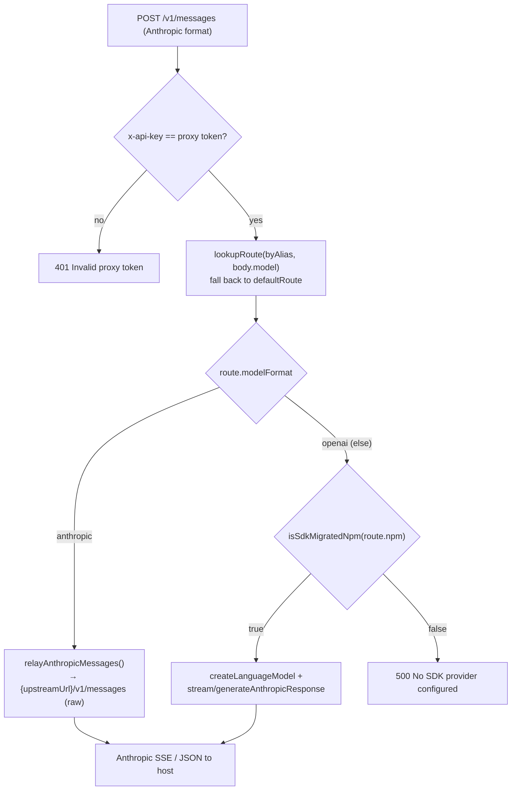

# PRD-005: Local Proxy & Catalog Routing *(Retroactive)*

> **Status:** Shipped
> **Priority:** —
> **Effort:** —
> **Written:** June 2026
> **Retroactive:** Yes — written after implementation (rflectr v0.2.7).
> **Source:** `src/proxy.ts`, `src/catalog.ts`, `src/proxy-shared.ts`, `src/upstream-forward.ts`

---

## Overview

rflectr re-points a host tool (Claude Code) at an alternative model backend by pointing `ANTHROPIC_BASE_URL` at a throwaway HTTP server it spins up on `127.0.0.1:<random ephemeral port>`. This **local proxy** accepts requests in Anthropic's wire format (`POST /v1/messages`, `GET /v1/models`) and, per request, either forwards them raw to a provider that already speaks Anthropic, or hands them to the Vercel AI SDK adapter (PRD-004) for any other provider.

The proxy is created at launch and torn down when the host process exits. It exists in two shapes: a **single-model** wrapper (`startProxy`) for an ordinary launch, and a **multi-route catalog** (`startProxyCatalog`) for switch-menu sessions where Claude Code's `/model` picker can hop between a starting model and the user's favorites. Catalog routing depends on a small set of pure route-builder functions in `src/catalog.ts` and an alias scheme (`aliasModelId`) that rewrites non-`claude-*` model ids into a form Claude Code's gateway model discovery will accept.

This PRD documents the proxy server, its request-dispatch model, the `ProxyRoute` carrier type, the synthetic model catalog, the alias scheme, the catalog route builders, and the shared upstream-forwarding helpers.

## What Was Built

- A local HTTP server bound to `127.0.0.1` on an OS-chosen ephemeral port (`server.listen(0, '127.0.0.1', …)`, `src/proxy.ts:294`) that serves `HEAD /`, `GET /v1/models`, `GET /v1/models/:id`, and `POST /v1/messages`.
- A per-request dispatch that resolves a `ProxyRoute` by model id and branches on `route.modelFormat`: `anthropic` → raw passthrough; otherwise → SDK adapter (`src/proxy.ts:211`, `src/proxy.ts:230`).
- Two entry points: `startProxyCatalog(routes, defaultAliasId, debug)` (`src/proxy.ts:112`) and the single-model wrapper `startProxy(completionsUrl, modelId, debug, contextWindow?, sdk?, apiKey?)` (`src/proxy.ts:315`), which builds a one-route catalog.
- A `ProxyHandle` (`{ port, token, close() }`) whose `token` (a `randomUUID()`) becomes the child's `ANTHROPIC_API_KEY`, so only the launched child can call the proxy (`src/proxy.ts:117`, `src/proxy.ts:177`).
- The `aliasModelId(realId, providerId)` rewrite that makes non-`claude-*` ids gateway-discovery-safe as `anthropic-{provider}__{id}` (`src/proxy.ts:96`).
- A synthetic `GET /v1/models` catalog, one entry per route, each carrying `context_window` via `formatAnthropicModelEntry` / `formatAnthropicModelList` (`src/proxy.ts:138`, `src/proxy.ts:162`; `src/server/models.ts:58`).
- Catalog route builders in `src/catalog.ts`: `localModelToRoute`, `zenGoModelToRoute`, `makeRouteResolver`, and `buildCatalogRoutes` (capped at `MAX_MODEL_CATALOG = 20`, `src/constants.ts:51`).
- Shared upstream forwarding in `src/upstream-forward.ts` (`relayAnthropicMessages`, `postJsonUpstream`, `anthropicUpstreamHeaders`, `UpstreamUnreachableError`), reused by both this proxy and the `server` command's router (PRD-012).
- Format-agnostic glue in `src/proxy-shared.ts` (`sseChunk`, `encodeToolUseId`/`splitToolUseId`, `grabRoundTripSignature`, `silenceSdkWarnings`, …) and request/response shapes in `src/proxy-types.ts`.

## Goals

- Let the host tool talk to any registered backend without modifying `settings.json` — env-var-only, child-process-scoped (see PRD-001).
- Translate only when necessary: a provider that already speaks Anthropic gets a raw byte-for-byte relay; everything else goes through the single SDK translation path (PRD-004).
- Support mid-session model switching by advertising a multi-model catalog the host can pick from, while keeping each model's real upstream id and key hidden behind a stable alias.
- Report accurate context windows to the host's status bar in single-model launches.
- Lock the proxy to the launched child via a per-session token.

## Non-Goals

- **Translation internals.** Wire-format mapping, endpoint selection, and provider quirks belong to the SDK adapter and provider factory (PRD-004). The proxy only chooses *which* path to dispatch to.
- **The Codex (`/v1/responses`) and Gemini (`/v1beta/...`) proxies.** Those are sibling servers that share `proxy-shared.ts` but expose different endpoints — see PRD-009 and PRD-010.
- **The standalone `server` gateway.** That long-lived multi-provider gateway reuses `upstream-forward.ts` but is its own surface (PRD-012).
- **Favorites collection / persistence.** How favorites are chosen and stored is PRD-008; this PRD consumes a `FavoriteModel[]` to build routes.
- **Live-switch context-window accuracy.** In gateway-discovery (switch-menu) mode the host fetches `/v1/models` once at startup; the displayed window reflects the launch model only (see Risks).

## Features

| Feature | Description | Source |
| --- | --- | --- |
| Ephemeral local server | Binds `127.0.0.1:0`; OS picks the port; returned in `ProxyHandle.port`. | `src/proxy.ts:294` |
| Per-session token auth | `POST /v1/messages` requires `x-api-key`/`Bearer` == the proxy's `randomUUID()` token, else 401. | `src/proxy.ts:117`, `src/proxy.ts:177` |
| Health-check ping | `HEAD /` → 200 (Claude Code startup ping). | `src/proxy.ts:148` |
| Synthetic model list | `GET /v1/models` returns one entry per route with `context_window`; `GET /v1/models/:id` returns a single entry or 404. | `src/proxy.ts:155` |
| Anthropic passthrough | `modelFormat === 'anthropic'` → `relayAnthropicMessages` to `{baseUrl}/v1/messages`, forwarding `anthropic-beta`. | `src/proxy.ts:211` |
| SDK-backed dispatch | `isSdkMigratedNpm(route.npm)` → `createLanguageModel` + `streamAnthropicResponse`/`generateAnthropicResponse`. | `src/proxy.ts:230` |
| Streaming + non-streaming | Honors `body.stream`; streams Anthropic SSE or returns JSON. | `src/proxy.ts:255` |
| `aliasModelId` | Rewrites non-`claude-*` ids to `anthropic-{providerId}__{id}` for gateway discovery; `claude-*` pass through. | `src/proxy.ts:96` |
| Alias-tolerant route lookup | `routeLookupIds` resolves prefix/suffix/`models/`-prefixed variants to the same route. | `src/proxy.ts:103` |
| Single-model wrapper | `startProxy` builds a one-route catalog from a completions URL + optional `sdk` carrier. | `src/proxy.ts:315` |
| Catalog route builders | `localModelToRoute`, `zenGoModelToRoute`, `makeRouteResolver`, `buildCatalogRoutes` (cap 20, dedup vs. starting route). | `src/catalog.ts:11`–`100` |
| Shared upstream forwarding | `relayAnthropicMessages`, `postJsonUpstream`, `anthropicUpstreamHeaders`, `UpstreamUnreachableError`. | `src/upstream-forward.ts` |
| Trace logging | When `debug`, redacted secure log via `appendSecureLog` (0600). | `src/proxy.ts:24`, `src/proxy.ts:40` |

## Architecture & Implementation

### Request dispatch flow

- **Token gate.** `extractApiKey(req)` (from `x-api-key` or `Bearer`) must equal `proxyToken`, else `401 Invalid proxy token` (`src/proxy.ts:176`). The token is a `randomUUID()` generated per proxy (`src/proxy.ts:117`) and handed to the child as its `ANTHROPIC_API_KEY`.
- **Route resolution.** `const route = lookupRoute(byAlias, originalModel) ?? defaultRoute` (`src/proxy.ts:195`). `lookupRoute` tries each id produced by `routeLookupIds` (`src/proxy.ts:103`), which strips the `[1m]` context suffix and handles a leading `models/` prefix so Claude Code's id variants resolve to one route.
- **Anthropic passthrough.** The raw Anthropic body (with `model` swapped to `route.realModelId`) is relayed to `${upstreamUrl}/v1/messages`, forwarding the inbound `anthropic-beta` header (`src/proxy.ts:211`–`224`). Failures surface as `502` and, for network errors, `UpstreamUnreachableError` (`src/upstream-forward.ts:45`).
- **SDK path.** `sdkTranslateRequest(body, route.npm, …)` builds SDK params, `createLanguageModel({ npm, modelId, apiKey, baseURL, … })` resolves the provider, then `streamAnthropicResponse`/`generateAnthropicResponse` map to Anthropic output (`src/proxy.ts:230`–`281`). A non-`anthropic` route with no SDK-migrated npm is a misconfiguration → `500` (`src/proxy.ts:284`).
- **Body decoding.** `readBody` honors `Content-Encoding` (gzip/deflate/br/zstd) and caps the body at 50 MB (`src/http-utils.ts:34`).

### The `ProxyRoute` carrier

Each route is self-contained — it carries everything needed to serve a request (`src/proxy.ts:72`): `aliasId` (advertised id), `realModelId` (sent upstream), `displayName`, `upstreamUrl`, `apiKey` (per-route; empty → 401), `modelFormat`, `contextWindow`, and the SDK/provider fields `npm`, `baseURL`, `providerId`, `authType`, `oauthAccountId`, `supportedParameters`, `reasoning`, `interleavedReasoningField`. `upstreamUrl` is a full chat-completions URL for openai-format routes, or a base URL **without** `/v1` for anthropic routes (the relay appends `/v1/messages`).

### Route resolution & catalog assembly (`src/catalog.ts`)

- `localModelToRoute(lp, model)` (`src/catalog.ts:11`) maps a discovered local-provider model to a `ProxyRoute`, returning `null` for unserveable models (anthropic without `baseUrl`; openai without an SDK npm and without a `completionsUrl`).
- `zenGoModelToRoute(model, apiKey)` (`src/catalog.ts:33`) maps a Zen/Go cloud model; `unsupported` formats return `null`. openai-format Zen/Go models route through `@ai-sdk/openai-compatible` with `baseURL = ${backend.baseUrl}/v1`; anthropic-format stay direct passthrough (no `npm`).
- `makeRouteResolver(localProviders, zenModels, goModels, zenGoApiKey)` (`src/catalog.ts:53`) returns a `(providerId, modelId) => ProxyRoute | undefined` closure that dispatches `zen`/`go` to the cloud builder and anything else to the local builder.
- `buildCatalogRoutes(startingRoute, favorites, resolveRoute, max = 20)` (`src/catalog.ts:81`) resolves each favorite, dedupes against the starting route's `aliasId`, caps at `MAX_MODEL_CATALOG`, and reports `droppedFavorites` (stale/unresolvable). The starting route is always first.

Both builders run the model id and `contextWindow` through `claudeCodeClientModelId(aliasModelId(id, providerId), window)` so the advertised alias is gateway-safe and carries the `[1m]` suffix when the window exceeds the default.

### Alias scheme

`aliasModelId(realId, providerId)` (`src/proxy.ts:96`) leaves `claude-*` ids unchanged and rewrites everything else to `anthropic-{slug}__{realId}`, where `slug` is the provider id lowercased and non-alphanumerics collapsed to `-`. Using the stable provider **id** (not display name) means renaming a provider does not break the alias. Claude Code's gateway model discovery only surfaces ids beginning `claude` or `anthropic`; this rewrite is what makes a third-party model selectable in the `/model` picker. (A side effect: after a switch-menu session a bare `claude` may still show a relay alias, because Claude Code caches the gateway id.)

### Single-model vs. catalog launch

`startProxy` (`src/proxy.ts:315`) is a thin wrapper that constructs one `ProxyRoute` from a completions URL plus an optional `sdk` carrier (`{ npm, baseURL, upstreamModelId, providerId, authType, … }`) and an `apiKey`, then calls `startProxyCatalog` with that single route as the default. Switch-menu launches instead call `buildCatalogRoutes` first and pass the full route array to `startProxyCatalog` (consumed by PRD-001 / PRD-008).

## API Surface

The proxy listens on `http://127.0.0.1:<ProxyHandle.port>`.

### `HEAD /`
Health-check ping → `200`, empty body (`src/proxy.ts:148`).

### `GET /v1/models`
Returns the synthetic catalog: `{ data: [...], has_more: false, first_id, last_id }`, one entry per route, each with `context_window` resolved by `resolveContextWindow` (`src/proxy.ts:138`, `src/server/models.ts:89`). No auth required.

### `GET /v1/models/:id`
Returns a single formatted entry for the resolved route, or `404 not_found_error` if the id matches no route (`src/proxy.ts:156`–`166`).

### `POST /v1/messages`
The main translation path. Requires the proxy token (`401` otherwise). Body is Anthropic `messages` format. Response is Anthropic SSE when `body.stream` is truthy, else Anthropic JSON. Error envelope is always `{ type: 'error', error: { type, message } }` — `400` invalid JSON, `401` bad/missing key, `500` misconfigured route, `502` upstream failure (`src/proxy.ts:175`–`285`).

Any other method/path → `404 Unknown endpoint` (`src/proxy.ts:289`).

## Acceptance Criteria

- [x] Proxy binds `127.0.0.1` on an OS-chosen ephemeral port and returns it in `ProxyHandle.port` (`src/proxy.ts:294`).
- [x] `POST /v1/messages` rejects requests whose key ≠ the per-session token with `401` (`src/proxy.ts:176`).
- [x] `HEAD /` returns `200` for the host's startup health check (`src/proxy.ts:148`).
- [x] `GET /v1/models` returns one entry per route with a `context_window` field (`src/proxy.ts:138`, `src/server/models.ts:58`).
- [x] `GET /v1/models/:id` returns the matching entry or `404` (`src/proxy.ts:156`).
- [x] `modelFormat === 'anthropic'` routes relay raw to `{upstreamUrl}/v1/messages`, forwarding `anthropic-beta` (`src/proxy.ts:211`).
- [x] Non-anthropic routes with an SDK-migrated `npm` dispatch through `createLanguageModel` + the SDK adapter (`src/proxy.ts:230`).
- [x] A non-anthropic route without a registered SDK npm returns `500` (`src/proxy.ts:284`).
- [x] Streaming is honored via `body.stream`; SSE for streaming, JSON otherwise (`src/proxy.ts:255`).
- [x] `aliasModelId` leaves `claude-*` unchanged and rewrites others to `anthropic-{providerId}__{id}` (`src/proxy.ts:96`).
- [x] `startProxy` is a single-route wrapper around `startProxyCatalog` (`src/proxy.ts:315`).
- [x] `buildCatalogRoutes` dedupes against the starting route, caps at `MAX_MODEL_CATALOG` (20), and reports dropped favorites (`src/catalog.ts:81`).
- [x] `localModelToRoute` / `zenGoModelToRoute` return `null` for unserveable / `unsupported` models (`src/catalog.ts:12`, `src/catalog.ts:34`).
- [x] `relayAnthropicMessages` distinguishes a network failure (`UpstreamUnreachableError`) from an upstream error response (`src/upstream-forward.ts:45`, `src/upstream-forward.ts:72`).
- [x] Upstream forwarding is shared with the `server` router via `src/upstream-forward.ts` (PRD-012).

## Files

| File | Role |
| --- | --- |
| `src/proxy.ts` | The Anthropic-facing proxy: `startProxyCatalog`, `startProxy`, `aliasModelId`, `ProxyRoute`, `ProxyHandle`, request dispatch, synthetic `/v1/models`, token auth, trace logging. |
| `src/catalog.ts` | Route builders: `localModelToRoute`, `zenGoModelToRoute`, `makeRouteResolver`, `buildCatalogRoutes`. |
| `src/proxy-shared.ts` | Format-agnostic glue shared across the Anthropic/Responses/Gemini proxies (SSE, tool-use id round-trip, signature grab, SDK-warning silencer). |
| `src/proxy-types.ts` | Anthropic/Gemini/OpenAI request & response shapes. |
| `src/upstream-forward.ts` | Shared upstream forwarding: `relayAnthropicMessages`, `postJsonUpstream`, Anthropic header helpers, `UpstreamUnreachableError`. |
| `src/http-utils.ts` | `readBody` (Content-Encoding decode + 50 MB cap), `extractApiKey`, `sendJson`. |
| `src/server/models.ts` | `formatAnthropicModelEntry` / `formatAnthropicModelList` / `resolveContextWindow` (consumed for the synthetic catalog). |
| `src/context-model-id.ts` | `claudeCodeClientModelId`, `routeLookupIds`, `stripOneMContextSuffix` (alias id derivation + lookup tolerance). |
| `src/constants.ts` | `MAX_MODEL_CATALOG = 20`. |

## Risks & Known Limitations

- **Switch-menu context window reflects the launch model only.** In gateway-discovery mode Claude Code fetches `/v1/models` once at startup and its discovery payload carries no `context_window`; only `CLAUDE_CODE_MAX_CONTEXT_TOKENS` (fixed at launch) drives the status bar. Single-model launches show the correct window. (Documented in CLAUDE.md / the knowledge doc.)
- **Cached gateway alias.** After a switch-menu session, a bare `claude` may show a relay alias (e.g. `anthropic-opencode-go__deepseek-v4-flash`) because Claude Code caches the gateway id at `~/.claude/cache/gateway-models.json`. Reset with `claude --model sonnet`.
- **Catalog cap.** Catalogs are capped at 20 routes (`MAX_MODEL_CATALOG`); favorites beyond the cap, or unresolvable ones, are silently dropped (surfaced as `droppedFavorites`).
- **Empty per-route key → 401.** A route with an empty `apiKey` returns `401 Missing API key` (`src/proxy.ts:203`); OAuth-only / placeholder-key gaps surface here.
- **`thought_signature` separator collision.** Tool-use ids encode a thought signature as `{id}__ts__{base64url}`; an id literally containing the separator would break round-tripping (extremely unlikely; legacy `::ts::` form still parsed for in-flight sessions). See PRD-004.

## Related

- [`../../../knowledge/private/integrations/local-proxy.md`](../../../knowledge/private/integrations/local-proxy.md) — knowledge doc this PRD is grounded in.
- [`../prd-004-translation-layer/prd-004-translation-layer-index.md`](../prd-004-translation-layer/prd-004-translation-layer-index.md) — the SDK adapter the proxy dispatches non-anthropic routes to.
- [`../prd-001-cli-core-launch-orchestration/prd-001-cli-core-launch-orchestration-index.md`](../prd-001-cli-core-launch-orchestration/prd-001-cli-core-launch-orchestration-index.md) — launch flow that starts and tears down the proxy.
- [`../prd-008-preferences-tiers-favorites/prd-008-preferences-tiers-favorites-index.md`](../prd-008-preferences-tiers-favorites/prd-008-preferences-tiers-favorites-index.md) — favorites that feed `buildCatalogRoutes`.
- [`../prd-012-server-gateway/prd-012-server-gateway-index.md`](../prd-012-server-gateway/prd-012-server-gateway-index.md) — the standalone gateway that reuses `upstream-forward.ts`.
