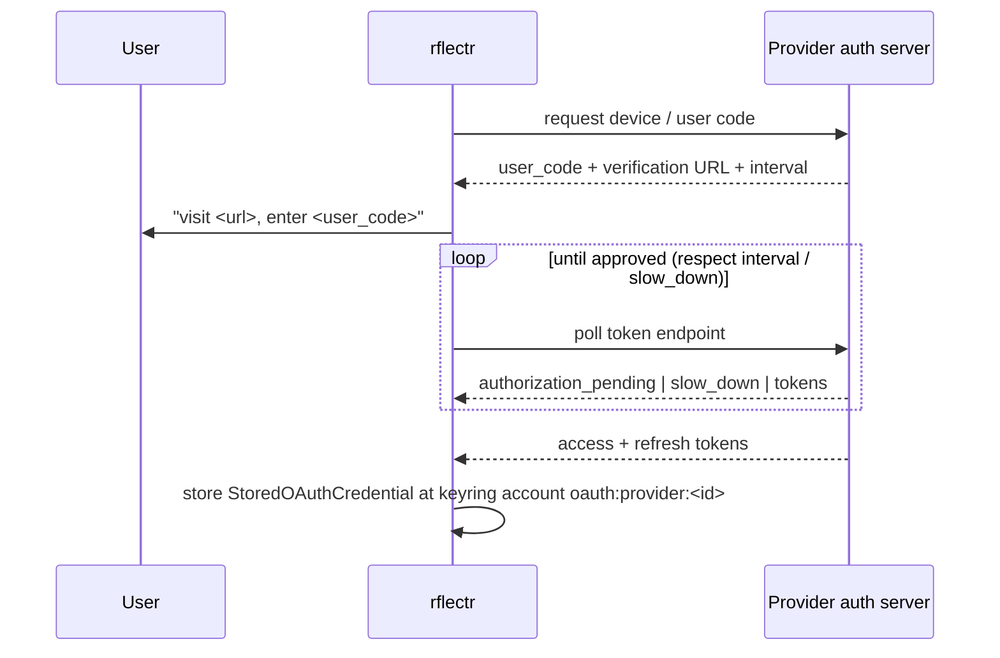

# PRD-007: OAuth Device & PKCE Flows *(Retroactive)*

> **Status:** Shipped
> **Priority:** —
> **Effort:** —
> **Written:** June 2026
> **Retroactive:** Yes — written after implementation (rflectr v0.2.7).
> **Source:** `src/oauth/*`, `src/registry/refresh-credentials.ts`

---

## Overview

Some model providers a developer might want to point Claude Code / Codex / Gemini at do not hand out a simple API key. ChatGPT (Plus/Pro), xAI SuperGrok, and GitHub Copilot authenticate the *user account* through OAuth, not a long-lived `sk-...` secret. Because rflectr runs in a terminal with no browser redirect URI to catch a callback, it uses the OAuth 2.0 **Device Authorization Grant** (RFC 8628): rflectr asks the provider for a user code, prints a verification URL, and polls the token endpoint until the user approves in their browser.

This PRD documents the device-code login flows, the PKCE utilities that back them, the stored-credential shape, the lazy token-refresh path, and the static OAuth-derived model lists that stand in for the `/v1/models` endpoints those OAuth tokens cannot reach. It is the auth-acquisition counterpart to PRD-006 (credential storage), which owns where the resulting token lives.

Knowledge doc: [`oauth-device-flows.md`](../../../knowledge/private/auth/oauth-device-flows.md).

---

## What Was Built

- A shared PKCE/utility module (`src/oauth/pkce.ts`) — crypto-random verifier + SHA-256 challenge, OAuth `state` generation, and polling helpers (`positiveSecondsToMs`, `sleepMs`).
- A stored-credential contract (`src/oauth/types.ts`) — `StoredOAuthCredential`, builders/parsers, time-based and proactive-JWT expiry checks, and the `supportsNativeOAuth()` gate over the native provider set `xai | xai-oauth | openai | openai-oauth | github-copilot`.
- Three per-provider device-code flows:
  - **OpenAI / ChatGPT** (`src/oauth/openai.ts`) — usercode → poll → authorization-code exchange with PKCE `code_verifier`, plus `chatgpt_account_id` extraction.
  - **xAI / Grok** (`src/oauth/xai.ts`) — standard RFC 8628 device grant with `slow_down` handling.
  - **GitHub Copilot** (`src/oauth/github.ts`) — GitHub device flow → `ghu_` token → second exchange for a short-lived Copilot session token.
- A single refresh dispatcher (`src/oauth/refresh.ts`) — `oauthCredentialShouldRefresh()` and `refreshStoredOAuthCredential()` routing to the right per-provider refresh.
- Integration into credential resolution (`src/env.ts`) — OAuth tokens are read from the keyring account `oauth:provider:<id>`, refreshed lazily and deduplicated per account, and written back; a stale-but-valid token is reused if refresh fails.
- Static OAuth model lists (`src/data/openai-oauth-models.ts`, `src/data/xai-oauth-models.ts`) — because the OAuth tokens are rejected by the providers' `/v1/models` endpoints.
- Placeholder/env-fallback key resolution for the refresh-models path (`src/registry/refresh-credentials.ts`).

---

## Goals

- Let a user sign into ChatGPT, SuperGrok, or GitHub Copilot from a terminal with no localhost callback server.
- Acquire and persist OAuth tokens in a shape that PRD-006 credential storage can read transparently (an access token comes back from `oauth:provider:<id>` just like an API key would).
- Keep short-lived access tokens fresh automatically, without re-prompting the user, by refreshing just-in-time at credential-resolution time.
- Provide a usable model list for OAuth providers even though their tokens cannot call the standard model-discovery endpoint.
- Make refresh robust to transient failures (reuse a still-valid token rather than hard-failing a launch).

## Non-Goals

- A localhost redirect-URI / authorization-code-in-browser flow — device code is the only path (`src/oauth/openai.ts:51`, `xai.ts:115`, `github.ts:149`).
- Making GitHub Copilot usable as a *model provider*. Copilot OAuth *login* is implemented, but Copilot-as-backend is out of scope (OpenCode loads `@ai-sdk/github-copilot` from internal `@opencode-ai/core`, not a public npm factory).
- Live model discovery for OAuth providers — replaced by static seed lists (`src/data/openai-oauth-models.ts:7`, `xai-oauth-models.ts:6`).
- Owning the keyring/OS-credential-store mechanics (that is PRD-006).

---

## Features

| Feature | Provider(s) | Module | Notes |
| --- | --- | --- | --- |
| Device-code login (RFC 8628) | OpenAI, xAI, GitHub Copilot | `openai.ts`, `xai.ts`, `github.ts` | user code + verification URL printed, then poll |
| PKCE verifier/challenge | OpenAI (authorization-code exchange) | `pkce.ts:22` | `challenge = base64url(SHA-256(verifier))` |
| OAuth `state` generation | shared utility | `pkce.ts:28` | base64url of 32 random bytes |
| `slow_down` / `authorization_pending` poll handling | OpenAI, xAI, GitHub | all three flows | interval bumped +5 s on `slow_down` (xAI/GitHub) |
| Account-id extraction | OpenAI | `openai.ts:20` | `chatgpt_account_id` from JWT → routes to ChatGPT Codex backend |
| Two-step token exchange | GitHub Copilot | `github.ts:57` | `ghu_` → short-lived Copilot session token |
| Token refresh | OpenAI, xAI, GitHub | `refresh.ts:21` | `grant_type=refresh_token` (OpenAI/xAI), re-exchange `ghu_` (GitHub) |
| Proactive JWT-expiry refresh | native providers | `types.ts:53` | decode `exp`, refresh before expiry |
| Static OAuth model list | OpenAI, xAI | `openai-oauth-models.ts`, `xai-oauth-models.ts` | substitutes for `/v1/models` |
| Refresh-time placeholder/env-fallback key | OpenCode-imported providers | `refresh-credentials.ts:56` | env fallback for `openai`/`anthropic` |

---

## Architecture & Implementation

### Why device flow

These hosts run in a terminal with no browser redirect URI to catch a callback. The Device Authorization Grant fits: request a user code, print a URL, poll until approval. `supportsNativeOAuth(providerId)` (`src/oauth/types.ts:71`) gates which providers offer this; the native set is defined in `NATIVE_OAUTH_PROVIDER_IDS` (`src/oauth/types.ts:68`). The `rflectr providers auth <id>` command drives it (`runProvidersAuth`, `src/providers-command.ts:221`).

### Device-code flow steps (generic)

The shared `runXxxDeviceCodeFlow(onDeviceCode, opts?)` signature (`openai.ts:51`, `xai.ts:115`, `github.ts:149`) calls back with `{ url, userCode }` so the CLI can print the prompt, then polls. `opts.sleep` / `opts.now` are injectable for tests. Each poller computes a `deadline` from the device response `expires_in` (defaulting to 5 min for OpenAI/xAI, 15 min for GitHub) and a per-iteration `intervalMs` from the response `interval`, capping each sleep at the remaining time (`xai.ts:64`, `github.ts:101`, `openai.ts:77`).

### Per-provider differences

| Aspect | OpenAI / ChatGPT | xAI / Grok | GitHub Copilot |
| --- | --- | --- | --- |
| Client id | `app_EMoamEEZ73f0CkXaXp7hrann` (`openai.ts:9`) | `b1a00492-073a-47ea-816f-4c329264a828` (`xai.ts:9`) | `Iv1.b507a08c87ecfe98` — VS Code Copilot extension id (`github.ts:13`) |
| Device endpoint | `…/api/accounts/deviceauth/usercode` (`openai.ts:58`) | `https://auth.x.ai/oauth2/device/code` (`xai.ts:11`) | `https://github.com/login/device/code` (`github.ts:14`) |
| Poll endpoint | `…/api/accounts/deviceauth/token` (`openai.ts:82`) | `https://auth.x.ai/oauth2/token` (`xai.ts:10`) | `https://github.com/login/oauth/access_token` (`github.ts:15`) |
| Grant on poll | proprietary device-auth, then `authorization_code` exchange at `/oauth/token` with PKCE `code_verifier` (`openai.ts:96`) | `urn:ietf:params:oauth:grant-type:device_code` (`xai.ts:12`) | `urn:ietf:params:oauth:grant-type:device_code` (`github.ts:114`) |
| Scope | (none on device request; `client_id` only) | `openid profile email offline_access grok-cli:access api:access` (`xai.ts:13`) | `copilot` (`github.ts:17`) |
| PKCE used | Yes — `code_verifier` returned by device-auth, sent on exchange (`openai.ts:104`) | No (standard device grant) | No (standard device grant) |
| Pending signal | HTTP 403/404 from token poll (`openai.ts:114`) | `error: authorization_pending` JSON (`xai.ts:84`) | `error: authorization_pending` JSON (`github.ts:132`) |
| `slow_down` handling | (margin only; no interval bump) | interval += 5 s (`xai.ts:88`) | interval += 5 s (`github.ts:136`) |
| Second exchange | none | none | `ghu_` → Copilot session token at `…/copilot_internal/v2/token` (`github.ts:57`) |
| Stored `refresh` field | provider refresh token | provider refresh token | the long-lived `ghu_` token itself (`github.ts:91`) |
| Account id | `chatgpt_account_id` from JWT (`openai.ts:20`) | — | — |

The GitHub two-step is the quirk to remember: the standard device flow yields a long-lived `ghu_` access token, then `exchangeForCopilotToken(ghuToken)` GETs `…/copilot_internal/v2/token` to mint a **short-lived** Copilot session token (`github.ts:57`). Because the session token is what's used at inference time, the **stored `refresh` field is the `ghu_` itself** (`github.ts:91`); `refreshGithubCopilotToken()` just re-exchanges it (`github.ts:87`).

### PKCE & utilities (`src/oauth/pkce.ts`)

- `generatePkce()` → `{ verifier, challenge }` with `challenge = base64url(SHA-256(verifier))` and a 64-char verifier from the unreserved-char set (`pkce.ts:22`).
- `generateOAuthState()` → base64url of 32 random bytes (`pkce.ts:28`).
- `generateRandomString(length)` — crypto-random from `A-Za-z0-9-._~` (`pkce.ts:10`).
- `positiveSecondsToMs(value, defaultMs)`, `sleepMs(ms)` — polling helpers (`pkce.ts:34`, `pkce.ts:39`).

### Stored credential shape (`src/oauth/types.ts`)

`StoredOAuthCredential` aliases OpenCode's `OpencodeOAuthCredential` (`types.ts:7`) — `{ type: 'oauth', access, refresh, expires, accountId? }`. It is serialized to JSON and written to the keyring account `oauth:provider:<id>` (`oauthProviderKeyringAccount`, `src/env.ts:100`). Helpers:

- `tokensToStoredCredential(tokens, existingRefresh?, accountId?)` — builds it from a token response, preserving the existing refresh token when the provider didn't return a new one, and defaulting `expires` to now + 1 h when `expires_in` is absent (`types.ts:16`).
- `parseStoredOAuthCredential(raw)` — parse + validate from the keyring (`types.ts:30`).
- `oauthCredentialNeedsRefresh(cred, skewMs?)` — true when `expires <= now + skew` (default 120 s, `types.ts:48`).
- `accessTokenIsExpiring(token, skewMs?)` — best-effort decode of the JWT `exp` claim; opaque tokens return `false` (no proactive refresh) (`types.ts:53`).

### Refresh orchestration (`src/oauth/refresh.ts` + `src/env.ts`)

`oauthCredentialShouldRefresh(cred, providerId)` is true when `oauthCredentialNeedsRefresh(cred)` (time-based) **or**, for native providers, `accessTokenIsExpiring(cred.access)` (proactive JWT check) (`refresh.ts:11`). `refreshStoredOAuthCredential(providerId, cred)` dispatches to `refreshOpenAiAccessToken` / `refreshXaiAccessToken` / `refreshGithubCopilotToken` and rebuilds a `StoredOAuthCredential` via `tokensToStoredCredential`, throwing if no refresh token is present (`refresh.ts:21`).

Refresh runs lazily at credential-resolution time. `readProviderSecret()` (`src/env.ts:324`) detects a JSON OAuth blob at an `oauth:provider:*` account and routes to `refreshOAuthKeyringAccount()` (`src/env.ts:290`), which:

- Deduplicates per keyring account via an in-flight `Map` (`src/env.ts:296`, `oauthRefreshInflight` at `src/env.ts:109`) so concurrent launches don't double-refresh.
- Writes the refreshed credential back to the keyring (`src/env.ts:307`).
- **On refresh failure**, reuses the existing access token if it hasn't yet expired (`src/env.ts:311`), otherwise rethrows.

The decoded *access token* (not the JSON blob) is what `resolveProviderCredential()` ultimately returns to callers (`decodeProviderSecret`, `src/env.ts:274`), so OAuth providers look identical to API-key providers downstream.

### OAuth-derived model lists (PRD-003 cross-reference)

OAuth tokens cannot call the providers' `/v1/models`:

- **OpenAI** — the ChatGPT OAuth backend (`chatgpt.com/backend-api/codex`) has no `GET /v1/models`, and `auth.openai.com` access tokens are rejected by `api.openai.com/v1/models` (`openai-oauth-models.ts:7`). `buildOpenAiOAuthModels()` returns a static seed list of GPT/o-series models with `npm '@ai-sdk/openai'` (`openai-oauth-models.ts:56`). `CHATGPT_CODEX_UNSUPPORTED_MODELS` filters out models the Codex backend explicitly rejects (currently `gpt-5.5-fast`) (`openai-oauth-models.ts:34`).
- **xAI** — the SuperGrok OAuth JWT is rejected by `api.x.ai/v1/models` with 401, so `buildXaiOAuthModels()` is a fallback seed list with `npm '@ai-sdk/xai'` (`xai-oauth-models.ts:6`, `xai-oauth-models.ts:40`).

Both lists are consumed by the registry refresh path (`src/registry/refresh-models.ts:186`, `:226`).

### Refresh-time key resolution (`src/registry/refresh-credentials.ts`)

OpenCode imports often carry placeholder keys (`anything`, `ollama`, `none`, …) because OAuth/env supplies the real credential at runtime. `isPlaceholderProviderKey()` / `isLikelyPlaceholderKey()` detect those (`refresh-credentials.ts:25`, `:30`), and `resolveRefreshCredential()` falls back to an env var (`OPENAI_API_KEY`, `ANTHROPIC_API_KEY`) when the stored key looks like a placeholder (`refresh-credentials.ts:56`).

---

## Acceptance Criteria

- [x] Device-code login is implemented for OpenAI, xAI, and GitHub Copilot with a `{ url, userCode }` callback for the CLI prompt (`openai.ts:51`, `xai.ts:115`, `github.ts:149`).
- [x] PKCE verifier/challenge generation exists and the OpenAI flow exchanges the authorization code with a `code_verifier` (`pkce.ts:22`, `openai.ts:104`).
- [x] Pollers honor the device `interval`, handle `authorization_pending` and `slow_down` (interval +5 s where applicable), and time out at the device `expires_in` deadline (`xai.ts:70`, `github.ts:107`, `openai.ts:81`).
- [x] The GitHub two-step exchange mints a short-lived Copilot session token and stores the `ghu_` token as the refresh field (`github.ts:57`, `github.ts:91`).
- [x] OpenAI account id (`chatgpt_account_id`) is extracted from the JWT for backend routing (`openai.ts:20`).
- [x] `StoredOAuthCredential` is built/parsed/validated and persisted to keyring account `oauth:provider:<id>` (`types.ts:16`, `types.ts:30`, `env.ts:100`).
- [x] Refresh is dispatched per provider and is both time-based and proactively JWT-based for native providers (`refresh.ts:11`, `refresh.ts:21`, `types.ts:53`).
- [x] Refresh is deduplicated per keyring account, written back, and falls back to a stale-but-valid token on failure (`env.ts:290`, `env.ts:307`, `env.ts:311`).
- [x] Static OAuth model lists exist for OpenAI and xAI, with Codex-unsupported models filtered (`openai-oauth-models.ts:56`, `xai-oauth-models.ts:40`, `openai-oauth-models.ts:34`).
- [x] Placeholder-key detection with env fallback is implemented for the refresh-models path (`refresh-credentials.ts:25`, `refresh-credentials.ts:56`).
- [x] Flows are unit-tested with injectable `sleep`/`now` (`tests/oauth.test.ts`, `tests/oauth-openai.test.ts`, `tests/oauth-github.test.ts`).

---

## Files

| File | Role |
| --- | --- |
| `src/oauth/pkce.ts` | PKCE verifier/challenge, OAuth `state`, polling helpers |
| `src/oauth/types.ts` | `StoredOAuthCredential`, builders/parsers, expiry checks, `supportsNativeOAuth` |
| `src/oauth/openai.ts` | OpenAI ChatGPT device-code flow + PKCE exchange + account-id + refresh |
| `src/oauth/xai.ts` | xAI SuperGrok device-code flow + refresh |
| `src/oauth/github.ts` | GitHub Copilot device flow + two-step Copilot-token exchange + refresh |
| `src/oauth/refresh.ts` | Single refresh dispatcher (`oauthCredentialShouldRefresh`, `refreshStoredOAuthCredential`) |
| `src/registry/refresh-credentials.ts` | Placeholder-key detection + env-fallback for refresh-models |
| `src/data/openai-oauth-models.ts` | Static ChatGPT-OAuth model seed list + Codex-unsupported filter |
| `src/data/xai-oauth-models.ts` | Static SuperGrok-OAuth model fallback seed list |
| `src/env.ts` (integration) | OAuth read/refresh/write-back at `oauth:provider:<id>`, dedup, stale-token fallback |
| `src/providers-command.ts` (integration) | `rflectr providers auth <id>` entry point |

---

## Risks & Known Limitations

- **OAuth providers with no stored key are silently skipped in some local-provider paths.** `normalizeProviders` skips providers whose `key` field is empty, which is exactly how OAuth-only providers (configured via browser login, no `sk-...`) appear. This is documented as by-design in the project notes; rflectr's own native OAuth path (`oauth:provider:<id>`) is the supported way to use these accounts.
- **GitHub Copilot works as a login but not as a model provider** — OpenCode loads `@ai-sdk/github-copilot` from internal `@opencode-ai/core`, not a public npm factory rflectr can ship.
- **No live model discovery for OAuth providers** — model lists are static seeds (`src/data/*-oauth-models.ts`) and must be hand-updated as providers change offerings. Codex-rejected models are filtered by a hard-coded set (`CHATGPT_CODEX_UNSUPPORTED_MODELS`).
- **Proactive refresh only works for JWT access tokens** — `accessTokenIsExpiring()` returns `false` for opaque tokens, so those rely solely on the time-based `expires` field (`types.ts:53`).
- **`::ts::`-style or other separator collisions** are not a concern here, but the `ghu_`-as-refresh design means a revoked GitHub OAuth grant surfaces only at the next Copilot-token exchange.
- **Best-effort error reuse** — if refresh fails and the access token is already expired, the launch fails hard (`env.ts:312`); there is no interactive re-auth prompt at launch time.

---

## Related

- [`oauth-device-flows.md`](../../../knowledge/private/auth/oauth-device-flows.md) — knowledge doc this PRD is grounded in.
- [PRD-006 — Credential Storage & API Key Management](../prd-006-credential-storage/prd-006-credential-storage-index.md) — owns the OS keyring / credential store where OAuth tokens live.
- [PRD-002 — Provider Registry](../prd-002-provider-registry/prd-002-provider-registry-index.md) — how an OAuth provider is registered and resolved (`authRef` = `keyring:oauth:provider:<id>`).
- [PRD-003 — Model Discovery & Classification](../prd-003-model-discovery-classification/prd-003-model-discovery-classification-index.md) — consumes the static OAuth model seed lists.
