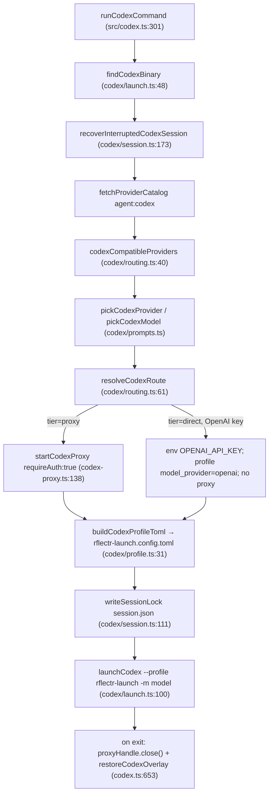
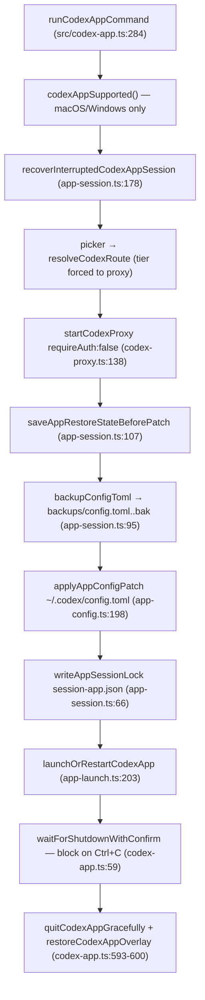

# PRD-009: Codex Integration (CLI + Desktop App) *(Retroactive)*

> **Status:** Shipped
> **Priority:** —
> **Effort:** —
> **Written:** June 2026
> **Retroactive:** Yes — written after implementation (rflectr v0.2.7).
> **Source:** `src/codex/*`, `src/codex.ts`, `src/codex-app.ts`, `src/codex-proxy.ts`, `src/codex-responses-adapter.ts`

## Overview

`rflectr codex` and `rflectr codex-app` launch OpenAI **Codex** — the terminal CLI and the desktop app — against any model in the user's rflectr registry (Anthropic, xAI, Gemini, Nvidia, DeepSeek, OpenAI, OpenCode Zen/Go, Vertex AI), even though Codex speaks the **OpenAI Responses API** (`POST /v1/responses`) and most of those providers do not.

The integration follows the shared host-harness skeleton (see [`harnesses.md`](../../../knowledge/private/integrations/harnesses.md)): find the Codex binary → resolve provider + model → start a local proxy that speaks the Responses wire format → point Codex at it → restore/clean up on exit. Codex departs from the Claude Code flow in two ways that define this PRD:

1. **A Responses-API translation proxy** (`src/codex-proxy.ts` + `src/codex-responses-adapter.ts`) instead of the Anthropic-format proxy.
2. **Two binding mechanisms.** The **CLI** is pointed at the proxy by a *sidecar TOML profile* (`~/.codex/rflectr-launch.config.toml`) and `codex --profile rflectr-launch -m <model>` — it never edits `~/.codex/config.toml`. The **desktop app** cannot inherit env or a `--profile` flag, so its `config.toml` is *patched in place with a backup* and *restored on exit* via a lock file.

A two-tier routing model decides whether a proxy is even needed: **Tier 1 (direct)** for OpenAI API-key providers (Codex talks to OpenAI natively); **Tier 2 (proxy)** for everyone else, including OpenAI via OAuth (`src/codex/routing.ts:60-91`).

## What Was Built

**CLI entry — `runCodexCommand`** (`src/codex.ts:301`): parses `--help` / `--restore` / `--config` / `--vertex` / `--provider` / `--model` / `--trace`, recovers interrupted sessions, builds the provider catalog filtered to Codex-compatible providers, runs the picker (or skips it for scripted launch), resolves a `CodexRoute`, starts the proxy when the route is Tier 2, writes the sidecar profile + catalog, takes a session lock, and spawns Codex. A `finally` block closes the proxy and removes the overlay on exit (`src/codex.ts:653-656`).

**App entry — `runCodexAppCommand`** (`src/codex-app.ts:284`): macOS/Windows only, parses the same flags, runs the picker, *always* starts the proxy (App is always Tier 2), saves a restore snapshot, backs up and patches `~/.codex/config.toml`, opens (or restarts) the Codex app, then **blocks on `Ctrl+C`** and restores the original config on shutdown (`src/codex-app.ts:589-606`).

**Responses proxy — `startCodexProxy`** (`src/codex-proxy.ts:138`): a `127.0.0.1:0` HTTP server serving `GET /health`, `GET /v1/models`, `GET /v1/models/<id>`, and `POST /v1/responses`. It pre-instantiates one `LanguageModel` per route via `createLanguageModel()`, resolves the requested model id against the route table (with fuzzy slug lookup and a fallback to `routes[0]`), translates the request through the Responses adapter, optionally trims history to the context window, and streams or returns the SDK result as Responses SSE/JSON.

**Responses adapter** (`src/codex-responses-adapter.ts`): `translateResponsesRequest` → SDK call params; `streamResponsesResponse` / `generateResponsesResponse` → Responses SSE/JSON; rate-limit and error stream helpers. This reuses the shared Vercel AI SDK translation machinery (`proxy-shared.ts`, `provider-factory.ts`) — the same single translation path documented in PRD-004.

**Favorites catalog mode**: when `prefs.favoriteModels.length > 0`, both commands resolve favorites via the shared `src/favorites-resolver.ts` (filtered by an `agent: 'codex'` blacklist), build a `CodexProxyRoute[]`, and start a single multi-route proxy. Catalog slugs are collision-safe `${providerId}__${modelId}` (`src/codex/favorites-catalog.ts:13`).

## Goals

- Launch Codex CLI and the Codex desktop app against any registry provider/model, bridging Responses ↔ upstream via one local proxy.
- **Never edit `~/.codex/config.toml` for CLI launches** — use a disposable sidecar profile so the user's personal Codex settings remain untouched.
- For the App, patch `config.toml` *safely*: snapshot + backup before, restore on `Ctrl+C` or crash recovery, never delete conversations.
- Preserve Codex's history visibility in the App by keeping `model_provider = "openai"` and redirecting via `openai_base_url` (a custom provider would hide existing OpenAI/ChatGPT threads).
- Route OpenAI API-key providers directly (Tier 1) and everyone else through the proxy (Tier 2).
- Support a multi-model favorites catalog for mid-session switching, capped at 20 routes.
- Default the CLI sandbox to `danger-full-access` so shell tools reach the network, and strip CI env vars so IDE terminals don't force read-only mode.
- Protect against context overflow (early auto-compaction config for the App + proxy-level truncation as a last resort).

## Non-Goals

- Owning the SDK translation layer itself — that is PRD-004 (this PRD reuses it via the Responses adapter).
- Owning the generic local proxy / catalog routing for Claude Code — that is PRD-005 (Codex has its own Responses proxy, but shares the favorites-resolver and provider-factory).
- Owning the favorites/tier data model — that is PRD-008 (this PRD consumes `favoriteModels` and resolves them per-surface).
- Owning credential storage (PRD-006) or OAuth device flows (PRD-007) — Codex reads resolved credentials and forwards them.
- Supporting the Codex desktop app on Linux (no app exists there).
- Mid-session live model switching in the App via a hot config swap — switching is via the catalog the app loads at launch.

## Features

| Feature | `rflectr codex` (CLI) | `rflectr codex-app` (App) | Source |
|---|---|---|---|
| Binding mechanism | Sidecar TOML profile + `--profile`/`-m` flags; never edits `config.toml` | Patches `~/.codex/config.toml` in place, with backup + restore | `src/codex/profile.ts:31`, `src/codex/app-config.ts:198` |
| Tier 1 direct (OpenAI API key) | Yes — Codex calls OpenAI natively, no proxy | No — always proxied | `src/codex/routing.ts:86-90` |
| Tier 2 proxy (everyone else) | Yes | Yes (always) | `src/codex-proxy.ts:138` |
| Proxy auth | `requireAuth: true` → `RFLECTR_CODEX_KEY=proxy-local` token | `requireAuth: false` (GUI can't send a token) + loopback origin check | `src/codex-proxy.ts:144-194`, `src/codex/launch.ts:90-92` |
| Catalog file | `models-<provider>.json` / `models-favorites.json` | `app-models-<provider>.json` / `app-models-favorites.json` | `src/codex/session.ts:52`, `src/codex/app-session.ts:42` |
| Catalog slug (single) | `stripGoogleModelPrefix(id)` | bare id (`codexAppModelSlug`) | `src/codex/catalog.ts:101-105` |
| Catalog slug (favorites) | `${providerId}__${modelId}` | `${providerId}__${modelId}` | `src/codex/favorites-catalog.ts:13` |
| Session lock | `session.json` (one CLI session) | `session-app.json` + `app-restore-state.json` + backups | `src/codex/session.ts:44`, `src/codex/app-session.ts:34-44` |
| Sandbox | `danger-full-access` (profile + spawn args) | n/a (app manages its own) | `src/codex/profile.ts:17`, `src/codex/launch.ts:82-85` |
| Context overflow | Proxy-level truncation (85% window) | `model_context_window` + `model_auto_compact_token_limit` (70%) + proxy truncation | `src/codex-proxy.ts:40-51`, `src/codex/app-profile.ts:47-50` |
| Vertex AI path | `--vertex` (gcloud ADC) | `--vertex` (gcloud ADC) | `src/codex.ts:206`, `src/codex-app.ts:142` |
| Favorites catalog | Up to 20 routes, multi-route proxy | Up to 20 routes, multi-route proxy | `src/codex/favorites-launch.ts:12`, `src/favorites-resolver.ts:91` |
| `--config` preview | Writes profile + catalog, prints paths, no launch | **Preview only** — prints the TOML, no disk writes, no app, no proxy | `src/codex.ts:583`, `src/codex-app.ts:481` |
| `--restore` | Removes overlay files (`models-*.json`, profile, lock) | Restores `config.toml`, removes `app-models-*.json`; refuses if a live session holds the lock | `src/codex/session.ts:142`, `src/codex/app-session.ts:143` |

## Architecture & Implementation

### CLI launch flow (`rflectr codex`)

**Routing** (`src/codex/routing.ts:61-91`): `resolveCodexRoute` returns `tier: 'direct'` only when `model.npm === '@ai-sdk/openai'`, the provider is **not** OAuth, and `modelFormat === 'openai'`; everything else is `tier: 'proxy'`. For Zen/Go cloud backends the endpoint format is taken from `modelFormat` (the registry npm is unreliable there) and the base URL gets a `/v1` suffix for non-Anthropic models (`src/codex/routing.ts:49-58`).

**Sidecar profile** (`src/codex/profile.ts:31-64`): a Tier 2 profile defines `model_provider = "rflectr-proxy"`, `[model_providers.rflectr-proxy]` with `base_url = http://127.0.0.1:<port>/v1`, `wire_api = "responses"`, `env_key = "RFLECTR_CODEX_KEY"`, plus `sandbox = "danger-full-access"`. A Tier 1 profile points `base_url` at OpenAI and uses the provider's real `env_key` (e.g. `OPENAI_API_KEY`).

**Child env** (`src/codex/launch.ts:87-98`): Tier 2 sets `RFLECTR_CODEX_KEY=proxy-local` (the placeholder the proxy validates); Tier 1 sets the provider's real key env var. `stripCodexInheritedEnv` removes nine CI vars (`CI`, `CODEX_CI`, `GITHUB_ACTIONS`, …) so IDE terminals don't drop Codex into read-only CI mode. Spawn always injects `-s danger-full-access` unless the user passed their own sandbox flag (`src/codex/launch.ts:82-85`, `:107`).

**Session lock & recovery** (`src/codex/session.ts`): `session.json` records pid + paths; a session is "stale" only when the owning pid is no longer alive (`isSessionStale`, `:134`). On launch, `recoverInterruptedCodexSession` removes orphaned overlay files unless a concurrent live session holds the lock. `--restore` calls `restoreCodexOverlay` to delete the profile, lock, and all `models-*.json`.

### App launch flow (`rflectr codex-app`)

**Config patch** (`src/codex/app-config.ts:121-212`): `mergeAppConfig` keeps the user's existing root keys but overwrites `model`, `model_provider`, `openai_base_url`, `model_catalog_json`, and the two context fields; it strips any legacy `profile` key and the legacy `rflectr-launch-codex-app` provider/profile tables. The written config is validated (`validateAppConfigText`, `:175`) to assert `model_provider` stays `openai`, the `openai_base_url` matches the proxy port, and the catalog path matches.

**Why `model_provider = "openai"`** (`src/codex/app-profile.ts:33-52`): the app records the provider on every local thread and filters history by provider, so a custom provider would hide the user's existing OpenAI/ChatGPT threads while a rflectr session is active. rflectr therefore writes the display model `CODEX_APP_DISPLAY_MODEL = 'gpt-5.5'` and redirects the built-in provider with `openai_base_url`. The proxy routes the actual selected model via its fallback mechanism.

**Backup + lock + restore**: before patching, `saveAppRestoreStateBeforePatch` snapshots the pre-session root keys to `app-restore-state.json`, and `backupConfigToml` copies `config.toml` to a rotating `backups/config.toml.<ts>.bak` (max 5). The lock `session-app.json` records `pid`, `configPath`, `catalogPaths`, `restoreStatePath`, `backupPath`, and `proxyPort`. On exit, `restoreCodexAppOverlay` (`src/codex/app-session.ts:143`) restores from the snapshot (preferred) or the backup file, removes `app-models-*.json`, and clears the lock. It **refuses** to run while another live session holds the lock (`:145-151`). Crash recovery on the next launch is automatic (`recoverInterruptedCodexAppSession`, `:178`).

**App launch/quit** (`src/codex/app-launch.ts`): finds `Codex.app` (macOS, via fixed paths + `mdfind` on bundle id `com.openai.codex`) or `Codex.exe` (Windows, via `%LOCALAPPDATA%\Programs` candidates + `Get-StartApps`). "Is it running?" uses `osascript` (macOS) / `Get-CimInstance` + window-handle checks (Windows). If Codex is already running, rflectr offers to restart it so new settings apply; otherwise it just opens it.

### The Responses proxy & adapter

`startCodexProxy(routes, options)` (`src/codex-proxy.ts:138`) builds a `Map<modelId, LanguageModel>` up front by calling `createLanguageModel({ npm, modelId: upstreamModelId, apiKey, baseURL, vertex })` per route (`:147-159`), then serves:

- **`GET /v1/models`** — synthesizes a catalog entry for each route under three id shapes: bare `modelId`, `codexAppModelSlug(modelId)`, and `${providerId}__${modelId}` (`:215-221`), so any slug Codex requests resolves.
- **`POST /v1/responses`** — when `requireAuth`, validates the inbound key equals `proxy-local` (`PROXY_PLACEHOLDER_KEY`, `:74`); resolves the model (with `codexRouteLookupIds` fuzzy matching across `/`, `__`, and app-slug prefixes, `:76-93`); falls back to `routes[0]` if unmatched (handles the app's hardcoded background `gpt-5.4`/`gpt-5.5` ids); translates via `translateResponsesRequest`; trims to the context window if set; then streams (`streamResponsesResponse`) or returns (`generateResponsesResponse`). 429s become a Responses rate-limit body/stream; other upstream errors map to honest HTTP statuses (`upstreamHttpStatus`, `:109-117`).

**App-mode security** (`requireAuth: false`, `src/codex-proxy.ts:177-194`): since the GUI cannot send the token, POSTs are gated by a loopback `Origin`/`Referer` check instead.

**Context truncation** (`src/codex-proxy.ts:24-51`): `trimToContextLimit` estimates characters (≈4 chars/token) and drops the oldest messages until the estimate is under 85% of the window, always keeping at least one user-led message.

**Error formatting** (`src/codex/upstream-error.ts`): `formatUpstreamError` extracts the shortest honest user-facing message from SDK/upstream error shapes — no stack traces, no `file://` noise — for the Codex TUI.

### Favorites catalog

When favorites are active, `resolveCodexFavorites` (`src/codex/favorites-launch.ts:54`) builds a per-surface `ResolveContext` and calls the shared `buildFavoritesList` (`src/favorites-resolver.ts:87`, cap 20). Zen/Go favorites require an OpenCode API key (resolved via `resolveOrCollectApiKey` / credential store) and are dropped if absent. `buildCodexProxyRoutesFromResolved` (`:12`) maps each resolved favorite to a `CodexProxyRoute`, skipping OAuth providers with an empty key (OAuth refresh isn't supported in the favorites proxy, `:24-27`). Each route's catalog slug is the collision-safe `${providerId}__${modelId}`. The starting model is launched via that slug (`codexCliFavoritesSlug`), which must match the profile `model` and `codex -m`.

## Acceptance Criteria

- [x] `rflectr codex` launches Codex CLI against a selected registry provider/model.
- [x] CLI launches **never edit** `~/.codex/config.toml` — only the sidecar `rflectr-launch.config.toml` (`src/codex/profile.ts:31`).
- [x] OpenAI API-key providers route Tier 1 direct (no proxy); OpenAI-via-OAuth and all others route Tier 2 through the proxy (`src/codex/routing.ts:86-90`).
- [x] The Tier 2 CLI child gets `RFLECTR_CODEX_KEY=proxy-local`, and the proxy rejects any other key when `requireAuth` (`src/codex/launch.ts:91`, `src/codex-proxy.ts:248-252`).
- [x] CLI default sandbox is `danger-full-access` in both the profile and the spawn args (`src/codex/profile.ts:17`, `src/codex/launch.ts:84`).
- [x] CI env vars are stripped before spawning Codex (`src/codex/launch.ts:16-34`).
- [x] `rflectr codex-app` patches `config.toml` with a backup and restores it on `Ctrl+C` (`src/codex-app.ts:547-600`).
- [x] App config keeps `model_provider = "openai"` and redirects via `openai_base_url`, validated on write (`src/codex/app-config.ts:185-195`).
- [x] App proxy runs with `requireAuth: false` and a loopback origin guard (`src/codex-proxy.ts:177-194`).
- [x] App writes `model_context_window` + `model_auto_compact_token_limit` (70%) when a window is known (`src/codex/app-profile.ts:47-50`).
- [x] Proxy serves `/v1/responses`, `/v1/models`, `/v1/models/<id>`, and `/health`, translating through the Responses adapter (`src/codex-proxy.ts:196-375`).
- [x] Proxy falls back to `routes[0]` for unknown model ids so the app's hardcoded background ids still resolve (`src/codex-proxy.ts:287-293`).
- [x] Favorites mode builds a multi-route catalog (≤20) with `${providerId}__${modelId}` slugs (`src/codex/favorites-catalog.ts:13`, `src/favorites-resolver.ts:91`).
- [x] Zen/Go favorites are included only when an OpenCode API key is available, and OAuth-empty favorites are skipped (`src/codex/favorites-launch.ts:24-27`, `src/favorites-resolver.ts:57-59`).
- [x] `--config` previews without launching (CLI writes files + prints paths; App prints TOML with zero writes) (`src/codex.ts:583`, `src/codex-app.ts:481-521`).
- [x] `--restore` cleans up overlay/app files; App `--restore` refuses while a live session holds the lock (`src/codex/app-session.ts:143-151`).
- [x] Interrupted sessions auto-recover on the next launch (`src/codex/session.ts:173`, `src/codex/app-session.ts:178`).
- [x] A concurrent live session is detected and blocks a second launch (`src/codex/session.ts:195`, `src/codex/app-session.ts:194`).
- [x] `--vertex` launches Claude models through Google Vertex AI via gcloud ADC for both CLI and App (`src/codex.ts:206`, `src/codex-app.ts:142`).
- [x] App launch is gated to macOS/Windows; Linux is rejected with a clear message (`src/codex/app-launch.ts:12-16`).

## Files

| File | Role |
|---|---|
| `src/codex.ts` | CLI entry `runCodexCommand`; help text; launch artifact writers; Vertex CLI path |
| `src/codex-app.ts` | App entry `runCodexAppCommand`; config patch orchestration; Ctrl+C shutdown loop; Vertex App path |
| `src/codex-proxy.ts` | Local Responses-API proxy (`startCodexProxy`); `CodexProxyRoute`; route resolution; `/v1/models` + `/v1/responses` |
| `src/codex-responses-adapter.ts` | Responses ↔ Vercel AI SDK translation (`translateResponsesRequest`, stream/generate, rate-limit/error helpers) |
| `src/codex/routing.ts` | Tier 1/Tier 2 routing; `resolveCodexRoute`; routable-model filter; `codexProviderEnvKey` |
| `src/codex/profile.ts` | Sidecar `rflectr-launch.config.toml` builder; sandbox constant; catalog path helpers |
| `src/codex/launch.ts` | `findCodexBinary`; CI-env stripping; sandbox-arg injection; child env; `launchCodex` spawn |
| `src/codex/catalog.ts` | `model_catalog_json` builder; reasoning fields; label formatting; serialize |
| `src/codex/session.ts` | CLI overlay session: lock, backup rotation, stale/recovery, restore |
| `src/codex/app-config.ts` | Read/merge/validate/restore `~/.codex/config.toml`; managed-config detection |
| `src/codex/app-profile.ts` | App root config content; display model; context fields; slug helpers |
| `src/codex/app-session.ts` | App session: backup, restore-state snapshot, lock, recovery |
| `src/codex/app-launch.ts` | Find/open/quit/restart the Codex desktop app (macOS + Windows) |
| `src/codex/favorites-catalog.ts` | Favorites slug (`${providerId}__${modelId}`); CLI/App favorites catalog builders |
| `src/codex/favorites-launch.ts` | Resolve favorites → `CodexProxyRoute[]`; OAuth skip; stale-favorite warnings |
| `src/codex/prompts.ts` | Codex provider/model pickers; managed-flag rejection; launch confirm |
| `src/codex/ui.ts` | Intro/outro, proxy/model log lines, session/cleanup panels |
| `src/codex/upstream-error.ts` | Short user-facing messages from SDK/upstream failures |
| `src/favorites-resolver.ts` | Shared per-surface favorite resolution (also used by Claude/Server) |

## Risks & Known Limitations

- **`@ai-sdk/github-copilot` won't work.** OpenCode loads it from internal `@opencode-ai/core`, not a public npm factory rflectr can ship — such providers are silently unroutable.
- **Zen/Go favorites are skipped in Codex when no OpenCode key is present** (and have no gateway path in Codex generally); resolution drops them (`src/favorites-resolver.ts:57-59`).
- **OAuth-empty favorites are dropped from the favorites proxy** — OAuth refresh flows aren't supported there (`src/codex/favorites-launch.ts:24-27`).
- **Codex App is a stateless client** — it resends the full accumulated history every turn (no `previous_response_id`), so a long GPT-5.5 session can't be transparently resumed on a smaller-window model. Mitigated by early auto-compaction config + proxy-level truncation, both lossy as a last resort.
- **App labels any catalog-loaded model "Custom"** (cosmetic) and periodically sends **background requests with hardcoded OpenAI ids** (`gpt-5.4`, `gpt-5.5`); the proxy routes these to the starting model via `routes[0]` fallback.
- **OAuth tokens refresh at launch only** — long sessions may 401 when a token expires; restart to re-auth.
- **Cost display is inaccurate for non-Anthropic models** (the host applies its own pricing table) — a documented, by-design limitation shared across harnesses.
- **macOS sandbox quirk:** the profile TOML alone may not grant network access; rflectr also passes `-s danger-full-access` on spawn ([Codex #10390](https://github.com/openai/codex/issues/10390)).
- **App support is macOS/Windows only** — there is no Codex desktop app on Linux.

## Related

- [`harnesses.md`](../../../knowledge/private/integrations/harnesses.md) — host-harness pattern; where Codex CLI/App depart from it.
- [`codex.md`](../../../knowledge/public/guides/codex.md) — user-facing Codex guide (flags, files owned, tiers, troubleshooting).
- [PRD-004 — Translation Layer](../prd-004-translation-layer/prd-004-translation-layer-index.md) — the SDK adapter the Responses adapter reuses.
- [PRD-005 — Local Proxy & Catalog Routing](../prd-005-local-proxy-catalog-routing/prd-005-local-proxy-catalog-routing-index.md) — the Claude-side proxy this mirrors; shared `provider-factory` / `proxy-shared`.
- [PRD-008 — Preferences, Tiers & Favorites](../prd-008-preferences-tiers-favorites/prd-008-preferences-tiers-favorites-index.md) — favorites data model and `favorites-resolver`.
- [PRD-011 — Claude Desktop Integration](../prd-011-claude-desktop-integration/prd-011-claude-desktop-integration-index.md) — sibling desktop-app integration (config patch + lock-file restore, gateway path).
- [PRD-001 — CLI Core & Launch Orchestration](../prd-001-cli-core-launch-orchestration/prd-001-cli-core-launch-orchestration-index.md) — subcommand dispatch that routes to `codex` / `codex-app`.
