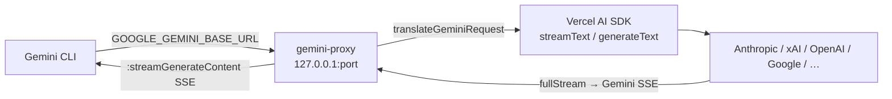

# PRD-010: Gemini CLI Integration *(Retroactive)*

> **Status:** Shipped
> **Priority:** —
> **Effort:** —
> **Written:** June 2026
> **Retroactive:** Yes — written after implementation (rflectr v0.2.7).
> **Source:** `src/gemini/*`, `src/gemini.ts`, `src/gemini-proxy.ts`, `src/gemini-parts.ts`

---

## Overview

`rflectr gemini` launches Google's [Gemini CLI](https://www.npmjs.com/package/@google/gemini-cli) re-pointed at any model in the rflectr registry — Anthropic, xAI, OpenAI, Nvidia, DeepSeek, OpenCode Zen / Go, and more. The Gemini CLI speaks the **Gemini REST protocol** (`POST /v1beta/models/<model>:generateContent`), so rflectr stands up a local **gemini-proxy** that translates that protocol to and from the shared Vercel AI SDK adapter ([PRD-004](../prd-004-translation-layer/prd-004-translation-layer-index.md)) and routes each request to the selected provider. The CLI is pointed at the proxy purely through environment variables — `GOOGLE_GEMINI_BASE_URL` plus a random `GEMINI_API_KEY` proxy token — so no Gemini config file is written or restored.

This is the third host harness in rflectr after Claude Code and Codex, and it follows the same find-binary → pick provider/model → start translating proxy → launch child with clean env → close proxy on exit skeleton documented in the [harnesses knowledge doc](../../../knowledge/private/integrations/harnesses.md). It ships flagged **🧪 Experimental** in the [public guide](../../../knowledge/public/guides/gemini-cli.md).

Unlike the Claude/Codex proxies that translate *into* the Anthropic and OpenAI-Responses wire formats, the gemini-proxy is the only one whose **inbound** format is Gemini REST. The proxy therefore owns a Gemini-specific request translator (`translateGeminiRequest`), a Gemini-specific SSE shape on the way out, and the `thought_signature` round-trip on tool-call parts (`src/gemini-parts.ts`).

---

## What Was Built

- **`rflectr gemini` command** (`src/gemini.ts:58`) — the full launch orchestration: binary discovery, provider catalog fetch, provider/model picker, route catalog assembly, proxy start, child env, launch, and proxy teardown.
- **Binary discovery + env + launch** (`src/gemini/launch.ts`) — `findGeminiBinary()`, `buildGeminiChildEnv()`, `launchGemini()`.
- **Interactive pickers** (`src/gemini/prompts.ts`) — provider picker (with a Favorites Catalog entry), model picker (recents + browse-all), favorites picker, launch confirm, and managed-flag rejection.
- **The gemini-proxy** (`src/gemini-proxy.ts`) — a local HTTP server on `127.0.0.1:0` serving `GET /v1beta/models`, `GET /v1beta/models/<model>`, and `POST .../<model>:generateContent` / `:streamGenerateContent`, translating each request through `createLanguageModel()` + the AI SDK (`streamText` / `generateText`) and emitting Gemini-format SSE / JSON.
- **Gemini part parsing** (`src/gemini-parts.ts`) — shared Gemini-part → Anthropic-block helpers including `thought_signature` extraction from tool-call parts (`partThoughtSignature`) and usage mapping.
- **Mid-session model switching** — the proxy intercepts a `.model <id>` chat command, switches the active route in memory, and sanitizes the synthetic switch turns out of subsequent request history.
- **Favorites catalog mode** — when favorites are saved ([PRD-008](../prd-008-preferences-tiers-favorites/prd-008-preferences-tiers-favorites-index.md)), they are resolved into proxy routes and exposed both in the provider picker and as switchable `.model` targets.
- **`--trace`** — writes proxy debug logs to `~/.rflectr/logs/gemini-proxy-debug.log`, printed on exit.
- **Agent stdout mode** — clean-stdout detection for non-interactive / scripted use (`wantsCleanAgentStdout('gemini', …)`).

---

## Goals

- Let users drive the Gemini CLI against **any** registry provider, not just Google's native Gemini endpoints.
- Reuse the single Vercel AI SDK translation path ([PRD-004](../prd-004-translation-layer/prd-004-translation-layer-index.md)) — no hand-rolled per-provider translation in the Gemini path.
- Keep the host's config untouched: point the CLI at the proxy with environment variables only, and leave the user's shell unchanged on exit.
- Reuse the shared registry, provider picker, preferences, and favorites already used by Claude Code and Codex ([PRD-002](../prd-002-provider-registry/prd-002-provider-registry-index.md), [PRD-008](../prd-008-preferences-tiers-favorites/prd-008-preferences-tiers-favorites-index.md)).
- Support mid-session model switching without restarting the CLI.

## Non-Goals

- A native Google-direct tier that bypasses the proxy. Per `src/gemini.ts:42` and the guide, **all** registry models route through the local translation proxy; Google's own provider entry simply routes through the same proxy back to Google's endpoint via the SDK.
- Surfacing Gemini-internal reasoning (`part.thought`) into the host — it is intentionally dropped (`src/gemini-parts.ts:24`); `includeThoughts` is disabled upstream.
- Refreshing the model name shown in the Gemini CLI UI after a mid-session `.model` switch (a Gemini CLI UI limitation, documented in the guide).
- Writing or restoring any Gemini CLI config file (env-var-only by design).

---

## Features

| # | Feature | Where |
|---|---------|-------|
| F1 | `rflectr gemini` launch orchestration | `src/gemini.ts:58` |
| F2 | Gemini binary discovery (PATH + platform fallbacks) | `src/gemini/launch.ts:23` |
| F3 | Env isolation → `GOOGLE_GEMINI_BASE_URL` + proxy-token `GEMINI_API_KEY` | `src/gemini/launch.ts:41` |
| F4 | Spawn Gemini CLI with `-m <modelId>` + passthrough flags | `src/gemini/launch.ts:57` |
| F5 | gemini-proxy: model list + detail endpoints | `src/gemini-proxy.ts:262`, `:274` |
| F6 | gemini-proxy: `:generateContent` / `:streamGenerateContent` | `src/gemini-proxy.ts:289` |
| F7 | `translateGeminiRequest` — Gemini REST → SDK params | `src/gemini-proxy.ts:75` |
| F8 | Gemini-format SSE / JSON response emission | `src/gemini-proxy.ts:342`, `:436` |
| F9 | `.model <id>` mid-session switch + history sanitization | `src/gemini-proxy.ts:306`, `:537` |
| F10 | `thought_signature` extraction from tool-call parts | `src/gemini-parts.ts:8` |
| F11 | Gemini-part → Anthropic-block parsing + usage mapping | `src/gemini-parts.ts:16`, `:76` |
| F12 | Provider / model / favorites pickers | `src/gemini/prompts.ts:15`, `:55`, `:127` |
| F13 | Managed-flag rejection (`--provider`/`--model`/`-m`/`--trace`) | `src/gemini/prompts.ts:167` |
| F14 | Favorites catalog mode → proxy routes | `src/gemini.ts:208` |
| F15 | `--trace` debug logging | `src/gemini.ts:294`, `src/gemini-proxy.ts:217` |

---

## Architecture & Implementation

### Launch flow (`rflectr gemini`)

```
runGeminiCommand(geminiArgs, trace, launch)        [src/gemini.ts:58]
  → findGeminiBinary()                             [gemini/launch.ts:23 — which/where + fallback paths]
  → rejectGeminiManagedFlags(geminiArgs)           [gemini/prompts.ts:167 — strip rflectr-managed flags]
  → wantsCleanAgentStdout('gemini', …)             [launch-target — agent stdout mode]
  → fetchProviderCatalog({ agent: 'gemini' })      [provider-catalog — registry providers]
  → providersForPicker(catalog)                    [filter to Gemini-compatible providers]

  ── interactive path ──
  → pickGeminiProvider(...)                         [gemini/prompts.ts:15 — incl. ⭐ Favorites Catalog]
  → pickGeminiModel / pickGeminiFavoriteModel       [gemini/prompts.ts:55 / :127]
  → confirmGeminiLaunch(...)                        [gemini/prompts.ts:110]

  ── boot path (--provider + --model / non-interactive) ──
  → findProviderAndModel(compatible, target)        [skip wizard]

  ── shared ──
  → recordLaunchSelection('gemini', …)             [config — saves lastGeminiProvider/Model]
  → resolveLocalProviderApiKey(activeProvider)      [provider-catalog — real key from keychain/registry]
  → build ProxyRoute[] for provider models + favorites + starting model   [gemini.ts:189–267]
  → startGeminiProxy(finalRoutes, trace)            [gemini-proxy.ts:204 — bind 127.0.0.1:0]
  → buildGeminiChildEnv(port, token)                [gemini/launch.ts:41]
  → launchGemini(path, modelId, env, passthrough)   [gemini/launch.ts:57 — stdio:inherit]
  → proxyHandle.close()                             [stop proxy after Gemini exits]
  → printTraceLog(...) when --trace                 [gemini.ts:294]
```

Routes are assembled into a de-duplicated `Map<aliasId, ProxyRoute>` (`src/gemini.ts:237`) seeded with the active provider's models, then enriched with resolved favorites (`src/gemini.ts:208`), and finally guaranteed to contain the starting model (`src/gemini.ts:248`). Each `ProxyRoute` carries `npm`, `baseURL` (`apiBaseUrl`), `realModelId` (`upstreamModelId`), `modelFormat`, `contextWindow`, and provider auth metadata so the proxy can lazily build the right SDK `LanguageModel`.

### Env contract

`buildGeminiChildEnv()` (`src/gemini/launch.ts:41`) copies `process.env`, **deletes** the four conflicting Gemini credential vars — `GOOGLE_GEMINI_BASE_URL`, `GEMINI_API_KEY`, `GOOGLE_API_KEY`, `GOOGLE_GENAI_API_KEY` — then sets exactly two:

| Var | Value | Purpose |
|-----|-------|---------|
| `GOOGLE_GEMINI_BASE_URL` | `http://127.0.0.1:<proxyPort>` | Points the Gemini CLI at the local proxy. |
| `GEMINI_API_KEY` | `<random proxy token>` | A per-session UUID the proxy issues (`startGeminiProxy` `proxyToken`); the user's real key never enters the child. |

Isolation applies to the child process only; the parent shell is unmodified on exit. `launchGemini()` additionally passes `-m <modelId>` so the CLI requests the selected model by default.

### gemini-proxy translation



The proxy (`startGeminiProxy`, `src/gemini-proxy.ts:204`) binds `127.0.0.1:0`, lazily builds and caches one `LanguageModel` per route via `createLanguageModel()` ([PRD-004](../prd-004-translation-layer/prd-004-translation-layer-index.md), [PRD-005](../prd-005-local-proxy-catalog-routing/prd-005-local-proxy-catalog-routing-index.md)), and serves three surfaces:

1. **`GET .../models`** (`src/gemini-proxy.ts:262`) — returns a synthetic catalog where each route is formatted as a Gemini model (`formatGeminiModel`, `src/gemini-proxy.ts:244`) with `inputTokenLimit` from the route's `contextWindow` and `supportedGenerationMethods`.
2. **`GET .../models/<model>`** (`src/gemini-proxy.ts:274`) — single-model detail, resolved via `lookupGeminiRoute` (which tolerates slash- and `__`-prefixed ids and falls back to the default route).
3. **`POST .../<model>:generateContent` / `:streamGenerateContent`** (`src/gemini-proxy.ts:289`) — the inference path.

**`translateGeminiRequest`** (`src/gemini-proxy.ts:75`) converts a Gemini REST body into SDK params:
- **System instruction** — joins `systemInstruction.parts`, then strips Gemini-CLI-injected identity (`stripGeminiIdentity`, `src/gemini-proxy.ts:68`) so the host model is not told it is "Gemini CLI".
- **Contents → messages** — `role: 'model'` → `assistant`; `text` parts (with inline `<thinking>` split into `reasoning`/`text`), `inlineData` → image parts, `functionCall` → SDK `tool-call` (synthesizing a `call_<uuid>` id and tracking name→id lists), and `functionResponse` → SDK `tool-result` (popping the matching id). Consecutive same-role messages are merged (`mergeConsecutiveMessages`).
- **Tools** — each `functionDeclarations[]` entry becomes an SDK `tool()` with a `jsonSchema()` input schema.
- **Tool choice** — `functionCallingConfig.mode` `ANY` → `required`, `AUTO` → `auto`.
- **Generation config** — `maxOutputTokens`, `temperature`, and `responseMimeType: 'application/json'` → `responseFormat: { type: 'json' }`.

On the way **out**, the streaming handler (`src/gemini-proxy.ts:342`) maps the SDK `fullStream` to Gemini SSE chunks: `reasoning` deltas are wrapped in `<thinking>…</thinking>` text (auto-closed before tool calls / finish), `text-delta` becomes model-role text parts, tool-input deltas are buffered and emitted as a single `functionCall` part on `tool-call`, and `finish` carries `finishReason` (mapped by `mapFinishReason`, `src/gemini-proxy.ts:16`) plus `usageMetadata`. The non-streaming branch (`src/gemini-proxy.ts:436`) builds the equivalent single JSON `candidates[0]` response.

### `thought_signature` and Gemini parts

`src/gemini-parts.ts` provides the shared Gemini-part → Anthropic-block parsing used where Gemini output is consumed in Anthropic terms. `partThoughtSignature` (`src/gemini-parts.ts:8`) reads the signature from either the part itself (`thoughtSignature` / `thought_signature`) or the nested `functionCall`, and `parseGeminiPart` (`src/gemini-parts.ts:16`) folds that signature into the encoded `tool_use.id` via `encodeToolUseId` (the `{id}::ts::{signature}` round-trip from [PRD-004](../prd-004-translation-layer/prd-004-translation-layer-index.md)). Gemini-internal reasoning parts (`part.thought`) are dropped (`src/gemini-parts.ts:24`). `mapGeminiUsage` (`src/gemini-parts.ts:76`) normalizes Gemini `usageMetadata` (subtracting cached tokens) into the Anthropic usage shape.

### Mid-session `.model` switch

The proxy inspects the last user turn (`findLastUserTurn`) and parses a `.model` command (`parseModelCommand`, `src/gemini-proxy.ts:572`). `.model` alone replies with the current model and the available list; `.model <id>` resolves a route via `lookupGeminiRoute`, sets the in-memory `sessionRouteOverride`, and replies with a mock confirmation (`sendMockGeminiResponse`). Subsequent requests have the synthetic switch turns stripped via `sanitizeModelSwitchTurns` (`src/gemini-proxy.ts:537`) so the upstream model never sees the command exchange. (The CLI's displayed model name does not refresh — a documented Gemini CLI UI limitation.)

---

## Acceptance Criteria

- [x] `rflectr gemini` discovers the Gemini binary on PATH with platform-specific fallbacks (`src/gemini/launch.ts:23`).
- [x] All registry models route through the local translation proxy (`src/gemini.ts:42`; routes built at `src/gemini.ts:189`).
- [x] The child env points the CLI at `http://127.0.0.1:<port>` via `GOOGLE_GEMINI_BASE_URL` and supplies a random proxy-token `GEMINI_API_KEY`, clearing conflicting `GOOGLE_API_KEY` / `GOOGLE_GENAI_API_KEY` (`src/gemini/launch.ts:41`).
- [x] The proxy serves the Gemini REST surface: `GET .../models`, `GET .../models/<model>`, and `POST .../<model>:generateContent` / `:streamGenerateContent` (`src/gemini-proxy.ts:262`, `:274`, `:289`).
- [x] `translateGeminiRequest` converts system instruction, contents (text/image/functionCall/functionResponse), tools, tool choice, and generation config into SDK params (`src/gemini-proxy.ts:75`).
- [x] Streaming responses are emitted as Gemini SSE chunks with reasoning wrapped in `<thinking>`, buffered tool-call parts, and a finish chunk with `usageMetadata` (`src/gemini-proxy.ts:342`).
- [x] `thought_signature` is read from tool-call parts and round-tripped through the encoded tool-use id (`src/gemini-parts.ts:8`, `:16`).
- [x] Gemini-CLI self-identification is stripped from system and user content (`src/gemini-proxy.ts:68`).
- [x] A `.model <id>` chat command switches routes in-session without restarting and is sanitized out of request history (`src/gemini-proxy.ts:306`, `:537`).
- [x] Favorites are resolved into proxy routes and shown in the provider/model pickers (`src/gemini.ts:208`, `src/gemini/prompts.ts:127`).
- [x] rflectr-managed flags (`--provider`, `--model`, `-m`, `--trace`) are stripped from passthrough args (`src/gemini/prompts.ts:167`).
- [x] `--trace` writes proxy debug logs to `~/.rflectr/logs/gemini-proxy-debug.log` and prints them on exit (`src/gemini.ts:294`, `src/gemini-proxy.ts:217`).
- [x] The proxy is closed after the Gemini CLI exits; the parent shell is left unchanged (`src/gemini.ts:288`).

---

## Files

| File | Role |
|------|------|
| `src/gemini.ts` | `rflectr gemini` command + launch orchestration + route assembly. |
| `src/gemini/launch.ts` | Binary discovery, child env contract, child spawn. |
| `src/gemini/prompts.ts` | Provider / model / favorites pickers, launch confirm, managed-flag rejection. |
| `src/gemini-proxy.ts` | Local Gemini-REST ↔ SDK translation proxy, model endpoints, `.model` switch. |
| `src/gemini-parts.ts` | Gemini-part → Anthropic-block parsing, `thought_signature`, usage mapping. |
| `src/provider-factory.ts` | `createLanguageModel()` — SDK provider construction (shared, PRD-004). |
| `src/sdk-adapter.ts` | Vercel AI SDK translation core (shared, PRD-004). |
| `src/provider-catalog.ts` | `fetchProviderCatalog`, `providersForPicker`, `resolveLocalProviderApiKey` (shared, PRD-002). |
| `library/knowledge/private/integrations/harnesses.md` | Host-harness pattern reference. |
| `library/knowledge/public/guides/gemini-cli.md` | User-facing guide (Experimental). |

---

## Risks & Known Limitations

- **Experimental maturity.** The guide flags the Gemini path as newer than Claude/Codex; expect rough edges (`gemini-cli.md`).
- **Stale model name in the CLI UI** after a mid-session `.model` switch — the new route is active, but the Gemini CLI's top-right model label does not refresh. This is a Gemini CLI UI limitation, not a routing bug.
- **Gemini-internal reasoning is dropped.** `part.thought` content is never surfaced (`src/gemini-parts.ts:24`); only tool-call `thought_signature` round-trips.
- **Identity-stripping is heuristic.** `stripGeminiIdentity` uses regexes against "Gemini CLI" phrasing; wording changes in the CLI's injected prompts could let some brand mentions through.
- **Cost display** in the Gemini CLI is inaccurate for non-Google models (host applies its own pricing), consistent with the cross-harness limitation.
- **JSON parse errors on first stdout lines** in agent/automation mode unless `-o stream-json` / `-o json` is passed (documented in the guide's troubleshooting table).

---

## Related

- [PRD-002: Provider Registry](../prd-002-provider-registry/prd-002-provider-registry-index.md) — the registry, provider picker, and key resolution reused here.
- [PRD-004: Translation Layer (SDK Adapter)](../prd-004-translation-layer/prd-004-translation-layer-index.md) — the single Vercel AI SDK translation path and the `thought_signature` `::ts::` round-trip.
- [PRD-005: Local Proxy & Catalog Routing](../prd-005-local-proxy-catalog-routing/prd-005-local-proxy-catalog-routing-index.md) — the shared `ProxyRoute` / proxy pattern this proxy follows.
- [PRD-008: Preferences, Tiers & Favorites](../prd-008-preferences-tiers-favorites/prd-008-preferences-tiers-favorites-index.md) — favorites catalog source.
- [PRD-009: Codex Integration](../prd-009-codex-integration/prd-009-codex-integration-index.md) — sibling host harness (OpenAI Responses format).
- [PRD-011: Claude Desktop Integration](../prd-011-claude-desktop-integration/prd-011-claude-desktop-integration-index.md) — sibling host harness (gateway config).
- [PRD-012: Server Gateway](../prd-012-server-gateway/prd-012-server-gateway-index.md) — the in-process gateway used by the desktop apps.
- Knowledge: [Host Harnesses](../../../knowledge/private/integrations/harnesses.md) · [Gemini CLI guide](../../../knowledge/public/guides/gemini-cli.md)
