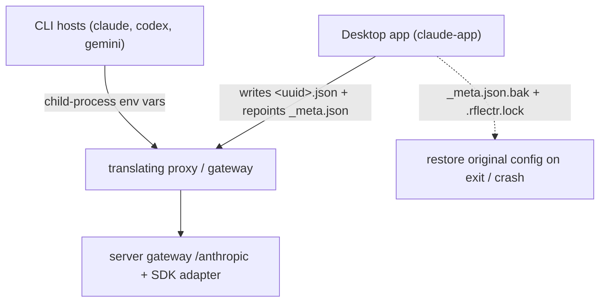
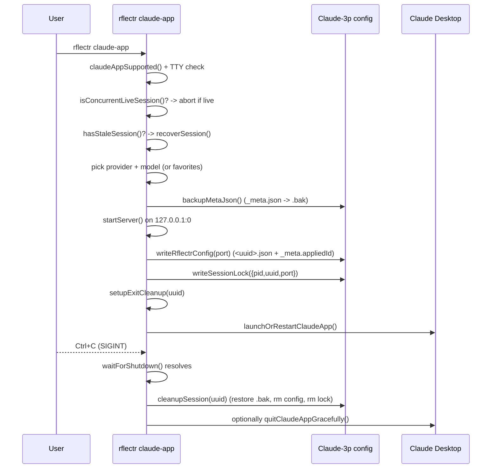

# PRD-011: Claude Desktop Integration *(Retroactive)*

> **Status:** Shipped
> **Priority:** —
> **Effort:** —
> **Written:** June 2026
> **Retroactive:** Yes — written after implementation (rflectr v0.2.7).
> **Source:** `src/claude-desktop/*`, `src/claude-app.ts`

---

## Overview

`rflectr claude-app` launches the **Claude Desktop** app in third-party-inference ("3P") mode, pointed at a local rflectr gateway instead of Anthropic's servers. The user picks a provider + model (or a favorites catalog), rflectr starts an in-process gateway server on a random local port, writes a gateway config into Claude Desktop's on-disk 3P config library, and opens (or restarts) the app. On exit, rflectr restores the original config.

The defining constraint of this surface: **a desktop app cannot inherit environment variables** the way a launched CLI can. The CLI launchers (`rflectr claude`, `codex`, `gemini`) point the host at the proxy purely through child-process env vars and never touch a config file (see [PRD-001 — CLI Core & Launch Orchestration](../prd-001-cli-core-launch-orchestration/prd-001-cli-core-launch-orchestration-index.md)). Claude Desktop has no such hook. So this is the one surface where rflectr **writes the host application's own config file** — and therefore must back it up and restore it on exit, guarded by a lock file to survive crashes. This is the deliberate exception to rflectr's env-only isolation contract.

Entry point: `runClaudeAppCommand` (`src/claude-app.ts:61`). Supported on **macOS and Windows only** (`claudeAppSupported`, `src/claude-desktop/app-launch.ts:11`).

> See also: [`harnesses.md`](../../../knowledge/private/integrations/harnesses.md) (private integration notes — the "where each host departs from the pattern" overview) and [`claude-desktop.md`](../../../knowledge/public/guides/claude-desktop.md) (public user-facing setup guide).

---

## What Was Built

- A `rflectr claude-app` command that, on macOS/Windows, drives Claude Desktop into 3P mode against a local gateway with no manual config editing.
- A **config-write** path: a `<uuid>.json` gateway config is written into the Claude Desktop 3P config library, and `_meta.json`'s `appliedId` is repointed at it so the app picks it up on next launch (`writeRflectrConfig`, `src/claude-desktop/app-config.ts:58`).
- A **backup + restore** path: `_meta.json` is copied to `_meta.json.bak` before the patch, and a `.rflectr.lock` file records the live session. On clean exit, crash recovery, or `--restore`, the backup is restored and the injected config removed (`src/claude-desktop/app-session.ts`).
- **Session lifecycle** handling: concurrent-session detection, stale-session recovery on startup, SIGINT/SIGTERM-driven shutdown, and a `process.on('exit')` cleanup hook.
- **Model selection** reusing the Codex provider/model pickers, plus a favorites-catalog mode driven by saved preferences.
- The gateway itself is the full `server` gateway (`startServer`, see [PRD-012 — Server Gateway](../prd-012-server-gateway/prd-012-server-gateway-index.md)), serving `/anthropic` with a synthetic model catalog — not a bespoke per-protocol proxy.

---

## Goals

- Let a user route Claude Desktop's **Cowork** and **Code** tabs at registry providers / OpenCode Zen / Go with one command, no manual Developer-menu config.
- Never leave Claude Desktop's config in a broken 3P state after the rflectr session ends — restore the prior config on exit and after crashes.
- Keep the model catalog under the user's control (single selected model, or a favorites-only catalog).
- Reuse the existing `server` gateway and SDK translation layer rather than building a Claude-Desktop-specific proxy.

## Non-Goals

- **Linux support.** macOS and Windows only; `claudeAppSupported()` throws otherwise (`src/claude-desktop/app-launch.ts:11`).
- **Restoring Claude Desktop to first-party (Anthropic sign-in / Chat tab) mode.** rflectr restores the *pre-session* 3P config state; full 1P revert is a documented manual procedure in the user guide ([`claude-desktop.md`](../../../knowledge/public/guides/claude-desktop.md) → "Restore Claude Desktop to Anthropic's servers").
- **The Chat tab.** With 3P inference, Claude Desktop offers only Cowork and Code; Chat is an Anthropic product constraint, not an rflectr limitation.
- **Editing `settings.json`-style host config beyond the 3P config library.** rflectr only writes the `<uuid>.json` and `_meta.json` under `Claude-3p/configLibrary/`.
- **Mid-session model switching** inside the running app (the Gemini CLI surface has a `.model` switch; Claude Desktop does not).

---

## Features

| # | Feature | Implementation |
|---|---------|----------------|
| F1 | `rflectr claude-app` command + help/restore/trace flags | `runClaudeAppCommand`, `claudeAppHelpText` (`src/claude-app.ts:27`, `src/claude-app.ts:61`) |
| F2 | Platform gate (macOS/Windows only) | `claudeAppSupported` (`src/claude-desktop/app-launch.ts:11`) |
| F3 | App discovery (Claude.app / Claude.exe / Start menu) | `findClaudeApp` (`src/claude-desktop/app-launch.ts:68`) |
| F4 | Launch or restart the app | `launchOrRestartClaudeApp` (`src/claude-desktop/app-launch.ts:198`) |
| F5 | Provider + model picker (reuses Codex pickers) | `pickCodexProvider` / `pickCodexModel` via `src/claude-app.ts:127`–`134` |
| F6 | Favorites-catalog mode | `favorites.length > 0` branch + `filterServerModelsByFavorites` (`src/claude-app.ts:121`, `src/claude-app.ts:153`) |
| F7 | Gateway config write into 3P config library | `writeRflectrConfig` (`src/claude-desktop/app-config.ts:58`) |
| F8 | `_meta.json` backup before patch | `backupMetaJson` (`src/claude-desktop/app-session.ts:43`) |
| F9 | Lock file (pid / startedAt / uuid / proxyPort) | `ClaudeSessionLock`, `writeSessionLock` (`src/claude-desktop/app-session.ts:7`, `:28`) |
| F10 | Concurrent + stale session detection | `isConcurrentLiveSession`, `hasStaleSession` (`src/claude-desktop/app-session.ts:76`, `:67`) |
| F11 | Shutdown wait (SIGINT/SIGTERM) + exit-hook cleanup | `waitForShutdown`, `setupExitCleanup` (`src/claude-desktop/app-session.ts:94`, `:119`) |
| F12 | Restore on exit / crash / `--restore` | `cleanupSession`, `recoverSession` (`src/claude-desktop/app-session.ts:113`, `:82`) |
| F13 | Local gateway (the `server` gateway, `/anthropic`) | `startServer` + `createGatewayModelCatalog` (`src/claude-app.ts:183`) |
| F14 | Recent-models persistence per provider | `savePreferences` recent-models update (`src/claude-app.ts:206`–`212`) |

---

## Architecture & Implementation

### Where this surface departs from the env-only rule

CLI hosts are pointed at the proxy through child-process environment variables only (PRD-001). A desktop app has no env to inherit, so Claude Desktop reads a **config file** at launch. rflectr therefore writes that config — and to keep the rule "never permanently mutate the host" intact, it pairs every write with a backup and a guaranteed restore.



### Gateway config shape

`buildRflectrConfig(proxyPort)` (`src/claude-desktop/app-config.ts:48`) produces the 3P gateway profile:

```jsonc
{
  "inferenceProvider": "gateway",
  "inferenceGatewayBaseUrl": "http://127.0.0.1:<port>/anthropic",
  "inferenceGatewayApiKey": "dummy",
  "inferenceGatewayAuthScheme": "bearer",
  "coworkEgressAllowedHosts": ["*"]
}
```

- `inferenceGatewayBaseUrl` ends in `/anthropic` with **no `/v1` suffix** — Claude Desktop appends `/v1/models` and `/v1/messages` itself; a `/anthropic/v1` URL would break discovery and inference (documented in [`claude-desktop.md`](../../../knowledge/public/guides/claude-desktop.md)).
- The API key is the literal `'dummy'` because local-mode gateway has no server password; the server is started with `apiKey: 'dummy'` / `serverPassword: null` (`src/claude-app.ts:186`–`187`).

### Config write + `_meta.json` repointing

`writeRflectrConfig(proxyPort)` (`src/claude-desktop/app-config.ts:58`):

1. Generates a `randomUUID()` and writes `buildRflectrConfig(...)` to `configLibrary/<uuid>.json`.
2. Reads (or initializes) `_meta.json`, sets `appliedId = uuid`, and appends an `entries` row `{ id: uuid, name: 'Rflectr Gateway' }` if not already present.
3. Returns the uuid (used as the session/cleanup key).

Config roots, by platform (`getClaudeDesktopHome`, `src/claude-desktop/app-config.ts:8`):

| Platform | 3P config root |
|---|---|
| macOS | `~/Library/Application Support/Claude-3p/` |
| Windows | `%LOCALAPPDATA%\Claude-3p/` |

The config library and `_meta.json` live under `configLibrary/` within that root (`getConfigLibraryPath`, `getMetaJsonPath`, `src/claude-desktop/app-config.ts:15`, `:19`).

### Backup / restore via lock files

The lock and backup are the safety mechanism that makes config-writing reversible:

- **Backup:** `backupMetaJson()` copies `_meta.json` → `_meta.json.bak` *before* the patch (`src/claude-desktop/app-session.ts:43`). Called at `src/claude-app.ts:181`, before `startServer` and `writeRflectrConfig`.
- **Lock:** `writeSessionLock({ pid, startedAt, uuid, proxyPort })` writes `.rflectr.lock` in the 3P home (`src/claude-desktop/app-session.ts:28`; shape `ClaudeSessionLock`, `:7`). Written at `src/claude-app.ts:196` right after the config is applied.
- **Restore:** `restoreMetaJson()` copies the `.bak` back over `_meta.json` and deletes the backup (`src/claude-desktop/app-session.ts:51`). `removeRflectrConfig(uuid)` deletes the injected `<uuid>.json` (`:60`).
- **Cleanup entry points:** `cleanupSession(uuid)` (clean exit, `:113`) and `recoverSession()` (crash / `--restore`, `:82`) both run restore + config-removal + lock deletion. `setupExitCleanup(uuid)` registers `cleanupSession` on `process.on('exit')` as a last-resort net (`:119`).

### Session lifecycle



Startup guards (`src/claude-app.ts`):
- **Interactive-terminal required** — non-TTY aborts (`src/claude-app.ts:84`).
- **Concurrent session** — `isConcurrentLiveSession()` (lock present + pid alive) aborts with a "stop it with Ctrl+C" message (`src/claude-app.ts:90`; `src/claude-desktop/app-session.ts:76`).
- **Stale session** — `hasStaleSession()` (lock present + pid dead) triggers `recoverSession()` to clean up a prior crash before proceeding (`src/claude-app.ts:96`).

Shutdown ordering (`src/claude-app.ts:232`–`245`): `waitForShutdown()` resolves on SIGINT/SIGTERM, then `cleanupSession(uuid)` runs **before** the optional "close Claude Desktop?" prompt — so the config is restored ASAP and a second Ctrl+C during the prompt finds nothing left to undo (per the inline comment at `src/claude-app.ts:235`).

### Model selection

- Providers come from `fetchProviderCatalog({ agent: 'codex-app' })`, filtered by `codexCompatibleProviders(..., 'codex-app')` (`src/claude-app.ts:105`, `:113`). The provider's models are narrowed with `routableModelsForProvider(provider, 'codex-app')` (`providerForClaudePicker`, `src/claude-app.ts:57`).
- **Single-model mode:** the picked model becomes a one-entry `ServerModelInfo[]` carrying `modelFormat`, `npm`, `apiBaseUrl`, `baseUrl`, `completionsUrl`, `upstreamModelId`, `contextWindow`, and the resolved provider `apiKey` (`src/claude-app.ts:157`–`174`). Credential resolved via `activeProvider.apiKey` or `resolveProviderCredential(id, authRef)` (`src/claude-app.ts:138`–`148`).
- **Favorites mode:** when `prefs.favoriteModels.length > 0`, a `__favorites__` picker option loads all server models and filters them with `filterServerModelsByFavorites(allModels, favorites)` (`src/claude-app.ts:153`–`155`).
- Either way, the model list is wrapped in `createGatewayModelCatalog(serverModels, { maskGatewayIds: true })` and handed to `startServer` (`src/claude-app.ts:188`). Discovery-id masking is on so Claude Desktop's competitor-name filtering doesn't hide models (rationale in [`claude-desktop.md`](../../../knowledge/public/guides/claude-desktop.md) troubleshooting).
- Recent models per provider are persisted (single-mode only) via `savePreferences` (`src/claude-app.ts:206`–`212`).

### App discovery & launch (platform specifics)

`findClaudeApp()` (`src/claude-desktop/app-launch.ts:68`):
- **macOS:** checks `/Applications/Claude.app` and `~/Applications/Claude.app`, then falls back to `mdfind` by bundle id `com.anthropic.claudefordesktop`.
- **Windows:** checks `%LOCALAPPDATA%\Programs\Claude` and `%LOCALAPPDATA%\Claude` (including `app-*` subfolders) for `Claude.exe`, then falls back to `Get-StartApps` returning a `shell:AppsFolder\<AppID>` URI.

`launchOrRestartClaudeApp()` (`src/claude-desktop/app-launch.ts:198`): if the app isn't running, it just opens it; if it is running, it prompts to restart (so the new config is read), quits gracefully (`osascript` on macOS, `CloseMainWindow()` on Windows), waits up to 5s, force-quits Windows PIDs if needed, then reopens. "Is it running?" uses `osascript` (macOS) or PowerShell `Get-Process` / matching-PID checks (Windows) (`isClaudeAppRunning`, `:121`).

---

## Acceptance Criteria

- [x] `rflectr claude-app` launches Claude Desktop in 3P gateway mode on macOS and Windows (`runClaudeAppCommand`, `src/claude-app.ts:61`; `claudeAppSupported`, `src/claude-desktop/app-launch.ts:11`).
- [x] A `<uuid>.json` gateway config is written into the 3P config library with `inferenceProvider: 'gateway'`, a `/anthropic` base URL (no `/v1`), `bearer` auth, and a `'dummy'` key (`buildRflectrConfig` / `writeRflectrConfig`, `src/claude-desktop/app-config.ts:48`, `:58`).
- [x] `_meta.json` `appliedId` is repointed at the new uuid and an `entries` row is added (`src/claude-desktop/app-config.ts:65`–`71`).
- [x] `_meta.json` is backed up to `_meta.json.bak` before the patch (`backupMetaJson`, `src/claude-desktop/app-session.ts:43`; called `src/claude-app.ts:181`).
- [x] A `.rflectr.lock` records `pid`, `startedAt`, `uuid`, and `proxyPort` (`ClaudeSessionLock` / `writeSessionLock`, `src/claude-desktop/app-session.ts:7`, `:28`).
- [x] On clean exit (Ctrl+C), the original `_meta.json` is restored, the injected config removed, and the lock deleted (`cleanupSession`, `src/claude-desktop/app-session.ts:113`; invoked `src/claude-app.ts:237`).
- [x] After a crash, a stale session is detected and cleaned up on next run, and `--restore` performs the same recovery (`hasStaleSession` + `recoverSession`, `src/claude-desktop/app-session.ts:67`, `:82`; `--restore` at `src/claude-app.ts:67`).
- [x] A concurrent live session is detected and the second invocation aborts (`isConcurrentLiveSession`, `src/claude-desktop/app-session.ts:76`; `src/claude-app.ts:90`).
- [x] Exit-hook cleanup is registered so an abrupt `process.exit` still restores config (`setupExitCleanup`, `src/claude-desktop/app-session.ts:119`; `src/claude-app.ts:204`).
- [x] Both a single selected model and a favorites-only catalog can drive the gateway (`src/claude-app.ts:153`–`174`).
- [x] The gateway is the shared `server` gateway serving `/anthropic`, not a bespoke proxy (`startServer` + `createGatewayModelCatalog`, `src/claude-app.ts:183`–`192`).
- [x] Non-interactive terminals are rejected (`src/claude-app.ts:84`).

---

## Files

| File | Role |
|---|---|
| `src/claude-app.ts` | Command entry: `runClaudeAppCommand`, help text, picker orchestration, server start, session wiring, shutdown |
| `src/claude-desktop/app-config.ts` | 3P config paths, `buildRflectrConfig`, `writeRflectrConfig`, `_meta.json` read/write |
| `src/claude-desktop/app-session.ts` | Lock file + backup/restore: `backupMetaJson`, `restoreMetaJson`, `removeRflectrConfig`, lock read/write, stale/concurrent detection, `cleanupSession`, `recoverSession`, `waitForShutdown`, `setupExitCleanup` |
| `src/claude-desktop/app-launch.ts` | App discovery + launch/restart/quit per platform: `claudeAppSupported`, `findClaudeApp`, `isClaudeAppRunning`, `launchOrRestartClaudeApp`, `quitClaudeAppGracefully` |

---

## Risks & Known Limitations

- **Config-editing exception to the env-only rule.** Unlike every CLI launcher, this surface writes the host application's config file. Reversibility depends entirely on the backup (`_meta.json.bak`) + lock (`.rflectr.lock`) machinery. If the backup or lock is lost, manual recovery (the documented 1P-revert procedure) is required.
- **Backup granularity.** Only `_meta.json` is backed up; the injected `<uuid>.json` is removed by uuid on cleanup. If `_meta.json` is mutated by Claude Desktop itself between backup and restore, restore overwrites those changes with the pre-session snapshot.
- **`process.on('exit')` constraints.** The exit hook runs synchronous cleanup; it cannot await async work. A hard kill (`SIGKILL`) bypasses both the SIGINT/SIGTERM handler and the exit hook, leaving a stale session for the next-run / `--restore` recovery to clean up.
- **Linux unsupported.** `claudeAppSupported()` throws on any non-darwin/non-win32 platform.
- **No mid-session model switch.** The catalog is fixed at launch; changing models means restarting the session.
- **Chat tab unavailable in 3P mode** (Anthropic product constraint). Claude in Chrome is also incompatible with a gateway. Both documented in [`claude-desktop.md`](../../../knowledge/public/guides/claude-desktop.md).
- **Full 1P revert is manual.** rflectr restores the pre-session 3P config but does not return Claude Desktop to Anthropic sign-in; the user guide documents the multi-step manual revert.

---

## Related

- [`harnesses.md`](../../../knowledge/private/integrations/harnesses.md) — private integration notes (the host-departure pattern, platform-differences table).
- [`claude-desktop.md`](../../../knowledge/public/guides/claude-desktop.md) — public setup, gateway cheat sheet, restore-to-1P, troubleshooting.
- [PRD-009 — Codex Integration](../prd-009-codex-integration/prd-009-codex-integration-index.md) — sibling desktop-app surface (`codex-app`) using the same config-patch + backup/restore-via-lock pattern.
- [PRD-005 — Local Proxy & Catalog Routing](../prd-005-local-proxy-catalog-routing/prd-005-local-proxy-catalog-routing-index.md) — the proxy/translation machinery the gateway builds on.
- [PRD-012 — Server Gateway](../prd-012-server-gateway/prd-012-server-gateway-index.md) — the `startServer` gateway that serves `/anthropic` for Claude Desktop.
- [PRD-001 — CLI Core & Launch Orchestration](../prd-001-cli-core-launch-orchestration/prd-001-cli-core-launch-orchestration-index.md) — the env-only isolation contract this surface deliberately departs from.
