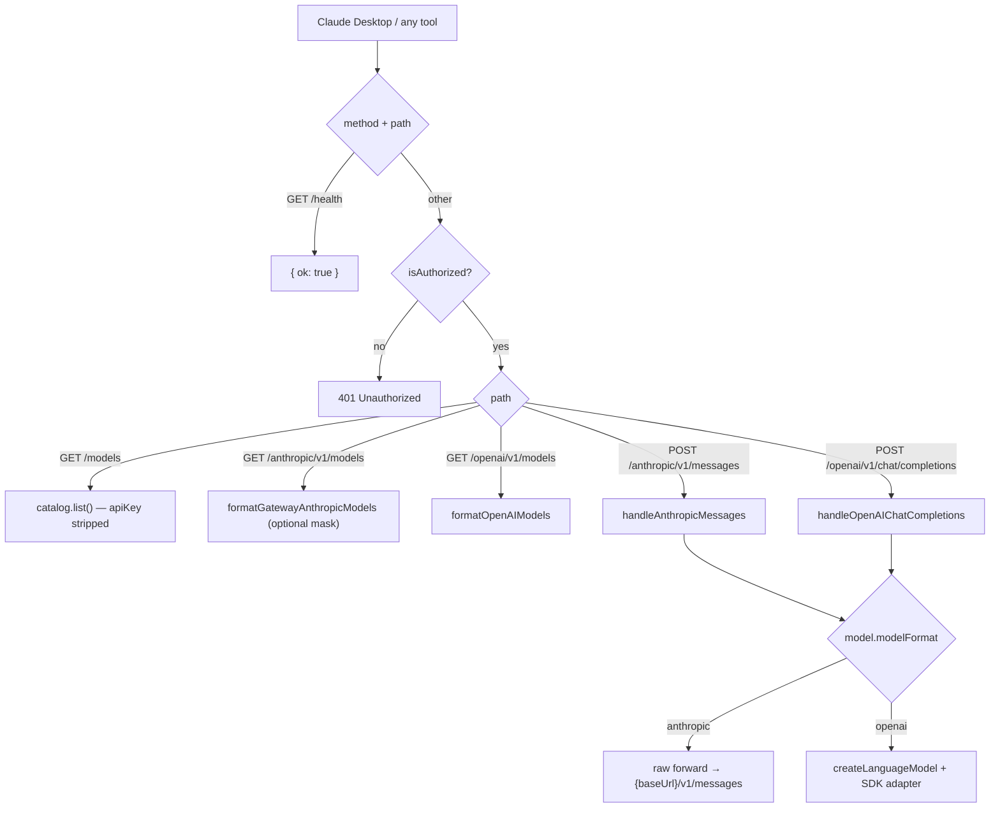

# PRD-012: Server Gateway *(Retroactive)*

> **Status:** Shipped
> **Priority:** —
> **Effort:** —
> **Written:** June 2026
> **Retroactive:** Yes — written after implementation (rflectr v0.2.7).
> **Source:** `src/server/*`

---

## Overview

Every other rflectr command is short-lived: it starts a proxy, spawns a coding
agent as a child process, and tears everything down on exit. `rflectr server`
inverts that model. It runs a **long-lived, foreground HTTP gateway** that
exposes the same model backends — OpenCode Zen, OpenCode Go, every materialized
local registry provider, or Claude on Google Vertex AI — behind both an
**Anthropic-compatible** and an **OpenAI-compatible** endpoint on a single port
(default **17645**).

The gateway is the backend for [PRD-011 Claude Desktop Integration](../prd-011-claude-desktop-integration/prd-011-claude-desktop-integration-index.md)
and for any tool that can be pointed at a base URL (e.g. THE AI Counsel, OpenAI-compatible
editor extensions). It reuses the same translation core as the CLI proxies
(PRD-004 / PRD-005): anthropic-format models forward raw to the provider's
`/v1/messages`; openai-format models route through the shared Vercel AI SDK
adapter via `createLanguageModel`. There is no second translation path.

`runServerCommand(options)` (`src/server/index.ts:377`) drives an interactive
wizard (which providers to expose, optional favorites-only catalog, discovery-id
masking, local vs network bind, server password) and then `startServer()`
(`src/server/router.ts:76`) listens until `Ctrl+C`.

---

## What Was Built

- **`rflectr server`** — foreground gateway over Zen/Go cloud models plus every
  local registry provider, served on one port as both Anthropic and OpenAI APIs
  (`src/server/index.ts:377`, `src/server/router.ts:76`).
- **`rflectr server --vertex`** — Claude on Google Vertex AI using local gcloud
  Application Default Credentials, no OpenCode key required
  (`src/server/index.ts:290`, `src/server/vertex-config.ts`).
- **Unified model loading** — `loadServerModels()` merges Zen, Go, and local
  provider models into a single `ServerModelInfo[]`, enriched with reasoning
  metadata (`src/server/index.ts:155`).
- **Per-endpoint routing** — `handleAnthropicMessages` and
  `handleOpenAIChatCompletions` dispatch by `modelFormat`: anthropic → raw
  forward; openai → SDK adapter with a per-`(model × npm × baseURL)`
  `LanguageModel` cache (`src/server/router.ts:155`, `:242`, `:331`).
- **Auth gate** — Bearer / `x-api-key` comparison against an optional server
  password; `null` password (local mode) allows all callers
  (`src/server/auth.ts:10`).
- **Discovery-id masking** — self-inverse provider/model-slug reversal so vendor
  names never appear literally in Claude Desktop / Cowork discovery ids
  (`src/server/vendor-mask.ts:14`).
- **Provider / favorites filtering** — expose a chosen subset of providers, or
  only favorite models (`src/server/catalog-filter.ts`).
- **Credential hygiene** — `GET /models` strips `apiKey` from every model entry;
  header values are CR/LF-sanitized (`src/server/router.ts:125`, `:397`).

---

## Goals

1. Serve every configured backend (Zen, Go, local registry providers, Vertex)
   behind **one** local HTTP port that speaks **both** Anthropic and OpenAI wire
   formats.
2. Reuse the shared SDK translation core (PRD-004) and upstream-forward helpers
   (PRD-005) — no gateway-specific translation logic.
3. Make the gateway safe to expose on a LAN: optional server password, network
   bind opt-in, credential stripping in catalog responses.
4. Provide a discovery surface Claude Desktop / Cowork can consume, including
   optional vendor-name masking.
5. Offer a zero-OpenCode-key path to Claude via Vertex AI using existing gcloud
   ADC.

## Non-Goals

- Process management / daemonization — the server runs in the foreground and
  exits on `Ctrl+C` (`waitForShutdown` in `src/server/index.ts:189`). No
  systemd unit, PID file, or background mode is shipped.
- TLS termination — the gateway listens over plain HTTP; HTTPS is expected to be
  handled by a front proxy if needed.
- Accurate cost reporting for non-Anthropic models (inherited limitation from
  the translation layer; Claude clients apply their own pricing table).
- Rate limiting, request quotas, or multi-tenant key management.
- Live context-window updates on `/model` switch (see Risks).

---

## Features

| # | Feature | Where |
|---|---------|-------|
| F1 | Foreground gateway on port 17645, dual Anthropic + OpenAI endpoints | `src/server/router.ts:76`, `src/server/index.ts:450` |
| F2 | Interactive wizard: start mode, favorites-only, exposed providers, masking | `src/server/index.ts:256`, `src/server/prompts.ts` |
| F3 | Unified model load (Zen + Go + local providers) with reasoning enrichment | `src/server/index.ts:155`, `:176` |
| F4 | Anthropic Messages relay (raw forward or SDK adapter by format) | `src/server/router.ts:155` |
| F5 | OpenAI Chat Completions relay (direct relay or SDK adapter) | `src/server/router.ts:242` |
| F6 | Gateway alias ids + bidirectional catalog lookup | `src/server/models.ts:114`, `:140` |
| F7 | Discovery-id masking (self-inverse) | `src/server/vendor-mask.ts:14` |
| F8 | Bearer / `x-api-key` auth with null-password local mode | `src/server/auth.ts:10` |
| F9 | `apiKey` stripped from `GET /models` | `src/server/router.ts:125` |
| F10 | Provider-subset and favorites-only filtering | `src/server/catalog-filter.ts:6`, `:15` |
| F11 | Vertex AI mode via gcloud ADC | `src/server/index.ts:290`, `src/server/vertex-config.ts` |
| F12 | Server-password save/reuse, network-bind opt-in | `src/server/index.ts:205`, `src/server/prompts.ts:51` |

---

## Architecture & Implementation

### Request flow

`routeRequest` (`src/server/router.ts:109`) handles `/health` **before** the auth
check, then gates everything else through `isAuthorized` before dispatching by
method + path.

### Server model loading

`loadServerModels()` (`src/server/index.ts:155`) calls
`fetchProviderCatalog({ agent: 'server' })` and assembles one `ServerModelInfo[]`:

- **Zen** models, filtered by the registry's `subscriptionFilter` (free-only when
  configured) via `filterZenModelsForServer` (`src/server/index.ts:115`), then
  mapped by `zenGoModelsToServerModels` (`src/provider-catalog.ts:259`).
- **Go** models, filtered to drop `modelFormat === 'unsupported'` by
  `usableGoModels` (`src/server/index.ts:123`), same mapper.
- **Local registry providers**, mapped by `localProvidersToServerModels`
  (`src/provider-catalog.ts:228`), each carrying `npm`, `apiBaseUrl`, `baseUrl`,
  `completionsUrl`, `apiKey`, `authType`, and `oauthAccountId`.

For Zen/Go, openai-format models get `npm = '@ai-sdk/openai-compatible'` and
`apiBaseUrl = ${backend.baseUrl}/v1`; anthropic-format models stay raw
passthrough (no `npm`) — matching the CLI catalog's `zenGoModelToRoute`
(`src/provider-catalog.ts:273`).

Every model is then passed through `enrichServerModelReasoning`
(`src/server/index.ts:176`), which calls `getReasoningCapabilities` and stamps a
`defaultEffort` fallback for openai-format models that declare one.

### Catalog & gateway aliases (`src/server/models.ts`)

`createGatewayModelCatalog(models, opts?)` (`:140`) builds a bidirectional
lookup keyed by `model.id` **and** by the exposed gateway alias, so Claude
clients (which only surface `claude-*` / `anthropic-*` ids) can address a model
by either form.

- `gatewayAliasId(model)` (`:114`) → `anthropic-{provider}__{model}` via
  `aliasModelId` (from `src/proxy.ts`).
- `exposedGatewayAliasId(model, opts?)` (`:118`) → masked alias when
  `opts.maskGatewayIds`.
- `gatewayDisplayName(model, opts?)` (`:124`) → `"Model Name"`, or
  `"Model Name (Provider Label)"` when masking is on.
- `upstreamModelId(model)` (`:159`) → strips a trailing `[1m]` context suffix
  for the wire call.
- `formatGatewayAnthropicModels` / `formatOpenAIModels` (`:129`, `:174`) build
  the endpoint payloads; `formatAnthropicModelEntry` (`:58`) attaches
  `context_window` / `max_input_tokens` via `resolveContextWindow`.

### Routing — Anthropic messages (`src/server/router.ts:155`)

1. Parse JSON body; look up the model in the catalog (`lookupModel`, `:307`).
2. **anthropic format** (`:176`): validate `baseUrl` is `http(s)://`, compute
   `{baseUrl}/v1/messages` (or the cloud backend's URL via `backendFor`, `:322`),
   forward the body verbatim — swapping in `upstreamModelId(model)` and relaying
   the inbound `anthropic-beta` header — through `postJsonUpstream`
   (shared with PRD-005's `upstream-forward.ts`).
3. **openai format** (`:192`): guard with `isSdkMigratedNpm(model.npm)`; init or
   reuse a cached `LanguageModel` (`getOrInitLanguageModel`, `:331`);
   `sdkTranslateRequest` → `streamAnthropicResponse` (SSE) or
   `generateAnthropicResponse`. The response `model` field is set to the masked
   display name when masking is on (`getResponseModelId`, `:363`) so Claude
   Desktop's status chip shows a human-readable name.

### Routing — OpenAI chat completions (`src/server/router.ts:242`)

- `supportsDirectOpenAIChatCompletions(model)` (`src/server/models.ts:165`) is
  true for openai-format models with a `completionsUrl` or a Zen/Go backend — those
  relay raw through `relayAnthropicMessages` to `{completionsUrl|backend}/v1/chat/completions`.
- Otherwise the request goes through the SDK adapter: `translateOpenAiRequest` →
  `streamOpenAiResponse` / `generateOpenAiResponse` (`src/openai-adapter.ts`).

### LanguageModel cache (`src/server/router.ts:331`)

`getOrInitLanguageModel` keys the cache on
`providerId/sourceBackend ∣ id ∣ upstreamModelId ∣ npm ∣ baseURL` (joined with
`\x1f`) so a given model is instantiated once per process and reused across
requests.

### Auth (`src/server/auth.ts`)

`isAuthorized(request, serverPassword)` (`:10`) returns `true` immediately when
`serverPassword === null` (local mode). Otherwise it accepts a `Bearer` token
(`extractBearerToken`, `:19`) **or** an `x-api-key` header, each passed through
`sanitizeCredential` (first non-empty line only, `:4`). In **network mode** the
wizard requires a server password; it is the only gate once the port is reachable
beyond localhost, so it must be treated as a real secret. Incoming header values
are CR/LF-stripped in `sanitizeIncomingHeaderValue` (`src/server/router.ts:397`).

### Vendor masking (`src/server/vendor-mask.ts`)

`maskGatewayModelId(aliasId)` (`:14`) reverses the provider-slug and
model-suffix segments of `anthropic-{provider}__{model}`. It is **self-inverse**
— `unmaskGatewayModelId` (`:24`) calls the same function. The masked catalog
registers all of `model.id`, the masked alias, and the raw alias so chat
requests resolve regardless of which id the client sends
(`createGatewayModelCatalog`, `src/server/models.ts:146`).

### Vertex mode (`src/server/index.ts:290`, `src/server/vertex-config.ts`)

`runVertexServerCommand` exposes **Claude on Vertex AI** without an OpenCode key:

- `buildVertexRuntimeConfig(env?)` (`vertex-config.ts:107`) resolves project
  (`ANTHROPIC_VERTEX_PROJECT_ID` → `GOOGLE_CLOUD_PROJECT` → `GOOGLE_VERTEX_PROJECT`)
  and location (`GOOGLE_CLOUD_LOCATION` → `CLOUD_ML_REGION` → `GOOGLE_VERTEX_LOCATION`
  → `global`); returns `null` if no project is set.
- `hasApplicationDefaultCredentials()` (`:66`) checks
  `GOOGLE_APPLICATION_CREDENTIALS` or `~/.config/gcloud/application_default_credentials.json`.
- `vertexModelsToServerModels(config)` (`:118`) builds `ServerModelInfo[]` routed
  through `@ai-sdk/google-vertex/anthropic` (`VERTEX_ANTHROPIC_NPM`,
  `modelFormat: 'openai'`, `sourceBackend: 'vertex'`).
- `createVertexModelCatalog(models)` (`:159`) adds short aliases (`sonnet` /
  `haiku` / `opus`) and `[1m]` context variants, resolving client lookups via
  `vertexClientModelLookupCandidates` (`:139`). Defaults: `claude-sonnet-4-6`,
  `claude-opus-4-6`, `claude-haiku-4-5`; overridable at
  `~/.rflectr/vertex-models.json`.

The Vertex server starts with `apiKey: 'vertex-local'` and passes a `vertex`
config (`{ project, location }`) to `startServer`, which threads it into
`createLanguageModel` (`src/server/router.ts:331`, `:348`).

---

## API Surface

Base URLs for clients:

- Anthropic: `http://127.0.0.1:17645/anthropic`
- OpenAI: `http://127.0.0.1:17645/openai/v1`

> Do **not** append `/v1` to the Anthropic base URL — the Anthropic SDK adds API
> paths itself.

| Method + path | Purpose | Source |
|---|---|---|
| `GET /health` | Liveness `{ ok: true }` (pre-auth) | `src/server/router.ts:114` |
| `GET /models` | Raw catalog, `apiKey` stripped | `src/server/router.ts:124` |
| `GET /anthropic/v1/models` | Anthropic-format list (optionally masked) | `src/server/router.ts:129` |
| `GET /openai/v1/models` | OpenAI-format list | `src/server/router.ts:134` |
| `POST /anthropic/v1/messages` | Anthropic Messages relay | `src/server/router.ts:139` |
| `POST /openai/v1/chat/completions` | OpenAI Chat Completions relay | `src/server/router.ts:144` |

`POST /anthropic/v1/messages` honors `stream` (SSE when true), supports both
streaming and non-streaming for anthropic-format (raw forward) and openai-format
(SDK adapter) models, and relays the inbound `anthropic-beta` header on raw
forwards. Unknown / unsupported models return `400`; upstream/SDK errors surface
as `502`.

---

## Acceptance Criteria

- [x] `rflectr server` starts a foreground HTTP gateway on port 17645 serving
      both `/anthropic` and `/openai/v1` endpoints (`src/server/index.ts:450`,
      `src/server/router.ts:76`).
- [x] `loadServerModels()` merges Zen, Go, and local registry provider models
      into one `ServerModelInfo[]` (`src/server/index.ts:155`).
- [x] Local providers are appended carrying `npm` / `apiBaseUrl` / `baseUrl` /
      `completionsUrl` / `apiKey` (`src/provider-catalog.ts:228`).
- [x] `handleAnthropicMessages` raw-forwards anthropic-format models to
      `{baseUrl}/v1/messages` (`src/server/router.ts:176`).
- [x] openai-format models route through the `isSdkMigratedNpm` guard →
      `createLanguageModel` + `streamAnthropicResponse` /
      `generateAnthropicResponse` (`src/server/router.ts:192`).
- [x] `GET /models` strips `apiKey` from every entry (`src/server/router.ts:125`).
- [x] Auth accepts `Bearer` or `x-api-key`; `null` password allows all callers
      (`src/server/auth.ts:10`).
- [x] Discovery-id masking reverses provider/model segments and is self-inverse
      (`src/server/vendor-mask.ts:14`).
- [x] Provider-subset and favorites-only filtering are available in the wizard
      (`src/server/catalog-filter.ts`, `src/server/index.ts:405`).
- [x] `rflectr server --vertex` exposes Claude on Vertex AI via gcloud ADC with
      no OpenCode key (`src/server/index.ts:290`, `src/server/vertex-config.ts:66`).
- [x] Per-`(model × npm × baseURL)` `LanguageModel` cache reuses instances across
      requests (`src/server/router.ts:331`).
- [x] `/health` is reachable without auth (`src/server/router.ts:114`).
- [x] Network mode requires a server password before binding to `0.0.0.0`
      (`src/server/index.ts:205`, `:394`).

---

## Files

| File | Role |
|------|------|
| `src/server/index.ts` | Command entry, wizard, `loadServerModels`, reasoning enrichment, Vertex command, startup output |
| `src/server/router.ts` | HTTP server, routing, Anthropic + OpenAI handlers, LanguageModel cache, header sanitization |
| `src/server/models.ts` | `ServerModelInfo`, catalog builders, gateway aliases, display names, endpoint payload formatters |
| `src/server/auth.ts` | `isAuthorized`, `extractBearerToken`, `sanitizeCredential` |
| `src/server/catalog-filter.ts` | Provider-subset / favorites filtering, provider summary |
| `src/server/provider-select.ts` | Interactive exposed-providers picker |
| `src/server/vendor-mask.ts` | Self-inverse discovery-id masking |
| `src/server/vertex-config.ts` | Vertex runtime config, ADC detection, Vertex model catalog |
| `src/server/prompts.ts` | Wizard prompts (start mode, listen mode, password, masking, favorites) |
| `src/provider-catalog.ts` | `zenGoModelsToServerModels`, `localProvidersToServerModels` (shared) |
| `src/upstream-forward.ts` | `postJsonUpstream`, `relayAnthropicMessages` (shared with proxy) |

---

## Risks & Known Limitations

- **No TLS / no daemonization.** Plain HTTP, foreground only. A LAN deployment
  relies entirely on the server password as its sole access gate.
- **Server password is the only network gate.** Once bound to `0.0.0.0`, any
  caller with the password reaches every exposed provider's upstream key. Treat
  it as a real secret.
- **Cost display inaccurate for non-Anthropic models** — Claude clients apply
  their own pricing table; the gateway cannot correct it.
- **Context window reflects launch state.** Discovery payloads carry a static
  `context_window`; a live `/model` switch in a Claude client does not refresh it.
- **OAuth-only local providers** with no stored key are skipped upstream of this
  gateway (PRD-002), so they never appear in the catalog.
- **Vertex auth beyond ADC** (impersonation, workload identity) is not handled —
  only `GOOGLE_APPLICATION_CREDENTIALS` or the default ADC file are detected.
- **`::ts::` / `[1m]` string conventions** are inherited from the translation and
  alias layers; the same edge-case caveats apply.

---

## Related

- [PRD-002: Provider Registry](../prd-002-provider-registry/prd-002-provider-registry-index.md) — local provider discovery feeding `localProvidersToServerModels`.
- [PRD-003: Model Discovery & Classification](../prd-003-model-discovery-classification/prd-003-model-discovery-classification-index.md) — `ModelInfo` source for `zenGoModelsToServerModels`.
- [PRD-004: Translation Layer](../prd-004-translation-layer/prd-004-translation-layer-index.md) — the shared SDK adapter (`createLanguageModel`, `streamAnthropicResponse`).
- [PRD-005: Local Proxy & Catalog Routing](../prd-005-local-proxy-catalog-routing/prd-005-local-proxy-catalog-routing-index.md) — shared `upstream-forward.ts` and `aliasModelId`.
- [PRD-011: Claude Desktop Integration](../prd-011-claude-desktop-integration/prd-011-claude-desktop-integration-index.md) — primary consumer of this gateway.
- Knowledge: [Server Gateway (private)](../../../knowledge/private/infrastructure/server-gateway.md) · [API Server guide (public)](../../../knowledge/public/guides/api-server.md)
